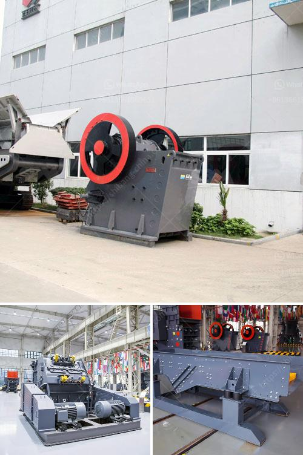

<h3>stone crusher plant information</h3>
Stone crusher plant is a profitable venture for new entrepreneurs. The demand for quality stone chips is increasing day-by-day. With the booming infrastructure sector, construction companies and contractors are looking for efficient machines that can undertake heavy workload. Investing in a stone crusher plant can offer abundant opportunities to profit.

Stone crusher plant machinery depends on the feed size of the stone, the desired product size and the size of the crusher used. Following are the generally required machinery:

The above machinery requires an initial investment of around 1 Crore rupees. The setup procedure and machinery details will vary based on the type of rock obtained during the quarrying process.

Stone Crusher in India work is very broad in beneficiation. There are many domestic stone crusher manufacturers in India. In mineral production lines in India, Indian stone crusher can improve production efficiency and used widely.

India is a large producer of various types of minerals such as iron ore, copper ore, manganese ore, bauxite, granite, and imports cobalt, mercury, graphite, limestone, etc. Successful development of these resources requires each of the broken types of machinery used for processing. Therefore, quartz stone crusher must have a good performance in these mineral production lines in India, Indian concrete crusher manufacturer put all their efforts to improve the performance and optimization of quartz stone crusher.

Stone crusher plant is generally applied in the open working site or quarry. It has the characteristics of low investment, high efficiency, and portable. It can provide customers with high-quality products and high-efficiency stone crusher machines for global mining companies. With the development of beneficiation technology, the demand for the stone crusher plant will increase significantly.

In a mining industry or process, stone crusher plant acts as a catalyst to reduce the size of the rock materials or make them more manageable for the subsequent mining processing. It further processes the rocks to a smaller size to enable easy transportation and process gradually. It is a fed raw material to the stone crushing plant that helps to enhance the efficiency and quality of the final product.

Investing in a stone crushing plant is not too expensive when compared to other infrastructure projects. It provides continuous production and services for the construction industry. With proper equipment and guidance, even a novice entrepreneur can start the venture. Apart from the growth opportunities, this business will provide benefits and support to the local communities and jobseekers. Thus, it is a win-win situation for all stakeholders.
<h3>Contact us</h3><ul><li><strong>Whatsapp:&nbsp;<a href="https://wa.me/8613661969651">+8613661969651</a></strong></li><li><a href="https://swt.shibang-china.com/?git&amp;zhl&amp;stone crusher plant information"><strong>Online Service(chat now)</strong></a></li></ul><h3>Related</h3><ul><li><a href='cost of cement clinker grinding unit.md'>cost of cement clinker grinding unit</a></li><li><a href='rock crusher for sale in botswana.md'>rock crusher for sale in botswana</a></li><li><a href='alluvial gold washing plants in south africa.md'>alluvial gold washing plants in south africa</a></li><li><a href='ball mill inside.md'>ball mill inside</a></li><li><a href='manual stone crusher in kenya.md'>manual stone crusher in kenya</a></li></ul>