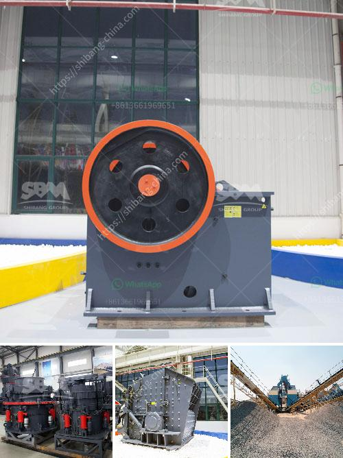

<h3>stone crusher plant layout pdf</h3>
Stone crusher plant is a machine designed to reduce the large stone, granites, marble, lime rocks into the smaller size and output gravel, dust, different size of the material.

Stone crusher plants used worldwide. It is available with different-2 capacity, design, and utility. Uses of Crusher plant Stone crushing industry engaged in producing a crushed stone that used as a raw material for infrastructure projects like, road, highway, bridges, building canals, etc. All projects are considered as the core infrastructure work that gives the economy boom.

Stone crusher units are not alone. Along with these plants, stone mining also associated. In fact, stone mining is the primary activity, and the crushing plant is the secondary activity that can be considered. Raw materials used for crushing unit Coal, Stone, Granite, limestone, Basalt, River stone, andesite calcite, abrasive rocks, glass, and ferrous material used for the crushing purpose. Stone Crusher plant Capacity The stone crusher plant will available from 50 TPH to 600 TPH (ton per hour). The plant can produce the 8 variants of material. Just to get the different variant material you also need to put the screening plant that just separates the different materials according to client or market demand. Stone Crusher plant works Raw Material processed through the vibrating feeder to crusher gradually and crusher crushed the material into respective pieces. From Crusher material conveyed to belt conveyor for secondary crushing before went on vibrating screen plant. Vibrating screen plant separates the quality and qualified material to final products. And unqualified material carried back to stone crusher and reprocesses it. Then again material elevated by the bucket elevator to another vibrating screen for separation. Over the vibrating screen, the material will separated into different sizes. Vibrating screen will separate the large material and small material. Mobile Stone Crusher Plant For Sale: Aimix® Mobile Crusher plant is suitable for the case that project location should be changed frequently. This plant integrates vibrating feeder, primary crusher, secondary crusher and vibrating screen together, which provides holistic solutions for clients. And it takes advantages of small coverage area and convenient process. Firstly, the main frame of the rock crushing plant. The main frame consists of the upper frame part and the lower frame part. The two parts are connected by hydraulic cylinder. The upper shelf is a welding piece, and the upper side of the shelf is welded with a wear-resistant copper plate. And the lower frame is a whole cast steel. Secondly, the rock crushing equipment has large production capacity.

The cone crusher has higher speed stroke, so the rated power of the cone crusher is increased, and the processing capacity of the equipment is greatly improved. Thirdly, this rock crusher machine has a two-way iron release hydraulic cylinder, which allows the iron to go through the crushing chamber, and reduces the shutdown due to debris in the crushing chamber. Fourthly, large diameter spindle and heavy main frame ensure that the equipment has durable and reliable working condition. The independent thin oil lubrication system can ensure the bearing lubrication has double protection. Lastly, the mobile rock crusher has high degree of automation. And it can be automatically controlled and even further controlled by a computer according to users' needs. Rock Crusher Parts: We all know it consists of several types of stone crusher machines. Now, Aimix will take a cone crusher as an example to describe rock crushing machine components. The type of rock crusher for sale is mainly composed of frame, rock crusher transmission shaft, eccentric sleeve, spherical bearing, crushing cone, adjusting device, adjusting sleeve, spring and discharging port. In order to give customers a better understanding of the crusher, Aimix will describe the detailed informations of the following parts . Firstly, the main frame of the rock crushing plant. The main frame consists of the upper frame part and the lower frame part. The two parts are connected by hydraulic cylinder. The upper shelf is a welding piece, and the upper side of the shelf is welded with a wear-resistant copper plate. And the lower frame is a whole cast steel. Secondly, the rock crushing equipment has large production capacity. The cone crusher has higher speed stroke, so the rated power of the cone crusher is increased, and the processing capacity of the equipment is greatly improved. Thirdly, this rock crusher machine has a two-way iron release hydraulic cylinder, which allows the iron to go through the crushing chamber, and reduces the shutdown due to debris in the crushing chamber. Fourthly, large diameter spindle and heavy main frame ensure that the equipment has durable and reliable working condition. The independent thin oil lubrication system can ensure the bearing lubrication has double protection. Lastly, the mobile rock crusher has high degree of automation. And it can be automatically controlled and even further controlled by a computer according to users' needs. Rock Crusher Parts: We all know it consists of several types of stone crusher machines. Now, Aimix will take a cone crusher as an example to describe rock crushing machine components. The type of rock crusher for sale is mainly composed of frame, rock crusher transmission shaft, eccentric sleeve, spherical bearing, crushing cone, adjusting device, adjusting sleeve, spring and discharging port. In order to give customers a better understanding of the crusher, Aimix will describe the detailed informations of the following parts . Firstly, the main frame of the rock crushing plant. The main frame consists of the upper frame part and the lower frame part. The two parts are connected by hydraulic cylinder. The upper shelf is a welding piece, and the upper side of the shelf is welded with a wear-resistant copper plate. And the lower frame is a whole cast steel. Secondly, the rock crushing equipment has large production capacity. The cone crusher has higher speed stroke, so the rated power of the cone crusher is increased, and the processing capacity of the equipment is greatly improved. Thirdly, this rock crusher machine has a two-way iron release hydraulic cylinder, which allows the iron to go through the crushing chamber, and reduces the shutdown due to debris in the crushing chamber. Fourthly, large diameter spindle and heavy main frame ensure that the equipment has durable and reliable working condition. The independent thin oil lubrication system can ensure the bearing lubrication has double protection. Lastly, the mobile rock crusher has high degree of automation. And it can be automatically controlled and even further controlled by a computer according to users' needs. Rock Crusher Parts: We all know it consists of several types of stone crusher machines. Now, Aimix will take a cone crusher as an example to describe rock crushing machine components. The type of rock crusher for sale is mainly composed of frame, rock crusher transmission shaft, eccentric sleeve, spherical bearing, crushing cone, adjusting device, adjusting sleeve, spring and discharging port. In order to give customers a better understanding of the crusher, Aimix will describe the detailed informations of the following parts . Firstly, the main frame of the rock crushing plant. The main frame consists of the upper frame part and the lower frame part. The two parts are connected by hydraulic cylinder. The upper shelf is a welding piece, and the upper side of the shelf is welded with a wear-resistant copper plate. And the lower frame is a whole cast steel. Secondly, the rock crushing equipment has large production capacity. The cone crusher has higher speed stroke, so the rated power of the cone crusher is increased, and the processing capacity of the equipment is greatly improved. Thirdly, this rock crusher machine has a two-way iron release hydraulic cylinder, which allows the iron to go through the crushing chamber, and reduces the shutdown due to debris in the crushing chamber. Fourthly, large diameter spindle and heavy main frame ensure that the equipment has durable and reliable working condition. The independent thin oil lubrication system can ensure the bearing lubrication has double protection. Lastly, the mobile rock crusher has high degree of automation. And it can be automatically controlled and even further controlled by a computer according to users' needs. Rock Crusher Parts: We all know it consists of several types of stone crusher machines. Now, Aimix will take a cone crusher as an example to describe rock crushing machine components. The type of rock crusher for sale is mainly composed of frame, rock crusher transmission shaft, eccentric sleeve, spherical bearing, crushing cone, adjusting device, adjusting sleeve, spring and discharging port. In order to give customers a better understanding of the crusher, Aimix will describe the detailed informations of the following parts. Firstly, the main frame of the rock crushing plant. The main frame consists of the upper frame part and the lower frame part. The two parts are connected by hydraulic cylinder. The upper shelf is a welding piece, and the upper side of the shelf is welded with a wear-resistant copper plate. And the lower frame is a whole cast steel. Secondly, the rock crushing equipment has large production capacity. The cone crusher has higher speed stroke, so the rated power of the cone crusher is increased, and the processing capacity of the equipment is greatly improved. Thirdly, this rock crusher machine has a two-way iron release hydraulic cylinder, which allows the iron to go through the crushing chamber, and reduces the shutdown due to debris in the crushing chamber. Fourthly, large diameter spindle and heavy main frame ensure that the equipment has durable and reliable working condition. The independent thin oil lubrication system can ensure the bearing lubrication has double protection. Lastly, the mobile rock crusher has high degree of automation. And it can be automatically controlled and even further controlled by a computer according to users' needs.
<h3>Contact us</h3><ul><li><strong>Whatsapp:&nbsp;<a href="https://wa.me/8613661969651">+8613661969651</a></strong></li><li><a href="https://swt.shibang-china.com/?git&amp;zhl&amp;stone crusher plant layout pdf"><strong>Online Service(chat now)</strong></a></li></ul><h3>Related</h3><ul><li><a href='calcium carbonate production line in germany.md'>calcium carbonate production line in germany</a></li><li><a href='project of crushing and screening stone crusher machine.md'>project of crushing and screening stone crusher machine</a></li><li><a href='2 micron limestone grinding unit in india.md'>2 micron limestone grinding unit in india</a></li><li><a href='puzzolana 200tph cone crusher plant prices.md'>puzzolana 200tph cone crusher plant prices</a></li><li><a href='precipitated calcium carbonate milling.md'>precipitated calcium carbonate milling</a></li></ul>