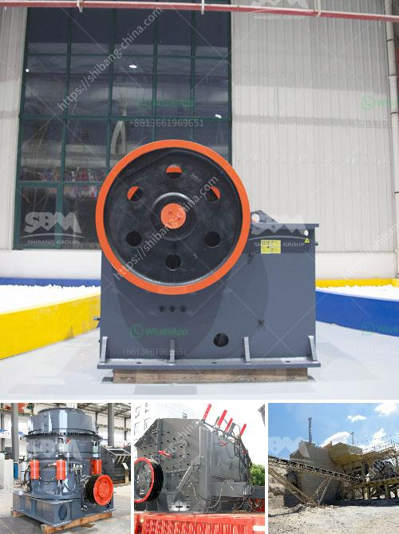

<h3>stone crusher plant ton per hour</h3>
Stone crusher plant is a versatile machine for processing various kinds of materials. It is commonly used for crushing hard, abrasive rocks, concrete, granite, limestone, etc. The stone crusher plant can crush various materials with a capacity of 200-300 tons per hour. Of course, this is an average value and the specific value will be determined by the different types of equipment used in the process and the actual raw materials being processed.

The stone crusher plant consists of jaw crusher, impact crusher/vsi crusher, vibrating screen, vibrating feeder, belt conveyor, etc. It is widely used to process granite, gravel, boulder, rock, aggregate, basalt and over 120 kinds of stones in many fields, such as mining, quarry, construction, road, bridge, etc.

The stone crusher plant is equipped with a vibrating feeder and a jaw crusher. The jaw crusher is the main crushing machine used in the stone crushing plant. It can process various kinds of materials, such as granite, limestone, marble, basalt, iron ore, river pebble, shale, bluestone, coal, gypsum, etc. The jaw crusher has the features of large crushing ratio, uniform product size, simple structure, reliable performance, easy maintenance, and low operating cost.

After the materials are evenly conveyed into the jaw crusher for primary crushing by the vibrating feeder, the crushed materials are transported to the impact crusher or the cone crusher through a belt conveyor for fine crushing. The secondary crushing process is completed by the impact crusher or the cone crusher, and then the materials are sieved by the vibrating screen. The qualified materials are sent to the finished product pile by the belt conveyor, and the unqualified materials are returned to the impact crusher or the cone crusher for further crushing until they reach the desired size.

The stone crusher plant has a large production capacity. It can process up to 200-300 tons of raw materials per hour. It takes 25-30 seconds for the equipment to crush one cubic meter of material, and the output is around 60-70 cubic meters per hour. The production capacity has a great relationship with the stone crusher plant model and specification, the feeding size, the final size, etc.

The stone crusher plant is a high-tech equipment for one-time processing with medium hardness and fine crushing effect. The maintenance and repair of the equipment are ordinary. It is a necessary work to regularly check the wear of vulnerable parts and replace them in time. The stone crusher plant also requires regular inspection and lubrication of the equipment bearings to ensure the fullness and smoothness of the machine operation. The regular maintenance and inspection of the stone crusher plant can greatly improve its production efficiency and service life.

In summary, stone crusher plant is a versatile machine for processing various kinds of materials. It can process granite, limestone, basalt, etc. The stone crusher plant has a large production capacity and a great crushing ratio. It is a good helper for the stone industry. Let's take a closer look at the stone crusher plant!
<h3>Contact us</h3><ul><li><strong>Whatsapp:&nbsp;<a href="https://wa.me/8613661969651">+8613661969651</a></strong></li><li><a href="https://swt.shibang-china.com/?git&amp;zhl&amp;stone crusher plant ton per hour"><strong>Online Service(chat now)</strong></a></li></ul><h3>Related</h3><ul><li><a href='price list of granite crusher.md'>price list of granite crusher</a></li><li><a href='desain mesin crusher tempurung kelapa.md'>desain mesin crusher tempurung kelapa</a></li><li><a href='granite crusher equipment.md'>granite crusher equipment</a></li><li><a href='400 tph mobile coal crusher plant manufacturer.md'>400 tph mobile coal crusher plant manufacturer</a></li><li><a href='crusher new used for sale in uae.md'>crusher new used for sale in uae</a></li></ul>