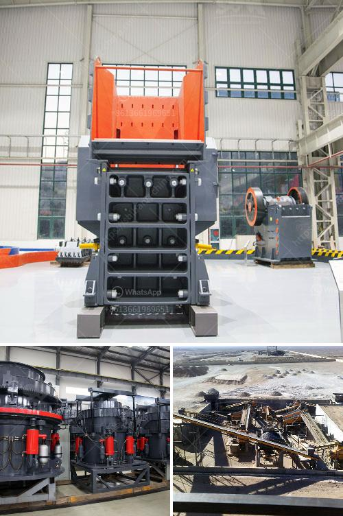

<h3>stone crusher price 20x20 stone</h3>
The stone crushing industry plays a crucial role in the construction and infrastructure development sectors worldwide. Stone crushers are used extensively for crushing stones into different sizes for various applications. With the increasing demand for stone materials in construction projects, the importance of understanding the stone crusher price 20x20 stone becomes paramount. In this article, we delve deeper into the factors influencing the price of stone crushers and shed light on their impact.

The availability and quality of raw materials significantly impact the price of stone crushers. Stone crusher manufacturers rely on quarries for their supply of raw materials. When plentiful, the prices tend to be competitive. However, scarcity or poor quality can drive up prices, making them more expensive.

The production capacity of the stone crusher directly influences its price. A stone crusher with a higher production capacity tends to be more expensive due to its ability to handle larger quantities of stones efficiently. Consequently, higher production capacities enable faster completion of projects, reducing overall costs.

The manufacturing and operating costs of stone crushers impact their price. Manufacturers that use advanced technologies and efficient production processes can offer more competitive prices. Additionally, the cost of operating the machinery, including electricity consumption, labor, and maintenance, affects the stone crusher price.

Market demand and competition amongst manufacturers are crucial price determinants. When the demand for stone crushers is high, manufacturers increase their prices as they capitalize on the market dynamics. Conversely, intense competition can lead to price wars between manufacturers, resulting in lower prices.

The cost of transportation and logistics to deliver stone crushers to various locations may also impact prices. If the distance between the manufacturing plant and the project site is significant, transportation costs can increase. Additionally, import and export regulations and taxes can affect stone crusher prices in different regions.

The stone crusher price greatly influences the overall construction costs, especially in projects requiring significant quantities of stone materials. A higher price can burden the project budget, potentially leading to financial constraints and delays. Therefore, understanding the price dynamics becomes essential to plan cost-effective construction projects.

Lower stone crusher prices allow for cost-efficient material selection. When prices are higher, project managers may need to adjust the types or quantities of stones used, potentially compromising the project's visual appeal or quality. Thus, affordable prices are crucial to achieving the desired project outcomes.

Affordable stone crusher prices stimulate economic growth in the construction industry. When prices are reasonable and within reach of developers, they spur construction activities. This, in turn, generates employment opportunities, enhances infrastructure development, and fosters economic growth.

The stone crusher price 20x20 stone has a significant impact on the construction industry, influencing construction costs, material selection, and overall economic growth. The availability and quality of raw materials, production capacity, manufacturing and operating costs, market demand and competition, and transportation logistics are crucial factors that determine the price of stone crushers. By understanding these factors, developers and project managers can plan more effectively, prioritizing affordable prices while ensuring quality outcomes and sustainable development.
<h3>Contact us</h3><ul><li><strong>Whatsapp:&nbsp;<a href="https://wa.me/8613661969651">+8613661969651</a></strong></li><li><a href="https://swt.shibang-china.com/?git&amp;zhl&amp;stone crusher price 20x20 stone"><strong>Online Service(chat now)</strong></a></li></ul><h3>Related</h3><ul><li><a href='granite stone crushing plants.md'>granite stone crushing plants</a></li><li><a href='cost of dolomite milling machine in india.md'>cost of dolomite milling machine in india</a></li><li><a href='silica sand crushing plant in pakistan.md'>silica sand crushing plant in pakistan</a></li><li><a href='screw conveyor for sand.md'>screw conveyor for sand</a></li><li><a href='processing of bauxite ore.md'>processing of bauxite ore</a></li></ul>