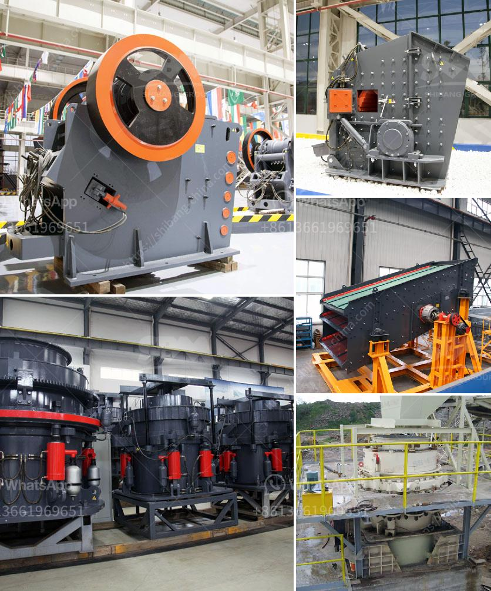

<h3>stone crusher price ton per day</h3>
Stone crusher is an essential equipment in mining machinery, and the common stone crusher mainly includes jaw crusher, mobile crushing plant, impact crusher, and cone crusher. Stone crusher is suitable for crushing all kinds of ores and rocks with medium hardness and above. It has the characteristics of reliable structure, high production efficiency, convenient adjustment, and low use cost. In recent years, with the continuous development of the construction industry, the demand for stone crushers has been increasing. Among them, the price of the stone crusher per ton per day has become a focus of attention.

The price of a stone crusher varies with different types and capacities. For instance, jaw crushers are available in a wide range of sizes and capacities, from 10 to 1000 tons per hour. Cone crushers are also widely used and can crush materials up to 400mm. Impact crushers can crush many kinds of materials, ranging from soft to medium-hardness. These stone crushers are often used for crushing larger rocks into smaller rocks, gravel, or rock dust. The final product size can be adjusted depending on the requirements of the customers.

When it comes to the price per ton per day, there are many factors that influence it. The quality of the stone crusher, the location of the quarry, and the size of the production line are some of the factors that affect the price. Additionally, the cost of transportation and taxes could also affect the overall cost.

In general, the price per ton per day of a stone crusher is relatively high. However, with the continuous improvement and innovation of technology, the cost of production has been reduced significantly over the years. Stone crushers are now more affordable for smaller-scale operations or individuals who need them for personal use.

In conclusion, the price of a stone crusher per ton per day can vary depending on the type and capacity of the crusher, the location of the quarry, and other factors. However, with technological advancements, stone crushers have become more affordable, making them accessible to a wider range of people. Whether for commercial or personal use, stone crushers are essential equipment for the construction industry.
<h3>Contact us</h3><ul><li><strong>Whatsapp:&nbsp;<a href="https://wa.me/8613661969651">+8613661969651</a></strong></li><li><a href="https://swt.shibang-china.com/?git&amp;zhl&amp;stone crusher price ton per day"><strong>Online Service(chat now)</strong></a></li></ul><h3>Related</h3><ul><li><a href='3 4 inch crushed limestone.md'>3 4 inch crushed limestone</a></li><li><a href='aggregate conveyor systems.md'>aggregate conveyor systems</a></li><li><a href='cost of stone crusher plant in saudi.md'>cost of stone crusher plant in saudi</a></li><li><a href='netherlands impact crushers.md'>netherlands impact crushers</a></li><li><a href='cost to construct a cement factory.md'>cost to construct a cement factory</a></li></ul>