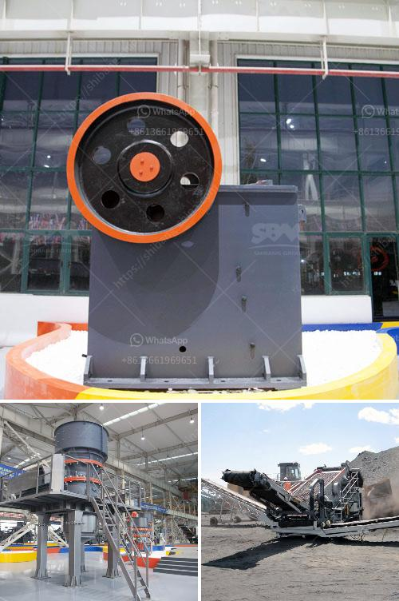

<h3>stone crusher prices in indonesia</h3>
Stone crusher is a machine used to convert large stones into small sizes that can be used in construction or other purposes. There are several types of stone crushing machines, including jaw crusher, impact crusher, and cone crusher. Depending on the type, size, and processing capacity of the machine, the prices of stone crushers vary.

One of the most important factors that determines the price of a stone crusher is the type of machine. There are different types of stone crushers, such as jaw crusher, impact crusher, and cone crusher. Each type has its own unique features and specifications, and therefore, the price of the crusher also varies. For example, jaw crushers are generally cheaper compared to cone crushers.

Another important factor that affects the price of a stone crusher is its size. A stone crusher with a larger size will have a higher price compared to smaller ones. This is because bigger machines require more materials and manpower to manufacture, which increases the production cost. Moreover, larger machines are usually more powerful and have a higher processing capacity, which makes them more expensive.

The processing capacity of the stone crusher also affects its price. Machines with higher processing capacity are generally priced higher because they can process more stones in a shorter time. This is especially important for industries that require a large amount of crushed stones, such as construction and mining industries. On the other hand, machines with lower processing capacity are usually priced lower.

Apart from the type, size, and processing capacity of the stone crusher, other factors such as brand reputation and after-sales service also contribute to the price. Well-known brands that have been in the market for a long time tend to have higher prices compared to less-known brands. This is because well-known brands have established a reputation for producing high-quality and reliable machines. Additionally, good after-sales service is important as it ensures that customers receive proper support and maintenance for their stone crushers, which may also affect the price.

In Indonesia, stone crusher prices are influenced by a variety of factors, including manufacturing costs, production capacity, and economic conditions. As a leading global manufacturer of crushing and grinding equipment, we provide advanced, rational solutions for any size-reduction requirements, including quarry aggregate grinding production and complete stone crushing plant. We also supply individual crushers and mills as well as spare parts of them. With prices ranging from around $15,000 to over $1 million, you can be sure to find the stone crusher that meets your needs and budget.

When choosing a stone crusher, you should consider factors such as the type of machine, size, processing capacity, and the proper maintenance and after-sales service. As the leading stone crusher manufacturer in Indonesia, we provide comprehensive crushing solutions, and our products have been exported to more than 120 countries and regions. In addition to the Indonesian market, we provide jaw crusher, cone crusher, impact crusher, hammer crusher, and other stone crushing equipment. Originality, reliability, and high quality are the key factors that we have built our reputation on.
<h3>Contact us</h3><ul><li><strong>Whatsapp:&nbsp;<a href="https://wa.me/8613661969651">+8613661969651</a></strong></li><li><a href="https://swt.shibang-china.com/?git&amp;zhl&amp;stone crusher prices in indonesia"><strong>Online Service(chat now)</strong></a></li></ul><h3>Related</h3><ul><li><a href='quartz processing machine up to 300 mesh.md'>quartz processing machine up to 300 mesh</a></li><li><a href='rock cone crusher.md'>rock cone crusher</a></li><li><a href='ghana quarry crusher.md'>ghana quarry crusher</a></li><li><a href='processing of bauxite ore.md'>processing of bauxite ore</a></li><li><a href='silica sand crushing plant in pakistan.md'>silica sand crushing plant in pakistan</a></li></ul>