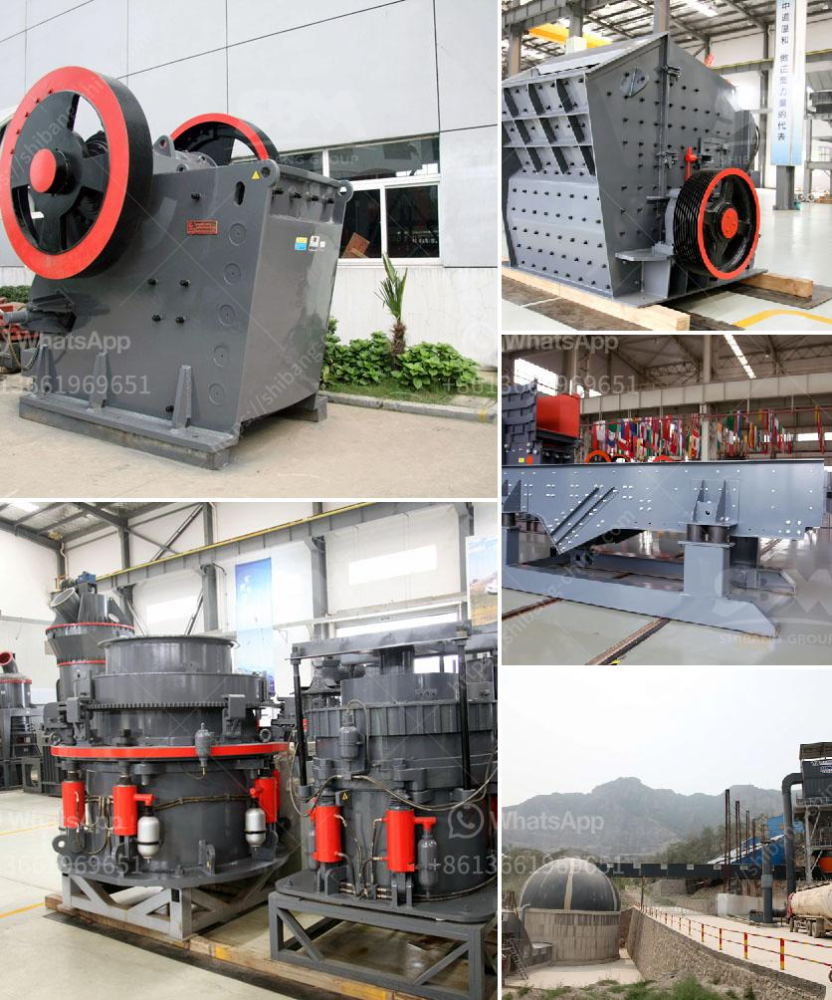

<h3>stone crusher quote list</h3>
A stone crusher is a necessary machine for mining and construction industries. With the increasing demand for stone and mineral resources, it is important to choose a suitable stone crusher. The stone crusher quote list includes models, specifications, and capacities for your selection.

There are many types of stone crushers, such as jaw crusher, impact crusher, cone crusher, mobile crusher, roll crusher, vertical shaft impact crusher, compound crusher, single-stage crusher, and hammer crusher, among others. Each type has its own advantages and uses.

Note that the capacity mentioned above may vary depending on the material, feed size, and crusher settings. It is advisable to consult the manufacturer or supplier for more accurate information.

The stone crusher quote list provides a wide range of options suitable for different applications. Whether you need a primary crusher for large-scale mining operations or a mobile crusher for on-site construction projects, this list will guide you to the right choice. Remember to consider factors such as production capacity, energy consumption, maintenance requirements, and cost-effectiveness when making your final decision.

In conclusion, a stone crusher is an essential machine for various industries. The quote list above offers a wide range of models and specifications to cater to different needs. With the right stone crusher, you can efficiently process stones and minerals, leading to higher productivity and profitability.
<h3>Contact us</h3><ul><li><strong>Whatsapp:&nbsp;<a href="https://wa.me/8613661969651">+8613661969651</a></strong></li><li><a href="https://swt.shibang-china.com/?git&amp;zhl&amp;stone crusher quote list"><strong>Online Service(chat now)</strong></a></li></ul><h3>Related</h3><ul><li><a href='quartz sand particle size quartz powder.md'>quartz sand particle size quartz powder</a></li><li><a href='stone crusher price ton per day.md'>stone crusher price ton per day</a></li><li><a href='crushing and screening contractors in gauteng.md'>crushing and screening contractors in gauteng</a></li><li><a href='used stone crushing plant for sale in germany.md'>used stone crushing plant for sale in germany</a></li><li><a href='costs of conveyor belts.md'>costs of conveyor belts</a></li></ul>