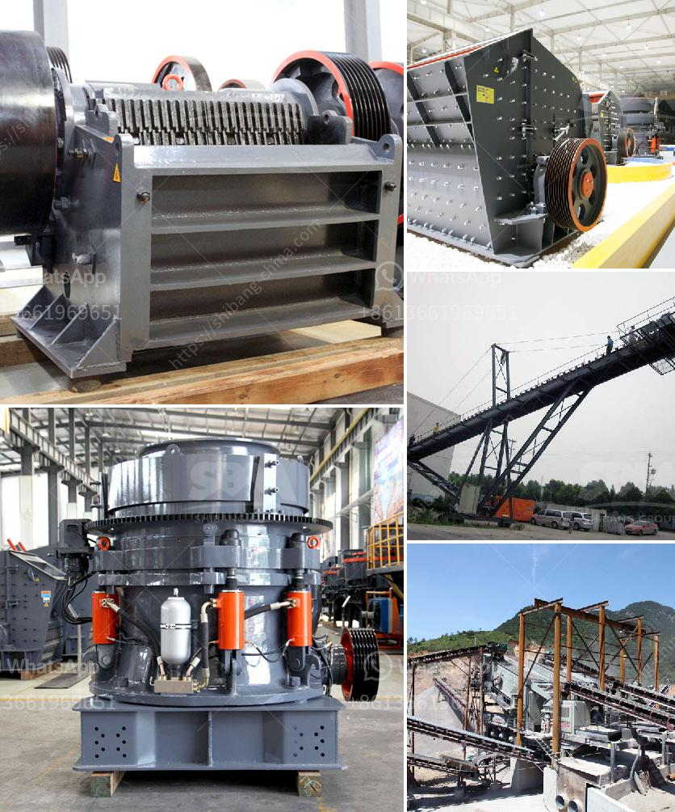

<h3>stone crusher rubber conveyor</h3>
The stone crusher rubber conveyor belts are designed to transport loose materials or aggregates for various applications. In the mining industry, the rubber belt conveyor is widely used in transporting mined stones or ores from one location to another. The rubber conveyor belt is lightweight, durable, and flexible, making it ideal for installation in confined spaces and providing the highest level of safety for workers.

One of the key advantages of using a rubber conveyor belt for stone crushing is its ability to transport materials over long distances. These belts can traverse rugged terrains, uneven surfaces, and steep inclines without causing any damage or degradation to the materials being transported. Therefore, they significantly reduce downtime and increase productivity by ensuring a continuous flow of materials.

Another benefit of using rubber conveyor belts for stone crushing is their high resistance to abrasion and impact. As the stones or ores are loaded onto the conveyor, they may undergo substantial wear and tear due to their weight and the impact of the loading process. The rubber composition of the conveyor belt helps to absorb much of this impact and reduces the wear and tear on the belt itself, increasing its lifespan and minimizing the need for frequent replacements or repairs.

Additionally, the rubber conveyor belts are resistant to moisture and can withstand harsh weather conditions. This makes them suitable for use in outdoor applications, where they are exposed to rain, sunlight, and extreme temperatures. The rubber material is also resistant to chemicals and oils, providing an added layer of protection against corrosion or degradation.

In conclusion, the stone crusher rubber conveyor belts are essential equipment for stone crushing plants, mines, and quarries. They provide a safe and efficient way to transport materials, reduce downtime, and increase productivity. The high resistance to wear, impact, moisture, and chemicals ensures a longer lifespan, reducing the overall maintenance and replacement costs.
<h3>Contact us</h3><ul><li><strong>Whatsapp:&nbsp;<a href="https://wa.me/8613661969651">+8613661969651</a></strong></li><li><a href="https://swt.shibang-china.com/?git&amp;zhl&amp;stone crusher rubber conveyor"><strong>Online Service(chat now)</strong></a></li></ul><h3>Related</h3><ul><li><a href='quartz making machine germany.md'>quartz making machine germany</a></li><li><a href='gold processing equipment price in ghana.md'>gold processing equipment price in ghana</a></li><li><a href='complete stone crushing.md'>complete stone crushing</a></li><li><a href='grinder machine parts and function.md'>grinder machine parts and function</a></li><li><a href='price of ball mill for sale.md'>price of ball mill for sale</a></li></ul>