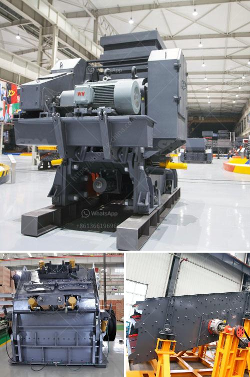

<h3>stone crusher supplier in tanzania</h3>
Stone crushers are widely used in the mining, construction and building material industries. Stone crushers are large machines that are typically used to crush or grind various types of rocks and stones into smaller, relatively uniform pieces. These machines are found in various sizes and capacities.

In Tanzania, stone crushers are widely used in the mining industry where they are used to crush hard stones into smaller pieces for further processing. Many stone crusher suppliers in Tanzania are involved in selling different types of crushers to mining industry clients. These suppliers understand the latest industry trends and possess the ability to provide superior-quality products.

In this article, we have shared information about the stone crusher supplier in Tanzania. Based on customer reviews, as well as industry insights, we highlight a few key suppliers who are known for their outstanding customer service and quality products.

With over 50 years of experience, Banks Engineering Works is a popular stone crusher supplier in Tanzania. They offer a wide variety of products, including hydraulic cone crushers, jaw crushers, impact crushers, vertical shaft impact crushers, vibrating screens, conveyor systems, and more.

Ashirwad Industries is well-known for its commitment to providing high-quality crushers to the mining industry in Tanzania. They offer a range of crushers, including cone crushers, impact crushers, jaw crushers, and mobile crushers. Ashirwad Industries also provides spare parts and after-sales services to their customers.

Jagdish Industries is a leading stone crusher supplier, known for its exceptional product quality and customer-centric approach. They offer a wide range of crushers, including cone crushers, jaw crushers, impact crushers, and vibrating screens. Jagdish Industries also provides installation, maintenance, and repair services to ensure the smooth operation of their crushers.

When choosing a stone crusher supplier in Tanzania, it is essential to consider factors such as product quality, after-sales service, and cost-effectiveness. By selecting a reliable and reputable supplier, you can ensure that you receive top-quality crushers to meet your mining industry needs. Additionally, a good supplier will offer prompt and efficient after-sales support, ensuring minimal downtime and enhanced productivity.

In summary, stone crushers are crucial in the mining industry to break down large stones into smaller pieces for further processing. With a wide range of suppliers available in Tanzania, it is essential to select one that offers superior-quality products, excellent customer service, and cost-effectiveness, ultimately helping you maximize your productivity and profitability.
<h3>Contact us</h3><ul><li><strong>Whatsapp:&nbsp;<a href="https://wa.me/8613661969651">+8613661969651</a></strong></li><li><a href="https://swt.shibang-china.com/?git&amp;zhl&amp;stone crusher supplier in tanzania"><strong>Online Service(chat now)</strong></a></li></ul><h3>Related</h3><ul><li><a href='desain mesin crusher tempurung kelapa.md'>desain mesin crusher tempurung kelapa</a></li><li><a href='india type cone crusher.md'>india type cone crusher</a></li><li><a href='standard ratio for cement sand building blocks.md'>standard ratio for cement sand building blocks</a></li><li><a href='coal dry wash project cost.md'>coal dry wash project cost</a></li><li><a href='mini crusher for sale in ireland.md'>mini crusher for sale in ireland</a></li></ul>