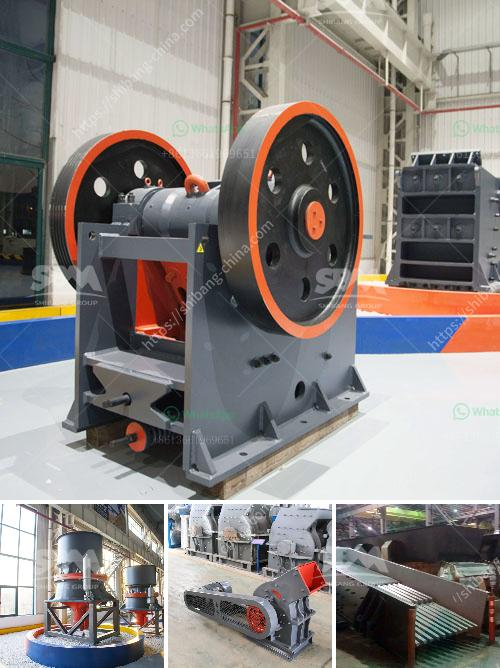

<h3>stone crusher user manual</h3>
The stone crusher user manual is an indispensable tool for owners of stone crushers and for contractors using these machines. The guide will provide you with comprehensive details on how to effectively operate, maintain, and service your stone crusher. The aim is to ensure efficient productivity and long-term reliability for your machine, thereby enhancing overall project outcomes.

Begin by providing a brief introduction to the stone crusher machine, its purpose, and functionality. Explain its main components, such as the hopper, crushing chamber, conveyor belts, and power source. This section should give users a basic understanding of the equipment before moving on to more detailed instructions.

This section provides step-by-step instructions on how to operate the stone crusher. Start with a safety checklist to ensure that all precautions are taken before starting the machine. Subsequently, describe key procedures including loading the material, engaging the power source, adjusting the settings, monitoring the crushing process, and shutting down the machine safely.

Highlight the importance of regular maintenance in maintaining optimal performance and prolonging the lifespan of the stone crusher. Discuss specific maintenance tasks such as lubrication, inspection of wear parts, tightening loose bolts, and cleaning or replacing filters. Emphasize the need for a maintenance schedule to prevent unexpected breakdowns and costly repairs.

Detail common issues that may arise during stone crusher operation and provide troubleshooting techniques to address them. These may include blockages, uneven crushing, excessive vibrations, or power-related problems. Outline step-by-step processes to remedy these issues, and when it is necessary to seek professional assistance.

Clearly outline the safety guidelines that must be followed when operating the stone crusher. These may include wearing appropriate protective gear, ensuring a safe working environment, and restricting access to unauthorized personnel. Emphasize the importance of training all personnel who will operate the machine to mitigate any risks and maximize safety.

The stone crusher user manual serves as a go-to reference for owners and operators using this equipment. By adhering to the guidelines provided, users can ensure minimal downtime and optimal crushing performance. Regular maintenance and thorough understanding of the stone crusher's operation will lead to enhanced productivity and project success.
<h3>Contact us</h3><ul><li><strong>Whatsapp:&nbsp;<a href="https://wa.me/8613661969651">+8613661969651</a></strong></li><li><a href="https://swt.shibang-china.com/?git&amp;zhl&amp;stone crusher user manual"><strong>Online Service(chat now)</strong></a></li></ul><h3>Related</h3><ul><li><a href='germany gypsum production line.md'>germany gypsum production line</a></li><li><a href='plant and machinery of quartz for sale in india.md'>plant and machinery of quartz for sale in india</a></li><li><a href='stone crusher machine price in kenya.md'>stone crusher machine price in kenya</a></li><li><a href='work method statement for jaw crusher.md'>work method statement for jaw crusher</a></li><li><a href='ball mill for size reduction.md'>ball mill for size reduction</a></li></ul>