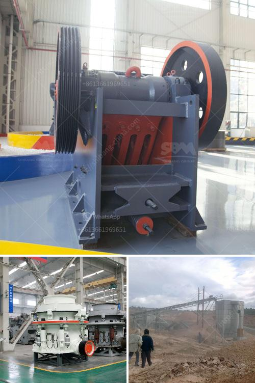

<h3>stone crusher youtube</h3>
In today's world, technology has advanced significantly, enabling us to access information and entertainment through various online platforms. YouTube, the popular video-sharing platform, has become a hub for content creators to share their knowledge and experiences with millions of viewers worldwide. One such topic that has gained traction on YouTube is the stone crusher machinery. In this article, we delve into the world of stone crushers on YouTube, highlighting their significance and impact.

YouTube has proven to be an excellent medium to educate individuals on the intricacies of stone crusher machinery. Creators on the platform often share instructional videos and tutorials that guide viewers from understanding the basics to mastering the operation of these powerful machines. By explaining the technological aspects, safe operation, and maintenance tips, creators contribute to the dissemination of knowledge in the field.

Videos on YouTube allow construction companies and enthusiasts to witness the crushing capabilities of various stone crusher machines in action. From colossal rocks being reduced to smaller, more manageable sizes to the precise shaping of stones for specific purposes, such videos empower viewers to witness the efficiency and power of these machinery firsthand.

YouTube channels dedicated to stone crushers also emphasize responsible usage and ethical practices. By promoting safety measures, following relevant regulations, and advocating for environmentally friendly methods, these creators aim to ensure that viewers adopt sustainable and responsible stone crushing practices.

YouTube serves as a platform where individuals can share their experiences and engage with a vibrant community interested in stone crusher machinery. Viewers have the opportunity to engage in discussions, ask questions, and seek advice from experts in the field. This interactive aspect of YouTube enhances the learning experience and fosters the growth of a supportive community.

As YouTube continues to evolve, its potential as an educational and entertainment platform grows exponentially. By embracing the world of stone crusher machinery on YouTube, creators have allowed viewers to gain knowledge, witness the power of these machines, and promote responsible usage. Whether it's exploring new techniques or seeking advice from experienced individuals, YouTube has become an essential resource for anyone interested in stone crushers.
<h3>Contact us</h3><ul><li><strong>Whatsapp:&nbsp;<a href="https://wa.me/8613661969651">+8613661969651</a></strong></li><li><a href="https://swt.shibang-china.com/?git&amp;zhl&amp;stone crusher youtube"><strong>Online Service(chat now)</strong></a></li></ul><h3>Related</h3><ul><li><a href='ball mill inside.md'>ball mill inside</a></li><li><a href='crusher stone for sale.md'>crusher stone for sale</a></li><li><a href='price of grinder machine in india.md'>price of grinder machine in india</a></li><li><a href='diamond screening plant for hire south africa.md'>diamond screening plant for hire south africa</a></li><li><a href='used coal power plant for sale.md'>used coal power plant for sale</a></li></ul>