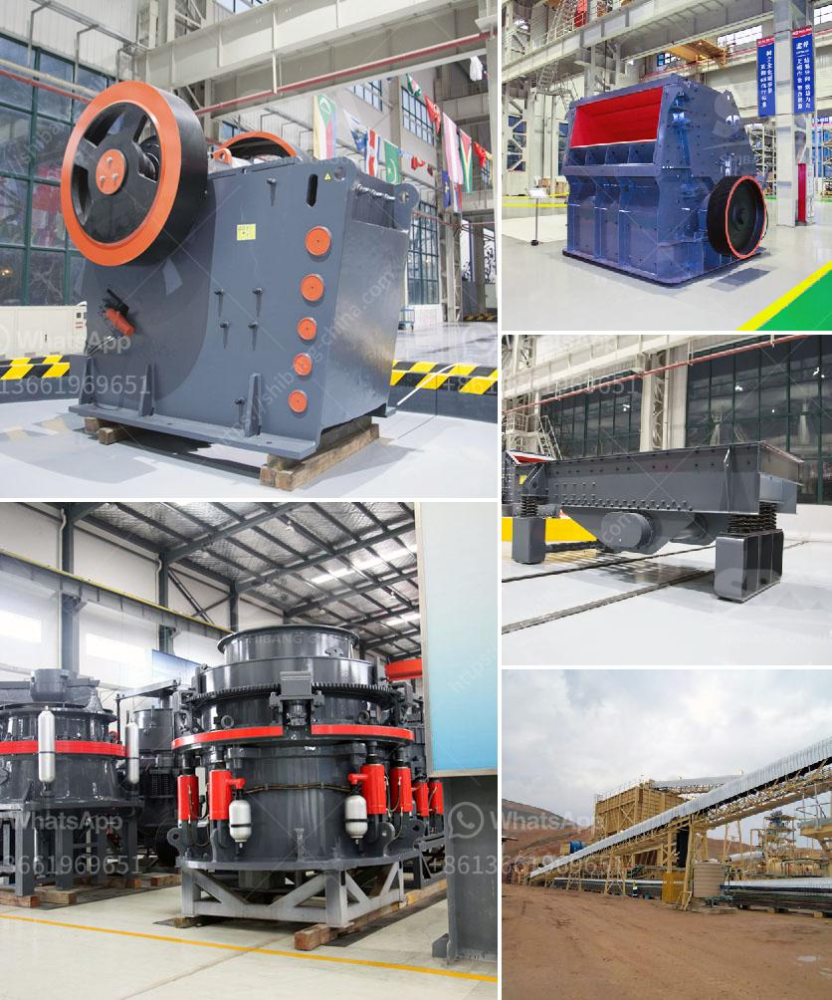

<h3>stone crushers china</h3>
Stone crushers are widely used machines in China's mining industry. In China, the industries that utilize crushers most extensively include metallurgy, mining, building material, transportation, energy, and chemical industries. Despite the rapid development of these industries, China's crushers are still in their early stages of development. However, China's stone crusher industry still faces challenges and opportunities.

China's stone crushers are mainly divided into three categories: jaw crushers, impact crushers, and cone crushers. Jaw crusher is the most common type of crusher, which is widely used in mining, metallurgy, building materials, roads, railways, water conservancy, and chemical industries. In addition, cone crusher is suitable for the crushing of various ores and rocks with medium hardness or above, and it is widely used in metallurgy, building materials, roads, railways, water conservancy, and chemical industries. Lastly, impact crusher is suitable for crushing ores and rocks with single rotor, which is widely used in highways, railways, electricity, water conservancy, cement, construction, refractories, coal and other industries.

China's stone crushers have a competitive advantage in price and quality in the international market. On the other hand, crushers produced in China's domestic market show significant quality differences compared with world-class crushers. Therefore, China's crusher manufacturers still have a lot of work to do to catch up with the world's advanced level.

In terms of environmental protection, China's stone crushers have always been in a state of non-compliance. In recent years, environmental pollution has become one of China's most serious problems. In order to solve this problem, China's government and enterprises actively introduce advanced technology and equipment to reduce pollution. Therefore, manufacturers of stone crushers are also trying to improve environmental protection, making the industry develop in a more environmentally friendly direction.

In conclusion, stone crushers in China still have a bright future. As the market demand increases, equipment efficiency improves, environmental protection awareness increases, and technology continues to innovate, China's stone crusher indust
<h3>Contact us</h3><ul><li><strong>Whatsapp:&nbsp;<a href="https://wa.me/8613661969651">+8613661969651</a></strong></li><li><a href="https://swt.shibang-china.com/?git&amp;zhl&amp;stone crushers china"><strong>Online Service(chat now)</strong></a></li></ul><h3>Related</h3><ul><li><a href='stone crusher coalaries.md'>stone crusher coalaries</a></li><li><a href='small jaw crusher for sale south africa.md'>small jaw crusher for sale south africa</a></li><li><a href='caco3 manufacturing process.md'>caco3 manufacturing process</a></li><li><a href='double toggle jaw crusher.md'>double toggle jaw crusher</a></li><li><a href='machine that crushes stones to ballast.md'>machine that crushes stones to ballast</a></li></ul>