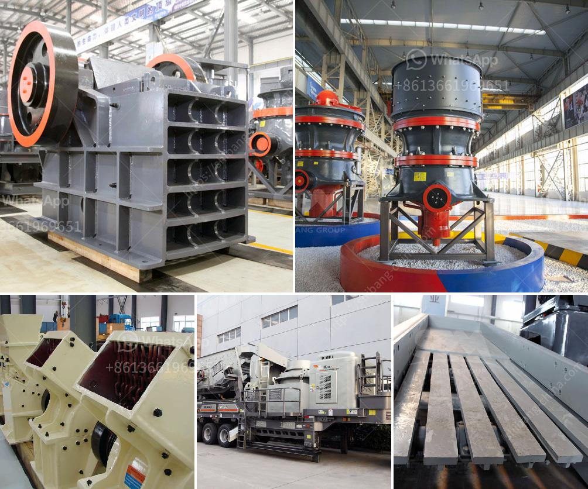

<h3>stone crushers company middle east</h3>
In recent years, the construction industry has been flourishing in the Middle East, especially in countries such as Turkey, Saudi Arabia, UAE, Oman, Qatar, and Jordan. With the rapid development of infrastructure projects, the demand for construction materials like aggregate, sand, cement, and gravel has increased significantly. This has led to a rise in the demand for stone crushers across the region.

Stone crushers are a fundamental part of the construction industry, as they help to process raw materials into a usable form for construction purposes. These machines can be either mobile or stationary crushers. They are designed for easy transportation, allowing them to be quickly moved from one location to another, as per the needs of the construction project.

One of the leading stone crushers in the Middle East, Al Ziad International Factory for Metal Crusher, is expanding its facilities and has signed an agreement with the UAE-based National Quarries LLC for the supply of high-quality aggregates to its sister company. They will be used in Al Ziad's own crushers, which have been designed to provide an efficient production rate and crushing performance, with reduced maintenance requirements.

The stone crushers company Middle East is using the latest technology and techniques to increase productivity & enhance operational efficiency, reduce costs, and improve safety standards. Al Ziad's extensive range of equipment includes crushers, conveyors, and screeners. Each machine is built to handle a wide range of materials, ensuring efficient crushing performance in various applications.

The stone crushers provided by Al Ziad are highly durable and robust, suitable for the harshest conditions in the Middle East. They are manufactured using high-quality materials and components, ensuring long-lasting performance and reliability. Furthermore, the machines are designed to minimize environmental impact, with a focus on reducing dust emissions and noise levels.

Al Ziad's stone crushers are widely used in various construction projects, including infrastructure, highways, buildings, and bridges. They are capable of processing a wide range of materials, including limestone, granite, marble, basalt, and river gravel. These crushers can crush the material to different sizes, depending on the specific requirements of the construction project.

Furthermore, Al Ziad provides comprehensive after-sales service and support to its customers, ensuring continuous productivity and minimal downtime. Their team of highly skilled technicians is available to provide maintenance, repair, and spare parts replacement whenever required. This ensures that the stone crushers operate smoothly and efficiently, even after prolonged use.

In conclusion, stone crushers have become an essential requirement in the Middle East construction industry. Al Ziad's stone crushers have proven to be effective and reliable, enabling construction companies to benefit from increased productivity and reduced costs. With their advanced technology and commitment to customer satisfaction, Al Ziad is set to continue being a prominent player in the stone crushers market in the Middle East.
<h3>Contact us</h3><ul><li><strong>Whatsapp:&nbsp;<a href="https://wa.me/8613661969651">+8613661969651</a></strong></li><li><a href="https://swt.shibang-china.com/?git&amp;zhl&amp;stone crushers company middle east"><strong>Online Service(chat now)</strong></a></li></ul><h3>Related</h3><ul><li><a href='stone crusher machine sale nederland.md'>stone crusher machine sale nederland</a></li><li><a href='ball mill in egypt.md'>ball mill in egypt</a></li><li><a href='stone crushers in bangalore.md'>stone crushers in bangalore</a></li><li><a href='conveyor belts in opracion.md'>conveyor belts in opracion</a></li><li><a href='grinding mill machine price in namibia.md'>grinding mill machine price in namibia</a></li></ul>