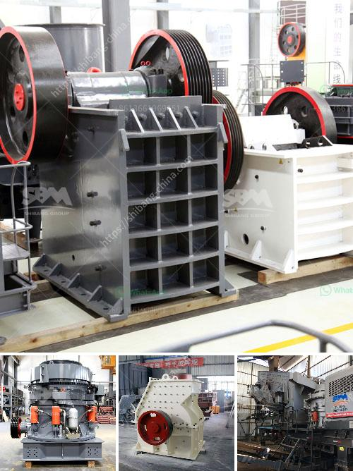

<h3>stone crushers for sale in riyadh</h3>
Stone crushers are essential crushing equipment in mining and stone quarry site. In stone quarry, stone crushers are used to crush stones into small particle size or change the form such as basalt, granite, limestone, quartz, marble, for building aggregates, artificial sand production and recycle building waste materials such as debris, asphaltic cement concrete.

In Riyadh, stone crushers can be found almost everywhere in every corner of the city. The supreme importance of stone crushers is self-evident. They play a vital role in enhancing the efficiency of construction projects in the city. The availability of high-quality and durable stone crushers makes it easier for contractors and builders to achieve their objectives efficiently.

One of the prominent factors contributing to the increasing popularity of stone crushers for sale in Riyadh is the advanced technology and machinery used for crushing rocks and stones. The machines are designed to withstand the harshest conditions and toughest rock. With the ability to process materials efficiently, stone crushers ensure high productivity and maximum output in a short span of time.

Moreover, stone crushers for sale in Riyadh are available in different models, which allows customers to choose the right size and capacity according to their specific requirements. Whether it's a small construction site or a large infrastructure project, there is a stone crusher suitable for every need.

Besides their advanced functionality, stone crushers for sale in Riyadh are also known for their relatively low maintenance and operational costs. High-quality materials used in their construction further contribute to their long lifespan and durability. This means that purchasers can save money in the long run, ensuring a great return on investment.

As the construction industry in Riyadh continues to flourish, the demand for stone crushers will only increase. To meet this growing demand, local suppliers and manufacturers are constantly introducing new and improved models, keeping the market dynamic and competitive.

In a nutshell, stone crushers for sale in Riyadh have proven to be an essential asset in the construction industry. With their robust design, advanced technology, and relative affordability, stone crushers are invaluable for enhancing productivity and achieving high-quality construction results.
<h3>Contact us</h3><ul><li><strong>Whatsapp:&nbsp;<a href="https://wa.me/8613661969651">+8613661969651</a></strong></li><li><a href="https://swt.shibang-china.com/?git&amp;zhl&amp;stone crushers for sale in riyadh"><strong>Online Service(chat now)</strong></a></li></ul><h3>Related</h3><ul><li><a href='mobile crushing and screening to hire south africa.md'>mobile crushing and screening to hire south africa</a></li><li><a href='gypsum powder industry basic machines.md'>gypsum powder industry basic machines</a></li><li><a href='gypsum powder manufacturing plant price.md'>gypsum powder manufacturing plant price</a></li><li><a href='fly ash processing plant machinery.md'>fly ash processing plant machinery</a></li><li><a href='used coal power plant for sale.md'>used coal power plant for sale</a></li></ul>