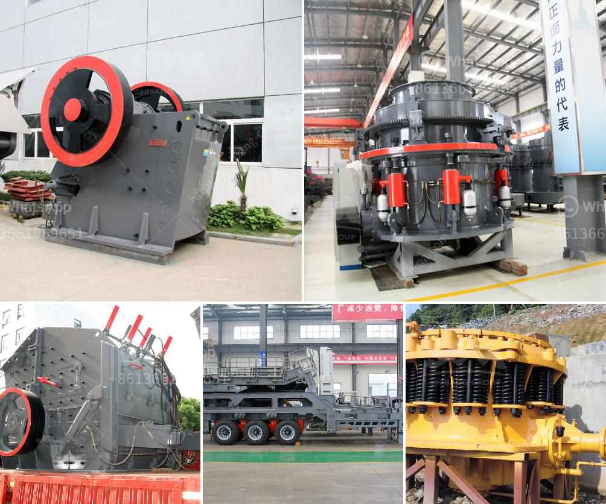

<h3>stone crushers for sale in uk</h3>
Stone crushing is an important industry in the UK, especially in the construction sector. Increase in the demand for stone materials for highways, railways, and buildings has led to the rise in the number of stone crushers for sale in the UK market.

To cater to the increasing demand for stone materials, manufacturers have made advancements in the designs and specifications of the crushers. They are now available in various models and sizes to suit different requirements. These crushers are primarily used for reducing the size of stones and rocks to granules or dust for various construction purposes.

One of the main types of crushers available in the market is called a jaw crusher. It utilizes compressive force to break down larger rocks into smaller materials. The jaw crusher consists of a fixed jaw and a moving jaw, which simulate the movement of animal jaws. The moving jaw moves periodically towards the fixed jaw, causing compression on the materials, which eventually leads to their breaking apart. Jaw crushers are known for their high production efficiency and low operating costs.

Another popular type of stone crusher is an impact crusher, which uses a high-speed rotating rotor with striking hammers to hit and break the rocks. The crushed materials are thrown against a series of anvils, which further break them down into smaller pieces. Impact crushers are particularly useful for producing a uniform shape and size of crushed materials.

Cone crushers are also commonly used in the stone crushing industry. They operate by squeezing the material between an eccentrically rotating mantle and a concave surface to produce a finer product. Cone crushers are suitable for crushing various types of ores and rocks with medium hardness and above.

When purchasing a stone crusher, there are several factors to consider, such as the size and hardness of the stones, the desired output, and the budget. It is essential to choose a reliable manufacturer or supplier who offers quality machines at reasonable prices. Additionally, it is important to ensure that the crusher comes with proper documentation, certifications, and warranty to safeguard the investment.

In the UK, there are several reputable manufacturers and suppliers of stone crushers. They provide an extensive range of crushers that cater to different needs and budgets. These crushers are backed by excellent after-sales service and technical support, ensuring smooth and trouble-free operation.

Many stone crushers for sale in the UK can be found on online platforms, such as MachineryTrader.com and Alibaba.com. You can choose from a variety of models and specifications, depending on your needs. It is recommended to go through customer reviews and ratings before making a final purchase decision.

In conclusion, stone crushers for sale in the UK play a crucial role in the construction industry. They are used to break down rocks and stones into smaller materials for various construction purposes. With advancements in technology, there are now different types of crushers available, offering high efficiency and low operating costs. To make an informed purchase, consider factors such as the type of crusher, desired output, and budget. With numerous reputable manufacturers and suppliers in the UK, finding the right crusher has never been easier.
<h3>Contact us</h3><ul><li><strong>Whatsapp:&nbsp;<a href="https://wa.me/8613661969651">+8613661969651</a></strong></li><li><a href="https://swt.shibang-china.com/?git&amp;zhl&amp;stone crushers for sale in uk"><strong>Online Service(chat now)</strong></a></li></ul><h3>Related</h3><ul><li><a href='grinding mills for ore.md'>grinding mills for ore</a></li><li><a href='harga stone crusher kapasitas 200 ton jam.md'>harga stone crusher kapasitas 200 ton jam</a></li><li><a href='used crushers for sale nigeria.md'>used crushers for sale nigeria</a></li><li><a href='conveyor belt for crusher china.md'>conveyor belt for crusher china</a></li><li><a href='grinding plant material gold.md'>grinding plant material gold</a></li></ul>