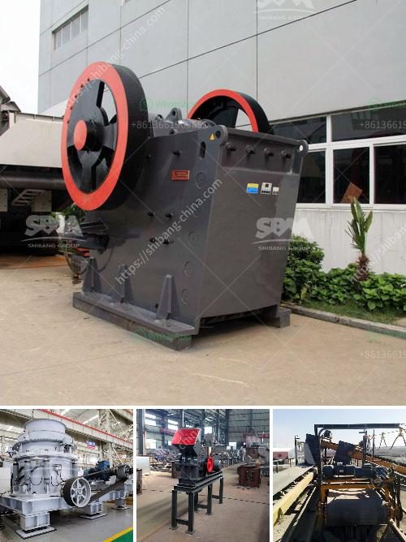

<h3>stone crushers for sale</h3>
Stone crushers are a fundamental part of the mining and quarrying industry, as they crush massive stones into smaller, more manageable sizes for different uses. These machines come in different forms, and their functions vary depending on the requirements of the end-user. The stone crusher market is booming, and millions of tonnes of stones are being crushed annually, to meet the growing demand for infrastructure development.

A stone crusher for sale is primarily used for reducing various kinds of stones and lump materials into smaller sizes for further application. The stone crusher is composed of several parts, such as a feeder, a distributor, a base, a transmission device, and a motor. It is known to break huge rocks into smaller stones or gravel. Its main function is to reduce the size of the stones or gravel to the desired size for further use.

Stone crushers come with different specifications and their performance depends on the type of stones and the production capacities required. The primary factors influencing the selection of a stone crusher include the type of rock, hardness, size, and the amount of material to be crushed. Additionally, the required processing rate, size distribution of the crushed product, and the specifications for the end product also play a significant role in determining the type of stone crusher to purchase.

Some stone crushers are mobile and can crush rocks as large as 1.5 meters, while others are stationary and only able to crush rocks into smaller pieces. Crushers can be classified into primary, secondary, and tertiary crushers based on their feed size and the desired final product. These different types of crushers are designed to handle different capacities and sizes of raw materials.

Several factors need to be considered when purchasing a stone crusher. The first factor is the price of the machine. A stone crusher for sale can be expensive, so it is important to consider accessibility, portability, and ease of transportation. With a variety of stone crushers available in the market, owners and operators can choose the most suitable one depending on their needs.

Another important factor to consider is the type of stone that will be crushed. Different stones have different hardness levels, which affect how the stones should be crushed. For instance, soft rocks like limestone are easier to crush, while hard and abrasive rocks like granite require more specialized equipment. It is important to choose a stone crusher with the appropriate crushing method to ensure efficient and effective operation.

Maintenance is also a critical aspect and should not be overlooked when purchasing a stone crusher. Regular maintenance and servicing of the crusher will prolong its lifespan and provide optimum performance. It is advisable to purchase a stone crusher from a reputable manufacturer that offers training, technical support, and spare parts availability.

In conclusion, stone crushers are essential equipment in mining and construction industries. The stone crusher market is competitive and the machines are widely sold worldwide. As a result, for the buyer, it is crucial to choose the correct model for their needs and invest wisely to ensure maximum productivity and return on investment.
<h3>Contact us</h3><ul><li><strong>Whatsapp:&nbsp;<a href="https://wa.me/8613661969651">+8613661969651</a></strong></li><li><a href="https://swt.shibang-china.com/?git&amp;zhl&amp;stone crushers for sale"><strong>Online Service(chat now)</strong></a></li></ul><h3>Related</h3><ul><li><a href='slag crushing machinery supplier from india.md'>slag crushing machinery supplier from india</a></li><li><a href='quarry crusher quartz.md'>quarry crusher quartz</a></li><li><a href='model pe 250 400 bantalan jaw crusher.md'>model pe 250 400 bantalan jaw crusher</a></li><li><a href='quartz stone lining machinery.md'>quartz stone lining machinery</a></li><li><a href='crusher for granite.md'>crusher for granite</a></li></ul>