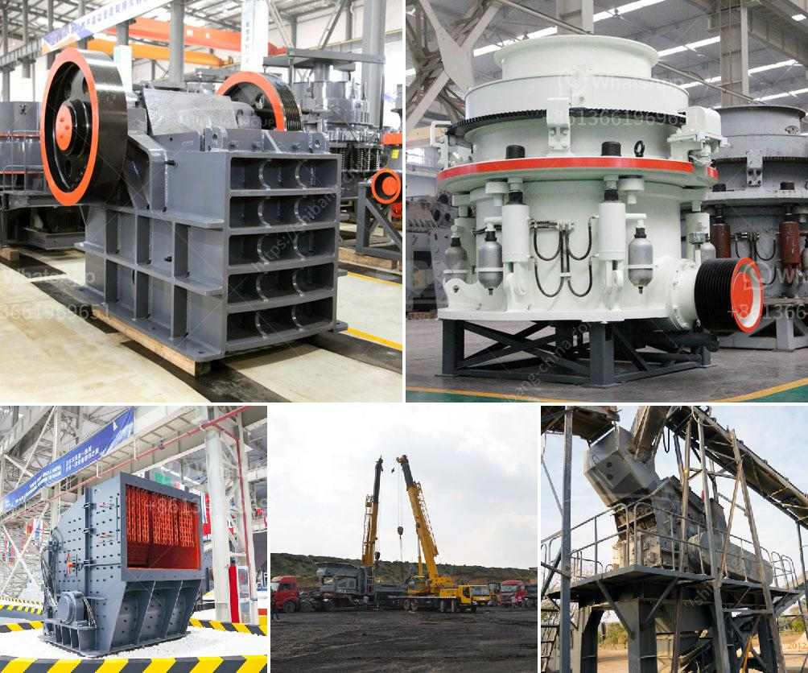

<h3>stone crushers in bangalore</h3>
Bangalore, the capital of Karnataka, is home to numerous stone crushers. These machines have been prevalent in the mining and construction industry for decades now, especially in the developing countries like India. Stone crusher manufacturers in Bangalore still maintain strong global ties with other stone crushing units in other parts of India.

As a mining and construction machine manufacturer, SBM adheres to the highest industry standards and quality. We ensure that everything we deliver meets all the local safety norms and regulations. Our stone crushing machines are durable, robust, and efficient. They are designed to address all the necessary requirements and specifications needed for any mining or construction project. 

In Bangalore, there are many stone crushing units and often they are spread across the entire length and breadth of the city, making transportation quite an expensive affair. As the transportation in Bangalore is fast and reliable, one can easily get crushed stones to their construction sites within no time. This is advantageous for the builders and developers as the stones are required in large quantities and have to be consistently supplied in order to meet construction deadlines.

While there are many stone crushers in Bangalore, we undertake the process of delivering high-quality crushed stones to the customers. Our stone crushers are designed to achieve larger productivity and higher crushing ratio. We have jaw crushers, impact crushers, cone crushers, sand makers and so on. They can meet various production needs through free combinations.

The standardized, standardized, and high-quality production line can meet the diversified needs of customers. Sale, manufacture, installation, and maintenance of stone crushers and crushing plants are our expertise. We are able to design, manufacture, install, and maintain stone crushing plants for various purposes such as infrastructure projects, road construction, bridge construction, airport construction, and mining.

In Bangalore, stone crushers are widely used in the mining industry as recycling equipment for construction materials and rarely used in demolition sites for crushing concrete and bricks. Using the same crushing process, these devices can be used for grinding limestone, granite, quartz, river pebble, silica, pebble, coal, etc.

This article mainly introduces the main working principle of the four crushers, damage causes of vulnerable parts and related solutions. Jaw crusher, Impact crusher, Cone crusher and VSI crusher are in the Bangalore market. We undertake the entire process of designing, manufacturing, installation, and commissioning of these crushers. The state-of-the-art manufacturing facility at SBM ensures that every crusher is designed and manufactured with a high level of quality. The crushers play an important role in the processes that enable the recovery and reuse of raw materials.

In conclusion, stone crushers are essential equipment in Bangalore. They are responsible for crushing large rocks into smaller ones so that they can be used for various purposes. Also, these crushers are known for their high productivity and efficiency. Thus, they are an important piece of machinery for any construction or mining project. With the existence of various stone crushers in Bangalore, one can choose the one that suits their requirements the best.
<h3>Contact us</h3><ul><li><strong>Whatsapp:&nbsp;<a href="https://wa.me/8613661969651">+8613661969651</a></strong></li><li><a href="https://swt.shibang-china.com/?git&amp;zhl&amp;stone crushers in bangalore"><strong>Online Service(chat now)</strong></a></li></ul><h3>Related</h3><ul><li><a href='rock crusher rock crusher.md'>rock crusher rock crusher</a></li><li><a href='vibrating feeders operating parameters from zenith china.md'>vibrating feeders operating parameters from zenith china</a></li><li><a href='gypsum processing machine price list.md'>gypsum processing machine price list</a></li><li><a href='iron crushing plant for sale.md'>iron crushing plant for sale</a></li><li><a href='stone crushing feasibility study.md'>stone crushing feasibility study</a></li></ul>