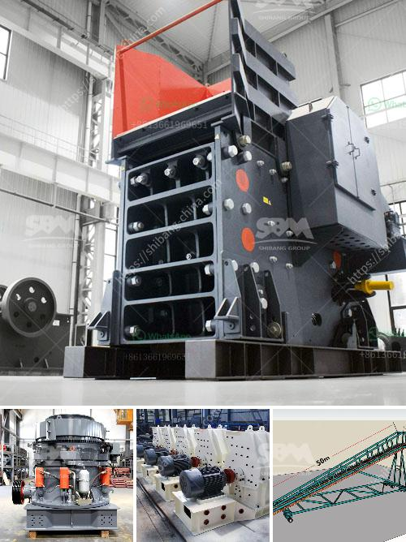

<h3>stone crushers nigeria</h3>
With the increasing population and energy demands, the need for construction materials like gravel, sand, and rock aggregates is on the rise. Nigeria has abundant natural resources, but stone deposits, particularly granite rocks, have been largely untapped. This has resulted in huge demand for these materials and the need for efficient stone crushers that can turn large rocks into smaller stones, sand, or gravel.

Stone crushers are essential machines in the construction and mining industries. They help break large rocks into smaller manageable sizes, helping to produce aggregate for use in a variety of applications. The excessive use of explosives and manual drilling techniques in the past often resulted in damaged or unusable rocks, but today, modern stone crushers have revolutionized the industry.

Stone crushers in Nigeria can be categorized into three types based on their crushing capabilities. Impact crushers: These crushers can break rocks at various sizes and produce fine rock particles for road construction and civil engineering purposes. Cone crushers: These crushers are commonly used for secondary crushing (although impact crushers are sometimes preferred) and are ideal for producing crushed rock aggregates for concrete and asphalt. Jaw crushers: These crushers are popular for their versatility and can handle almost any type of material, including hard abrasive stones and recycled concrete.

The benefits of stone crushers in Nigeria are numerous, as they help in reducing large rocks into smaller aggregate sizes. They are ideal for producing large quantities of crushed stone for new road and infrastructure projects, as well as for creating a foundation for future roads. Moreover, stone crushers are increasingly being used in the recycling of construction waste, helping to turn rubble into usable materials for new projects.

In conclusion, Nigeria’s stone crushers play a crucial role in the country's economic development. They offer flexible crushing solutions, making them popular among customers in the construction and mining industries. Whether it's limestone, granite, or any other material, stone crushers efficiently break down rocks into smaller sizes that can be used for various purposes. With the increasing demand for construction materials, the stone crushing industry in Nigeria will continue to thrive and create wealth for its stakeholders.
<h3>Contact us</h3><ul><li><strong>Whatsapp:&nbsp;<a href="https://wa.me/8613661969651">+8613661969651</a></strong></li><li><a href="https://swt.shibang-china.com/?git&amp;zhl&amp;stone crushers nigeria"><strong>Online Service(chat now)</strong></a></li></ul><h3>Related</h3><ul><li><a href='alluvial gold washing plant in zimbabwe.md'>alluvial gold washing plant in zimbabwe</a></li><li><a href='mobile crusher made in turkey.md'>mobile crusher made in turkey</a></li><li><a href='stone crusher manufacturers in ranchi.md'>stone crusher manufacturers in ranchi</a></li><li><a href='double toggle jaw crusher.md'>double toggle jaw crusher</a></li><li><a href='working machine of a stone crusher.md'>working machine of a stone crusher</a></li></ul>