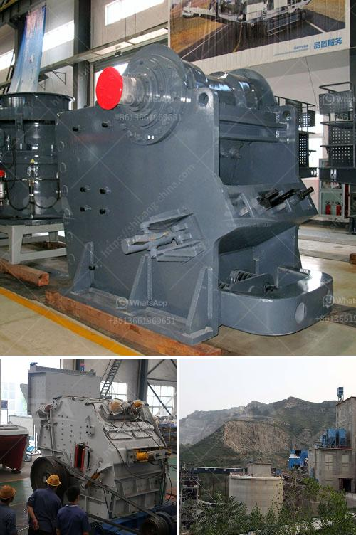

<h3>stone crushets for sale south aftica</h3>
Stone crushers are essential crushing equipment in mining and construction industries. The rapid development in South Africa and its surrounding regions has resulted in increased demand for this machinery. Stone crushers are used to crush large rocks and stones into smaller sizes for construction purposes or to create gravel for landscaping. With the growing demand for stone crushers, there are several manufacturers and sellers offering a wide range of stone crushers for sale in South Africa.

South Africa is rich in mineral resources, making it an ideal place to invest in mining and construction equipment. There is a vast range of crushers available in the market, catering to different applications such as primary crushing, secondary crushing, tertiary crushing, and even quaternary crushing. Each type of crusher is designed to handle a specific size range and hardness of materials.

One of the popular types of stone crushers in South Africa is jaw crushers. These crushers basically consist of a fixed and a movable jaw plate. The materials are crushed between these two plates, and the movable jaw moves back and forth to crush the stones. Jaw crushers are commonly used in the primary crushing stage and are ideal for applications where the input material is relatively large.

Another type of stone crusher commonly used in South Africa is cone crushers. These crushers operate by compressing the material between a moving cone and a fixed cone. The crushed material falls through the bottom opening and is discharged into a product conveyor. Cone crushers are particularly suitable for secondary and tertiary crushing stages, producing a high-quality end product.

In addition to jaw crushers and cone crushers, there are also impact crushers available in the market. These crushers use impact rather than pressure to crush the material. They are known for their high reduction ratios and can produce uniform and well-graded end products. Impact crushers are commonly used for soft and medium-hard materials.

When searching for stone crushers for sale in South Africa, it is important to choose a reputable seller or manufacturer. Consider factors such as the quality of the equipment, after-sales service, and warranty period. It is also beneficial to compare prices and features offered by different sellers to make an informed decision.

In conclusion, stone crushers play a crucial role in the mining and construction industry in South Africa. They are used to crush rocks and stones into smaller sizes, making them suitable for various applications. When considering stone crushers for sale, it is important to choose reliable sellers or manufacturers offering high-quality equipment. Whether it is a jaw crusher, cone crusher, or impact crusher, each type has its own advantages and suitability for different crushing needs. By investing in the right stone crusher, businesses can enhance their productivity and meet the demands of the rapidly growing construction sector in South Africa.
<h3>Contact us</h3><ul><li><strong>Whatsapp:&nbsp;<a href="https://wa.me/8613661969651">+8613661969651</a></strong></li><li><a href="https://swt.shibang-china.com/?git&amp;zhl&amp;stone crushets for sale south aftica"><strong>Online Service(chat now)</strong></a></li></ul><h3>Related</h3><ul><li><a href='fine grinding mill.md'>fine grinding mill</a></li><li><a href='quarry crusher quartz.md'>quarry crusher quartz</a></li><li><a href='gypsum grinding machine manufacturer in india.md'>gypsum grinding machine manufacturer in india</a></li><li><a href='precipitated calcium carbonate manufacturing machinery.md'>precipitated calcium carbonate manufacturing machinery</a></li><li><a href='gypsum crushing making machine south africa.md'>gypsum crushing making machine south africa</a></li></ul>