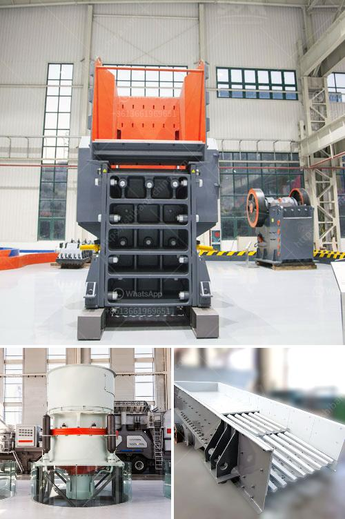

<h3>stone crushing feasibility study</h3>
Stone crushing feasibility study is the detailed study of the possibility of crushing stone materials to produce different sizes of crushed stones and aggregates, which are used as raw material for various construction purposes. This feasibility study aims at providing an objective evaluation and recommendation on the financial, technical, and economic viability of setting up a stone crushing plant.

The study explores two main aspects: the technical aspect and the economic aspect. In terms of the technical aspect, the study examines the methods and processes involved in crushing stones, including the equipment used, the crushing process, and the desired end product. It also considers the availability of raw materials, the capacity and efficiency of the crushing plant, and the environmental concerns related to the operation.

The economic aspect of the study focuses on analyzing the financial feasibility of the project. It involves evaluating the total investment required for setting up the stone crushing plant, estimating the production and operating costs, and determining the expected revenue and profits. This assessment also includes an analysis of the market demand and competition, as well as the potential risks and challenges that may affect the profitability of the project.

The feasibility study begins with a detailed market analysis to assess the demand for crushed stones in the local and regional markets. This helps in gauging the potential sales volume and market share that the project can achieve. The study also examines the prices and trends in the stone crushing industry to determine the competitiveness of the project.

Next, the study analyzes the cost of acquiring and installing the required equipment for the stone crushing plant. This includes the cost of machinery, such as crushers, screens, and conveyors, as well as the cost of setting up the infrastructure, such as access roads, power supply, and water source. Additionally, the study considers the labor costs, maintenance expenses, and other operational costs associated with the crushing plant.

Based on these technical and economic analyses, the feasibility study provides recommendations on the financial viability of the stone crushing project. It includes a detailed financial model that estimates the project's cash flow, profitability, and return on investment. The study also identifies the critical success factors and strategies that can help maximize the project's profitability, such as efficient operations, effective marketing, and optimal resource utilization.

In conclusion, a stone crushing feasibility study is essential for investigating the feasibility of the potential project and providing valuable insights for decision-making. It assesses the technical and economic aspects of setting up a stone crushing plant and provides recommendations on its viability. With a well-executed feasibility study, investors and developers can make informed decisions and mitigate risks associated with stone crushing projects.
<h3>Contact us</h3><ul><li><strong>Whatsapp:&nbsp;<a href="https://wa.me/8613661969651">+8613661969651</a></strong></li><li><a href="https://swt.shibang-china.com/?git&amp;zhl&amp;stone crushing feasibility study"><strong>Online Service(chat now)</strong></a></li></ul><h3>Related</h3><ul><li><a href='zinc ore suppliers in south africa.md'>zinc ore suppliers in south africa</a></li><li><a href='cost sand dryer in keralan.md'>cost sand dryer in keralan</a></li><li><a href='ton per hour hammer mill grinding mill china.md'>ton per hour hammer mill grinding mill china</a></li><li><a href='precipitated calcium carbonate plant in bangladesh.md'>precipitated calcium carbonate plant in bangladesh</a></li><li><a href='crusher for sale in sri lanka.md'>crusher for sale in sri lanka</a></li></ul>