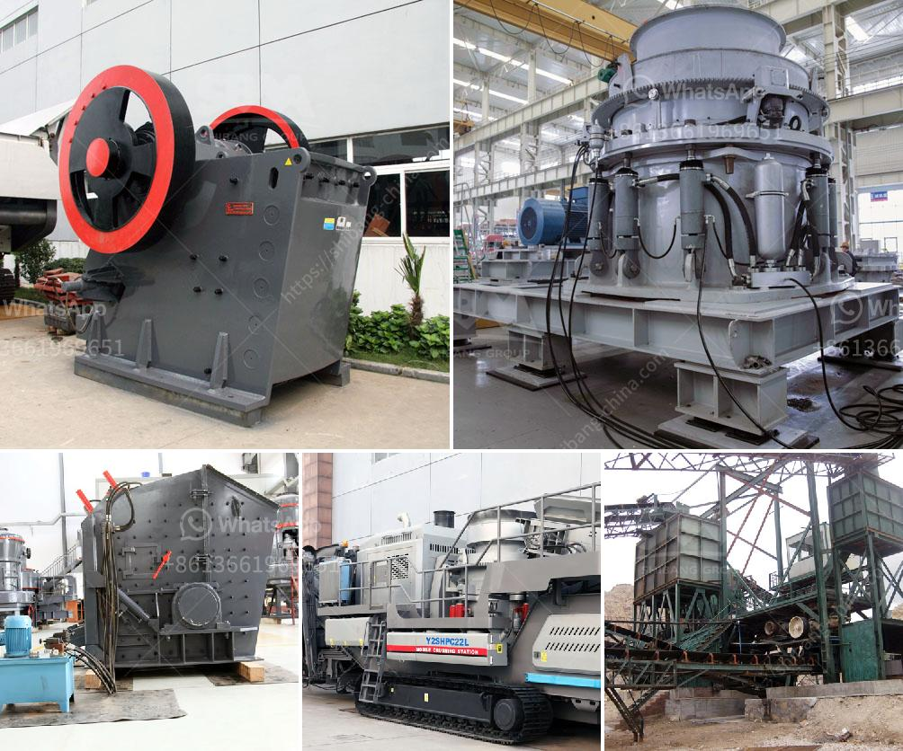

<h3>stone crushing machine for sale in uganda</h3>
Stone crushing machine is used to crush large-sized rocks into fragments by the ways of extruding, splitting, bending, impacting and rolling. Commonly used stone crushing machines are stone jaw crusher, stone cone crusher, hammer stone crusher, roll stone crusher and stone impact crusher, etc. Stone crushing machine features large crushing rate, high yield, equal product size, simple structure, reliable operation and easy maintenance, economic operating costs etc. According to different principles and functions of various equipment, the stone crushing machine is divided into several types including jaw crusher, cone crusher, hammer crusher, impact crusher, and so on.

In Uganda, there are a lot of minerals such as gold, tin, iron, copper, tungsten, stone and many other high-grade precious stones. Uganda is a country with excellent natural environments and mineral resources, and stone crushing machines have been widely used in Uganda. The exact processing technologies of stone crushing machines are often applied in many components of the object.

Mining industries in Uganda are important to the country's economy. With the increasing pace of economic development and infrastructure construction, the demand for stone crushing machines is also growing rapidly, especially for infrastructure construction. Stone crushing machines have had better development chances in Uganda, because of the increasing infrastructure demands.

To meet the developing needs of Uganda's infrastructure construction, the stone crusher machines for sale in Uganda are divided into several types -- single toggle jaw crusher, cone crusher, impact crusher and hammer mill crusher. The stone crushing machinery in Uganda is used for various fields, such as mining, construction, cement industry, metallurgy, and so on. It has advantages of high crushing efficiency, safety and environmental protection, and has been used in many countries.

The quality of stone crushing machines in Uganda can be guaranteed. As a professional manufacturer of mining machinery and equipment, Great Wall Heavy Industry has been adhering to the scientific management mode, advanced manufacturing technology, and innovative concept in the field of mining machinery to transform the traditional mining crushing technology and optimize the production layout, making the mining industry greener and more energy-saving.

The sale of stone crushing machines in Uganda is always popular around the world. The stone crushing machines produced by our company are manufactured using high-quality raw materials and advanced manufacturing technology. Our machines have passed ISO9001: 2000 certification and CE certification. Our products are exportable to various countries, such as Uganda, Tanzania, Kenya, Ethiopia, Nigeria, South Africa, Egypt, etc.

In conclusion, stone crushing machines in Uganda are versatile and have a wide range of applications. With the increasing efforts of infrastructure construction in Uganda, the demand for stone crushing machines is booming, which provides a huge opportunity for investment and development of stone crushing machine manufacturers in Uganda. Great Wall Heavy Industry is one of the leading stone crushing machine manufacturers in Uganda, providing high-quality and energy-saving crushing equipment.
<h3>Contact us</h3><ul><li><strong>Whatsapp:&nbsp;<a href="https://wa.me/8613661969651">+8613661969651</a></strong></li><li><a href="https://swt.shibang-china.com/?git&amp;zhl&amp;stone crushing machine for sale in uganda"><strong>Online Service(chat now)</strong></a></li></ul><h3>Related</h3><ul><li><a href='coal washing plant design.md'>coal washing plant design</a></li><li><a href='south africa coal mining cost per ton.md'>south africa coal mining cost per ton</a></li><li><a href='iron ore concentrate prices.md'>iron ore concentrate prices</a></li><li><a href='sell jaw crusher for turkey.md'>sell jaw crusher for turkey</a></li><li><a href='rock pulverizer for manufacturing.md'>rock pulverizer for manufacturing</a></li></ul>