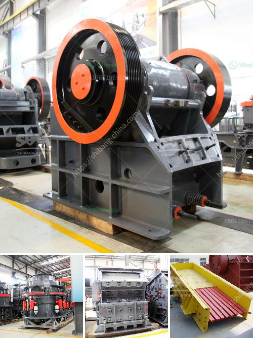

<h3>stone crushing machine manufacturer in japan</h3>
Stone crushing machines have been widely used in the mining industry for decades now. With the depletion of natural resources and the increasing demand for stone materials, the need for crushing machines is growing. To cater to this need, Japan has developed a range of crushing machines that fulfills almost all types of requirements.

Stone crushing machines in japan are ideal for small-scale mining operations as they are not only efficient and high-quality but also the most economical and reliable methods of reducing the size of rock and ore. Technological advancements have made crushing machines quite safe to use and equipped with a range of safety mechanisms to prevent accidents. These machines are highly productive and do not demand much labor.

Japanese crushing machine manufacturers have been working in collaboration with international partners to provide high-quality crushing machines that meet the needs of the mining industry. Some prominent manufacturers in Japan also offer new and advanced stone crushing machines for various industries such as metallurgy, mining, building materials, chemicals, and environmental protection.

One of the leading stone crushing machine manufacturers in Japan is Shinde Stone Co., Ltd. Based in Nagoya, this company is specialized in creating rock crushers for various purposes and industries. They have machines that reduce the size of large rocks to smaller rocks or even to gravel or dust. These machines are highly efficient and can produce the desired output in a short period of time.

Shinde Stone Co., Ltd's crushing machines are known for their innovative design and features. They use advanced technology and high-quality materials to manufacture these machines, making them durable and reliable. The company also provides after-sales services such as installation and maintenance, ensuring that their customers have a hassle-free experience.

Another noteworthy stone crushing machine manufacturer in Japan is the Crushco. Based in Osaka, this company manufactures a wide range of crushers for mining and related industries. They are also known for their advanced technology and innovative design, which helps them produce efficient machines that require less power and produce minimal noise and dust.

The stone crushing machines manufactured by these companies are not only efficient but also environmentally friendly. They are designed to minimize the environmental impact by reducing noise and dust emissions. These manufacturers understand the importance of sustainable development and strive to provide machines that are both efficient and eco-friendly.

In conclusion, stone crushing machines manufactured in Japan are highly efficient and reliable. They are designed to cater to the needs of various industries, including mining, metallurgy, building materials, chemicals, and environmental protection. These machines are safe to use, economically viable, and environmentally friendly. With the advancements in technology, these manufacturers continue to innovate and create more advanced stone crushing machines that meet the ever-evolving demands of the industry.
<h3>Contact us</h3><ul><li><strong>Whatsapp:&nbsp;<a href="https://wa.me/8613661969651">+8613661969651</a></strong></li><li><a href="https://swt.shibang-china.com/?git&amp;zhl&amp;stone crushing machine manufacturer in japan"><strong>Online Service(chat now)</strong></a></li></ul><h3>Related</h3><ul><li><a href='equipos para triturado de mineria.md'>equipos para triturado de mineria</a></li><li><a href='fine powder grinders 30 50 microns.md'>fine powder grinders 30 50 microns</a></li><li><a href='small rock crusher machine in india.md'>small rock crusher machine in india</a></li><li><a href='kenya mobile crusher.md'>kenya mobile crusher</a></li><li><a href='granular barite production process flow.md'>granular barite production process flow</a></li></ul>