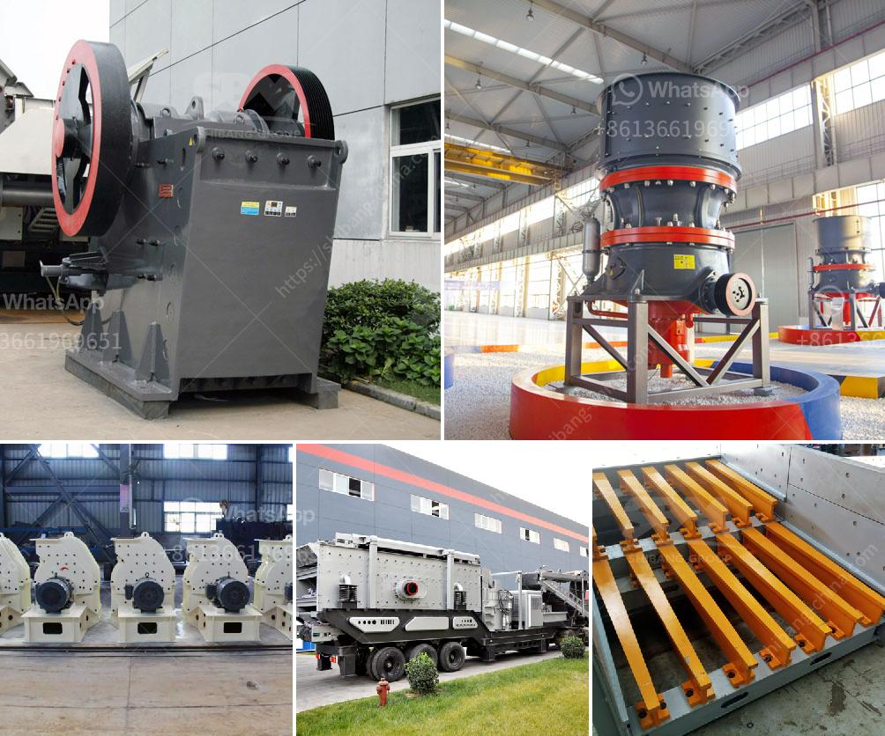

<h3>stone crushing machineries imphal</h3>
Stone crushing is a crucial process in the construction and road building industries. The process involves multiple stages of crushing and screening to transform raw materials into final products.

Stone crushing machineries are widely used in these industries for reducing large-sized stones into smaller pieces, granules, or gravel. These machines come in various types and models to suit different needs and specifications. They are vital for efficient and cost-effective crushing operations.

One of the most commonly used machines in stone crushing is the jaw crusher. This machine is designed to crush large rocks or ores into smaller pieces by applying compressive force. It has two jaws, one fixed and the other moving, which work together to crush the material. The crushed material is discharged through the bottom opening of the crusher.

Another type of stone crushing machinery is the cone crusher. This machine operates on the same principle as the jaw crusher but has a different shape. It has a cone-shaped crushing chamber that allows the material to be crushed between an eccentrically rotating mantle and a concave. Cone crushers are ideal for secondary and tertiary crushing stages.

Impact crushers are also commonly used in stone crushing. These machines use impact to crush the material, rather than compression or shearing forces. They are versatile and can handle a wide range of materials, including soft to hard rocks and recycled materials. Impact crushers consist of a rotor that rotates rapidly, causing the material to be shattered upon impact with the rotor’s hammers or blow bars.

To further enhance the efficiency of stone crushing machineries, vibrating screens are often used. These screens separate crushed materials based on their size and ensure uniformity in the final product. Vibrating screens improve the overall quality of crushed materials by removing any oversize or undersize particles.

Stone crushing machineries have evolved over the years to become more efficient and eco-friendly. Many modern machines are equipped with advanced features and technologies to enhance productivity and reduce downtime. For instance, some crushers have adjustable settings that allow operators to produce different sizes of crushed materials with ease.

In Imphal, the capital city of Manipur in India, stone crushing machineries are widely used due to the booming construction industry in the region. These machines play a vital role in supplying crushed stones for various construction projects, including buildings, roads, highways, bridges, and railways.

However, it is important to ensure that stone crushing operations in Imphal are conducted responsibly and with proper environmental safeguards. Dust emissions from stone crushing activities can be a concern for air quality. Measures such as water spray systems and dust suppression technologies should be implemented to minimize dust pollution.

In conclusion, stone crushing machineries are indispensable in the construction and road building industries. The availability of different types and models allows for efficient and tailored solutions for various crushing needs. However, it is crucial to prioritize environmental protection and strictly follow regulations to minimize the impact of these operations. Proper maintenance and regular inspections of the machinery are also essential to ensure reliable and safe operations.
<h3>Contact us</h3><ul><li><strong>Whatsapp:&nbsp;<a href="https://wa.me/8613661969651">+8613661969651</a></strong></li><li><a href="https://swt.shibang-china.com/?git&amp;zhl&amp;stone crushing machineries imphal"><strong>Online Service(chat now)</strong></a></li></ul><h3>Related</h3><ul><li><a href='crusher plant supplier in nepal.md'>crusher plant supplier in nepal</a></li><li><a href='mobile stone crusher gauteng.md'>mobile stone crusher gauteng</a></li><li><a href='cost of set up mini cement plant in india.md'>cost of set up mini cement plant in india</a></li><li><a href='gold ore crusher for sale.md'>gold ore crusher for sale</a></li><li><a href='dolomite powder machine in sri lanka.md'>dolomite powder machine in sri lanka</a></li></ul>