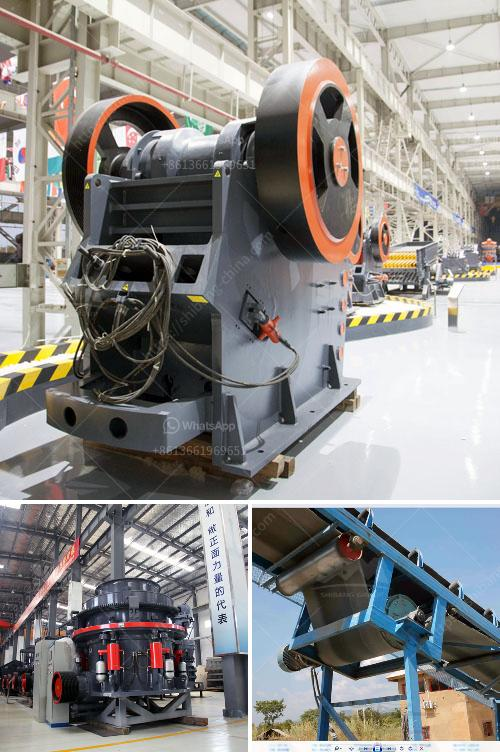

<h3>stone crushing machinery</h3>
Stone Crushing Machinery is an indispensable equipment for crushing plant. If you want to invest a sand and gravel processing plant, the purchase of crushing machinery is a more important process. It requires the investment budget for the production of machinery, and the equipment and manufacturers should be reasonably selected; Next, let's take a look at the more common types of stone crusher equipment.

Jaw crusher is an ideal crusher for primary crushing. The main characteristic of jaw crusher is its large crushing ratio, uniform particle size, simple structure, reliable operation, simple maintenance, and economical operating cost. The jaw crusher machine is widely used in mining, metallurgy, building materials, highway, railway, water conservancy, and chemical industries.

The impact crusher can be used in the coarse, medium, fine (granite, limestone, concrete), the crushing granularity lower than 500 mm the anti-pressure strength under 350 MPa. It is widely used in railway,highway, mining,energy,cement,chemical, construction, etc industries. The size of the discharge material can be adjusted, and the crushing specifications are diversified.

Cone crusher is generally used as a secondary crushing in stone production line. we can supply HPT series multi-cylinder hydraulic cone crusher, CS series high-efficiency spring cone crusher and HST series single cylinder hydraulic cone crusher. Cone crusher machine is composed of frame, driving device and adjusting device, hydraulic system and lubrication system.

Cone crusher crushes materials with the working surface between the movable cone and fixed cone. The movable cone is supported by spherical bearing and fixed on a hanging erect shaft which is set in the eccentric sleeve, and the sleeve is set on the stopping and pushing bearing. The movable cone and erect shaft are driven by the eccentric shaft sleeve together.

Hammer crusher is a kind of rock crusher equipment which can crush materials with compressive strength no more than 150MPa. Applications Mining, refractory material, cement, sand & gravel, concrete sand, dry mortar, mechanical sand, and so on operations.

7. Vibration feeder + Jaw crusher + Hammer crusher + Impact crusher + Cone crusher + VSI crusher + Vibrating screen

In conclusion, the stone crushing machinery is not only used in various industries, but also plays an important role in many sand and gravel aggregate production lines. It is mainly used in cement, mining, building materials, highways, railways, chemical industries, etc. Leading stone crushing machinery manufacturers in China, we have more than 30 years of experience in stone crushers. So, relying on its quality and experience, we will continue to innovate and provide high-quality products and efficient services for our customers.
<h3>Contact us</h3><ul><li><strong>Whatsapp:&nbsp;<a href="https://wa.me/8613661969651">+8613661969651</a></strong></li><li><a href="https://swt.shibang-china.com/?git&amp;zhl&amp;stone crushing machinery"><strong>Online Service(chat now)</strong></a></li></ul><h3>Related</h3><ul><li><a href='gypsum board manufacturing factory in turkey.md'>gypsum board manufacturing factory in turkey</a></li><li><a href='hammer mills grinding.md'>hammer mills grinding</a></li><li><a href='vibrating feeders operating parameters from zenith china.md'>vibrating feeders operating parameters from zenith china</a></li><li><a href='large volume conveyor belt systems rentals.md'>large volume conveyor belt systems rentals</a></li><li><a href='stone crusher machine price in kenya.md'>stone crusher machine price in kenya</a></li></ul>