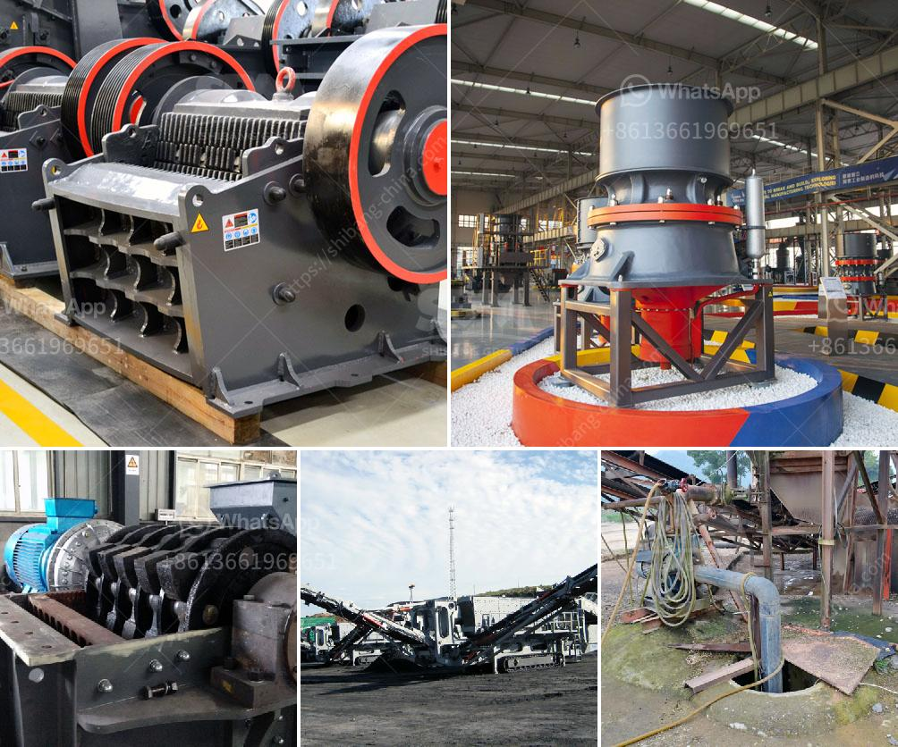

<h3>stone crushing machines uk</h3>
Stone crushing machines are used in a wide range of industries, such as mining, construction, and recycling. Industries predominantly requiring the use of these machines include road and highway construction, building construction, and mining. These machines have become indispensable for various applications.

The demand for stone crushing machines in the UK continues to increase in the mining industry. These machines help extract minerals and precious metals from the earth. Since stone crushing is an energy-intensive process, incorporating modern technology can significantly reduce energy consumption and maximize productivity. These machines are designed to break apart large rocks into smaller pieces to be used in the construction industry for various purposes, such as making concrete or asphalt.

Stone crushing machines in the UK come in different sizes and capabilities. Industry leaders in stone crushing technology offer a comprehensive range of products for various applications. These machines are capable of handling rocks of different hardness levels, from soft to extremely hard. Additionally, these machines can be equipped with features like automated systems, reducing the need for manual labor, and improving safety on-site.

One of the crucial aspects that make stone crushing machines in the UK desirable is their portability. Many machines are designed to be easily transported from one location to another, making them ideal for on-site operations. This mobility allows workers to crush stones on-site, reducing transportation costs and time. Moreover, some machines are equipped with remote control features, further enhancing productivity and ease of operation.

In the recycling sector, stone crushing machines have become a vital element. They are used to crush construction waste and debris, turning it into reusable materials such as gravel, sand, or crushed concrete. This not only reduces the need for raw materials but also helps in the preservation of natural resources.

To conclude, stone crushing machines in the UK play a significant role in various industries. Their ability to break down rocks into smaller pieces makes them essential for mining, construction, and recycling. With advancements in technology, these machines continue to evolve and improve, providing better efficiency, productivity, and versatility.
<h3>Contact us</h3><ul><li><strong>Whatsapp:&nbsp;<a href="https://wa.me/8613661969651">+8613661969651</a></strong></li><li><a href="https://swt.shibang-china.com/?git&amp;zhl&amp;stone crushing machines uk"><strong>Online Service(chat now)</strong></a></li></ul><h3>Related</h3><ul><li><a href='vibrating screen in the philippines.md'>vibrating screen in the philippines</a></li><li><a href='pebble crushing machine.md'>pebble crushing machine</a></li><li><a href='ball grinding machine manufacturer in india.md'>ball grinding machine manufacturer in india</a></li><li><a href='gypsum processing plant in.md'>gypsum processing plant in</a></li><li><a href='specifications of roller mill.md'>specifications of roller mill</a></li></ul>