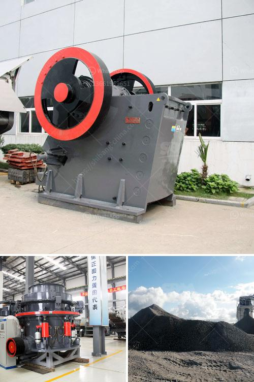

<h3>stone grinding mills in pakistan</h3>
Stone grinding mills have been around for thousands of years in various forms since ancient times. In Pakistan, stone grinding mills are still widely used due to their unique ability to offer fine particle size distribution coupled with a high grinding efficiency over a wide range of materials.

Pakistan is known for its rich diversity of minerals and natural resources, which has made it a hub for several industries. One such industry is the stone grinding mill sector, which has been thriving due to the abundance of high-quality stones such as granite, marble, and quartz in the country.

Stone grinding mills in Pakistan have played a crucial role in Pakistan's economic development by providing jobs to thousands of skilled workers, enhancing the utilization of mineral resources, and generating revenue for the government. These mills have become an integral part of various industries such as construction, ceramics, glass manufacturing, and even the food industry.

The traditional method of stone grinding involves crushing the mineral-containing rocks into small particles, then grinding them between two stones. However, modern stone grinding mills in Pakistan are designed to crush and grind mineral-containing rocks into finer particles mechanically. This is achieved through the use of highly efficient grinding wheels, which rotate at high speeds to pulverize the stones into a fine powder.

Stone grinding mills in Pakistan offer a wide range of grinding options to meet different needs. Some mills are primarily used for coarse grinding, while others are designed for fine grinding. Regardless of the type of mill used, the final product is always a fine powder with a consistent particle size distribution.

These stone grinding mills have several advantages over other grinding methods. First and foremost, they offer exceptional control over the particle size distribution, allowing manufacturers to produce materials with specific properties and characteristics. This is particularly important in industries such as ceramics, where the composition and size of the particles directly impact the final product's quality.

Additionally, stone grinding mills are known for their high grinding efficiency. They can efficiently grind large quantities of material in a short period, thereby increasing productivity and reducing production costs. This is of great importance, especially in industries where large volumes of fine particles are required, such as the construction industry.

Stone grinding mills also offer environmental benefits. Unlike other grinding methods, stone grinding mills do not produce harmful emissions or pollutants, making them a sustainable option for industries. They also require minimal maintenance and have a long lifespan, further reducing their environmental impact.

In conclusion, stone grinding mills in Pakistan have been a valuable asset to the country's economy and industries for several decades. These mills provide jobs, utilize valuable natural resources, and contribute to economic growth through the production of high-quality materials. With their unique advantages, stone grinding mills will continue to play a vital role in Pakistan's industrial and economic development.
<h3>Contact us</h3><ul><li><strong>Whatsapp:&nbsp;<a href="https://wa.me/8613661969651">+8613661969651</a></strong></li><li><a href="https://swt.shibang-china.com/?git&amp;zhl&amp;stone grinding mills in pakistan"><strong>Online Service(chat now)</strong></a></li></ul><h3>Related</h3><ul><li><a href='basalt impact crusher price.md'>basalt impact crusher price</a></li><li><a href='cone crusher manufacturer.md'>cone crusher manufacturer</a></li><li><a href='quartz powder suppliers in dubai.md'>quartz powder suppliers in dubai</a></li><li><a href='list of cement plant in india.md'>list of cement plant in india</a></li><li><a href='ft standard cone crusher pdf.md'>ft standard cone crusher pdf</a></li></ul>