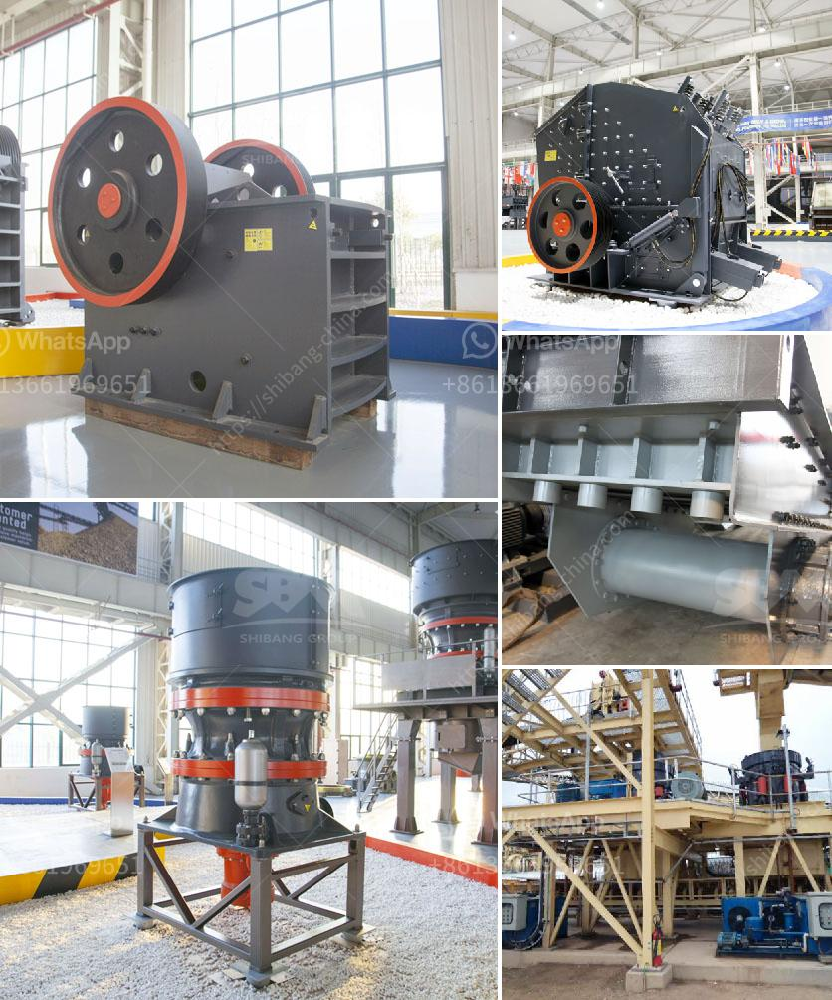

<h3>stone jaw crusher machinery supplier</h3>
Mining industry is one of the key sectors which drive growth in economy development in India. There are many crusher manufacturers in India, providing various crusher machines for mining industry. SBM is world famous crusher plant manufacturer and supplier all over the world. We provide cost-effective stone crushing solution for mobile and stationary crushing applications, including jaw crusher, impact crusher, cone crusher, mobile crushing production line etc.

Our industrial crusher plant products and services support customers on the surface and underground, in all mineral, coal and metal mining applications from exploration to ore transportation. Stone jaw crusher machinery suppliers and manufacturers’ situations in India

In India, there are many suppliers and manufacturers of stone crusher machinery, such as shanghai SBM Company. As for the abundant mineral resources, stone jaw crusher machinery has large market in India.

Stone jaw crusher machinery has large market in India. As a professional jaw crusher supplier, SBM has strong strength and good reputation. With the development of science and technology, SBM jaw crusher machinery has grown into a sophisticated and well-diversified enterprise, occupying an important position in the crusher industry.

The pure nature of stone, innovative and efficient design, combined with the most advanced materials and components, makes stone jaw crusher machinery technology and equipment more productive and efficient.

Stone jaw crusher machinery manufacturers can provide customers with a wide range of processing capacity, such as 100 tons per hour, 150 tons per hour, 200 tons per hour, 500 tons per hour and so on. SBM is a top crushing equipment supplier in China, and we have stocked large number of crusher parts to suit CM series jaw crusher.

To support our clients with the best jaw crusher parts, we have collaborated with more than 100+ dealers and customers worldwide. SBM is committed to providing the highest quality products and service to our customers. We will spare no efforts to make customers satisfied. With a history of more than 20 years, we have set up branch offices in many countries to ensure that we have a sound and efficient service system.

In conclusion, SBM is a reliable and professional stone jaw crusher machinery supplier. We provide a variety of mining equipment needed in the mining industry, and ensure good customer service, well-respected reputation. If you are interested in our products or have any questions, please feel free to contact us. We look forward to cooperating with you!
<h3>Contact us</h3><ul><li><strong>Whatsapp:&nbsp;<a href="https://wa.me/8613661969651">+8613661969651</a></strong></li><li><a href="https://swt.shibang-china.com/?git&amp;zhl&amp;stone jaw crusher machinery supplier"><strong>Online Service(chat now)</strong></a></li></ul><h3>Related</h3><ul><li><a href='south africa coal mining cost per ton.md'>south africa coal mining cost per ton</a></li><li><a href='floatation washing machine for silica sand.md'>floatation washing machine for silica sand</a></li><li><a href='sand screw professional apr.md'>sand screw professional apr</a></li><li><a href='gypsum processing machine price list.md'>gypsum processing machine price list</a></li><li><a href='granite processing machines china.md'>granite processing machines china</a></li></ul>