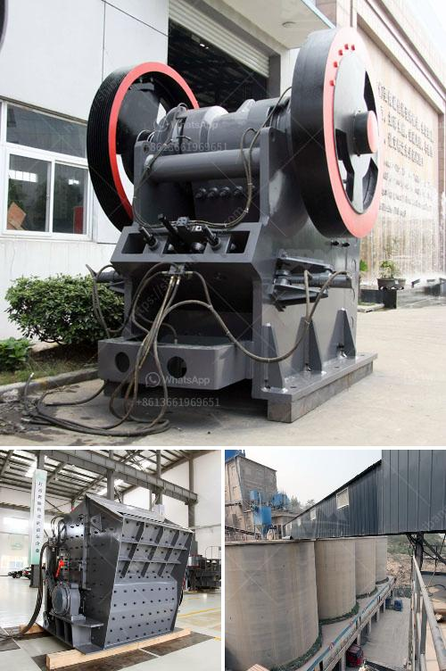

<h3>stone mill grinder appliances made in china</h3>
Stone mill grinders have been used for centuries in the food processing industry. Traditionally, they were powered by horses, waterwheels, or windmills. However, with technological advancements, the stone mill grinders have now become modern and efficient appliances. Nowadays, China is one of the leading manufacturers of stone mill grinder appliances.

These stone mill grinders made in China are a popular choice among consumers for several reasons. Firstly, the use of natural stone for grinding ensures that the nutrients and flavor of the ingredients are retained. Unlike metal grinders that can generate heat during the grinding process, stone mill grinders keep the temperature low, preserving the integrity of the food.

Another advantage of stone mill grinders from China is their durability. Made from high-quality materials, these appliances are built to last. The sturdy construction guarantees that the grinder can withstand the demands of continuous use without wearing out easily. This makes them a long-term investment for any kitchen or food processing facility.

Furthermore, stone mill grinders made in China are versatile appliances that can be used for grinding a wide variety of ingredients. From grains and pulses to nuts and spices, these grinders can handle it all. The adjustable settings allow users to achieve the desired texture, whether it's coarse or fine.

In terms of safety, stone mill grinders made in China also deliver. They are equipped with various safety features to ensure that accidents are minimized. From guards and emergency stops to secure lids, these appliances prioritize the user's well-being while grinding.

Finally, Chinese stone mill grinders are often more affordable compared to ones produced elsewhere. China's expertise in manufacturing and its ability to produce high quantities at competitive prices make these appliances accessible to a wider range of consumers.

In conclusion, stone mill grinder appliances made in China offer an excellent solution for individuals and businesses seeking efficient and reliable grinding equipment. With their ability to retain nutrients, durability, versatility, safety features, and affordability, these appliances have become a top choice for those in the food processing industry.
<h3>Contact us</h3><ul><li><strong>Whatsapp:&nbsp;<a href="https://wa.me/8613661969651">+8613661969651</a></strong></li><li><a href="https://swt.shibang-china.com/?git&amp;zhl&amp;stone mill grinder appliances made in china"><strong>Online Service(chat now)</strong></a></li></ul><h3>Related</h3><ul><li><a href='aggregate crusher supplier tanzania.md'>aggregate crusher supplier tanzania</a></li><li><a href='crusher plant for quartz crushing.md'>crusher plant for quartz crushing</a></li><li><a href='gold mining equipments manufacturers.md'>gold mining equipments manufacturers</a></li><li><a href='bauxite calcination plant cost in india.md'>bauxite calcination plant cost in india</a></li><li><a href='conveyor belts for sale in china.md'>conveyor belts for sale in china</a></li></ul>