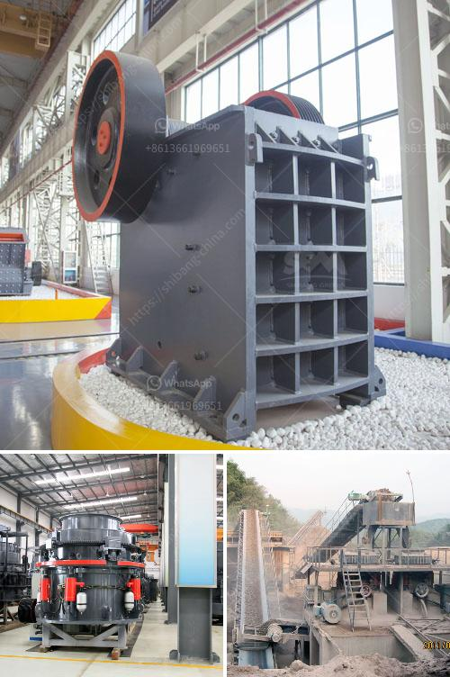

<h3>stone processing equipment turkey company</h3>
Stone processing equipment is an essential part of the construction and mining industry. Turkey, known for its unique blend of cultural heritage and modern infrastructure, has emerged as one of the key players in providing top-notch stone processing equipment to meet the growing demands of the industry.

One company that stands out in this domain is a prominent stone processing equipment manufacturer based in Turkey. With decades of experience, cutting-edge technology, and a commitment to delivering quality products, this company has built a solid reputation in the market.

The company offers a wide range of stone processing equipment that caters to various stages of the production process. From cutting and polishing machines to CNC routers and bridge saws, their equipment is designed to enhance efficiency, productivity, and precision.

What sets this company apart is its focus on innovation and continuous improvement. They invest heavily in research and development to ensure that their equipment incorporates the latest technological advancements. This allows their customers to stay ahead of the curve and adapt to changing market needs.

Moreover, the company takes pride in its stringent quality control measures. Each piece of equipment undergoes rigorous testing to meet international standards. This ensures that customers receive reliable and durable machines that can withstand the demanding nature of the stone processing industry.

In addition to their cutting-edge equipment, this Turkish company provides exceptional after-sales service. Their team of skilled technicians is readily available to assist customers with installation, training, and troubleshooting. They prioritize customer satisfaction and strive to build long-term relationships by providing comprehensive support beyond the point of sale.

Furthermore, this company believes in sustainable and environmentally responsible manufacturing practices. They employ energy-efficient processes in their production facilities and utilize natural resources responsibly. This commitment to sustainability aligns with the global shift towards greener construction practices and resonates with environmentally conscious customers.

With its vast product range, superior quality, and unmatched customer service, this Turkish stone processing equipment company has successfully established a strong presence not only in Turkey but also internationally. Their equipment is exported to various countries, contributing to the growth and development of the global construction and mining industry.

As the demand for stone processing equipment continues to rise, this company remains at the forefront, consistently meeting the needs of its customers. They understand the challenges faced by the industry and strive to provide solutions that streamline processes, improve productivity, and elevate overall efficiency.

In conclusion, the Turkish stone processing equipment company is a leading player in the industry, known for its state-of-the-art equipment, commitment to quality, and exceptional customer service. With its focus on innovation, sustainability, and consistent improvement, this company is poised to remain a key player in the stone processing equipment market for years to come.
<h3>Contact us</h3><ul><li><strong>Whatsapp:&nbsp;<a href="https://wa.me/8613661969651">+8613661969651</a></strong></li><li><a href="https://swt.shibang-china.com/?git&amp;zhl&amp;stone processing equipment turkey company"><strong>Online Service(chat now)</strong></a></li></ul><h3>Related</h3><ul><li><a href='aggregate crushing machine portable.md'>aggregate crushing machine portable</a></li><li><a href='list price vibrating screen.md'>list price vibrating screen</a></li><li><a href='copper leaching plants for sale.md'>copper leaching plants for sale</a></li><li><a href='used clinker grinding mill for sale.md'>used clinker grinding mill for sale</a></li><li><a href='price list of used stone crusher in india.md'>price list of used stone crusher in india</a></li></ul>