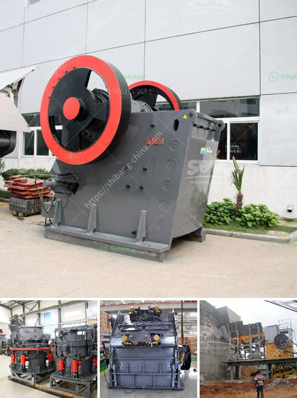

<h3>stone quarry business proposal crusher machine</h3>
A stone quarry business is a business that involves the excavation of different dimension of stones, rocks, ripraps, construction aggregates, slates and gravels for the constructions industry. Players in this industry basically extract rocks from an open-pit mine and the rocks are crushed to produce construction aggregate, which is them screened into different size categories either for immediate use like in construction or other applications or further processed to obtain other aggregates like gravels, ripraps, and slates.

A stone quarry business is a capital intensive business that requires specialized equipment and expertise. Equipment such as excavators, bulldozers, haulage trucks, and crushers are mostly used at the quarry site to crush stones into aggregates.

The likelihood of starting a stone quarry business is that you will be dealing with several construction companies cum sites in and around your location. Players in this industry basically extract rocks from an open-pit mine and the rocks are crushed to produce construction aggregate, which is them screened into different size categories either for immediate use in construction or other industrial applications or further processed to obtain secondary aggregates like gravels, ripraps, and slates.

If YES, here is a complete sample stone crusher & quarry business plan template & FREE feasibility report

Okay, so we have considered all the requirements for starting a stone crusher & quarry business. We also took it further by analyzing and drafting a sample stone & granite marketing plan template backed up by actionable guerrilla marketing ideas for quarry businesses. So let's proceed to the business planning section.

When it comes to starting a stone quarry business, one of the basic things that is needed is the mining license. Of course, you can do other businesses alongside starting a stone quarry business. In fact, you can combine both or choose one of them if you have a enough capital investment.

Hello, my name is [Name] and I am writing to seek financial assistance to kick-start my stone quarry business. I have been in the mining industry for over 10 years and currently, I am the CEO of [Company Name], a mining company with proven track record in producing high-quality stones for the construction industry.

I have a solid knowledge of the mining industry and have built strong relationships with key players in the construction industry. However, due to the increasing demand for construction materials in my region, I have decided to expand my operations by investing in a stone crusher machine.

The stone crusher machine is essential equipment in mining machinery, crushing the stone to meet the required size. I believe that through the use of this machine, the efficiency of construction projects can be greatly improved. In fact, the improvement of the efficiency of projects is an important factor in determining the success or failure of a construction project.

I have conducted market research on stone quarry business, and I am certain that if I start this business, I will meet the needs of construction companies in my region. I have a clear understanding of the target market, and I have developed strategies that will enable me to reach potential customers and effectively promote my business.

The total cost for the purchase of heavy machinery and equipment, as well as the purchase of dump trucks, is estimated at $3,150,000. The total cost for the construction of a standard stone quarry is estimated at $2,000,000. The cost of launching a website is $600.

Our goal is to become one of the leading stone quarry companies in the world, which is why we have mapped out strategies that will help us take advantage of the available market and grow to become a global force in the industry.

At [Company Name], we are committed to providing our customers with high-quality stones, crushed rocks, and construction aggregates at competitive prices. Our team of experts has a thorough understanding of the industry, and this knowledge will enable us to meet the needs of our customers.

In conclusion, I believe that starting a stone quarry business is a profitable business venture. However, obtaining the necessary licenses and permits and funding the purchase of the needed heavy equipment, investments in marketing and promotion, and securing an operational base are some of the hurdles that must be scaled before the business can start generating cash flow and making profits. With your financial assistance, I am confident that I will be able to overcome these challenges and establish a successful stone quarry business.
<h3>Contact us</h3><ul><li><strong>Whatsapp:&nbsp;<a href="https://wa.me/8613661969651">+8613661969651</a></strong></li><li><a href="https://swt.shibang-china.com/?git&amp;zhl&amp;stone quarry business proposal crusher machine"><strong>Online Service(chat now)</strong></a></li></ul><h3>Related</h3><ul><li><a href='coal mill in china.md'>coal mill in china</a></li><li><a href='size of a 50 tpd rotary kiln.md'>size of a 50 tpd rotary kiln</a></li><li><a href='ball mill for pigment.md'>ball mill for pigment</a></li><li><a href='used brick making machine for sale.md'>used brick making machine for sale</a></li><li><a href='gemstones found in nigeria.md'>gemstones found in nigeria</a></li></ul>