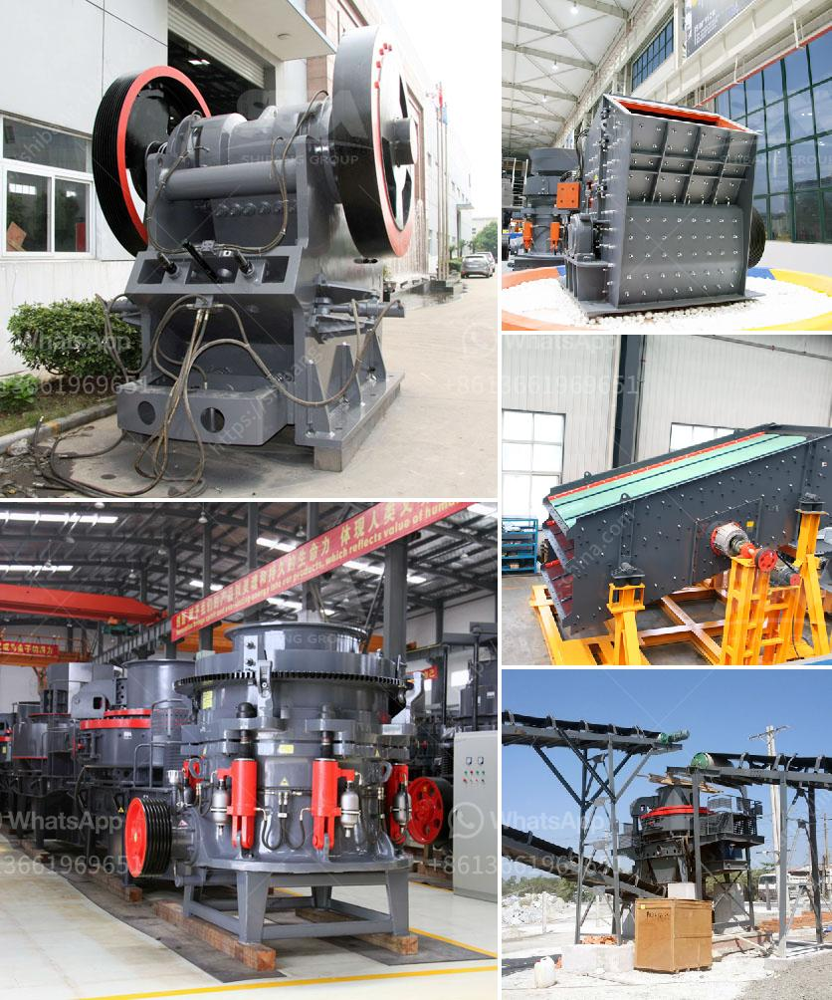

<h3>stone quarry crusher equipment germany</h3>
Germany is Europe's largest producer of aggregates with an annual demand of 500 million tons of gravel, sand, silica sand, and natural stone products. Moreover, it is one of the leading exporters of aggregates worldwide. Stone quarrying and mineral extraction have contributed significantly to the German economy, with the construction industry being the primary consumer of these materials.

To meet the ever-growing demand for aggregates, Germany has a well-established stone quarrying industry equipped with advanced technologies and efficient equipment. The quarrying process involves several stages, including drilling, blasting, loading, hauling, and crushing. Each stage requires specific machinery to ensure efficient and cost-effective operations.

One of the crucial pieces of equipment in stone quarrying is the crusher. Crushers are used to break rocks into smaller sizes suitable for construction and other applications. Germany has a wide range of crusher types that cater to different crushing needs. Cone crushers, impact crushers, jaw crushers, and gyratory crushers are some of the commonly used crushers in German quarries.

Cone crushers, also known as conical crushers, are popular in secondary and tertiary crushing stages. They have a cone-shaped mantle that rotates eccentrically within a concave bowl. This design allows the crusher to deliver a consistent particle size and shape. Advanced features such as hydraulic technology and automation make cone crushers efficient and reliable in crushing various types of rocks.

Impact crushers, on the other hand, use impact force to break rocks. They are ideal for crushing soft to medium-hard materials such as limestone, gypsum, and concrete. Impact crushers can be stationary or mobile, depending on the specific quarrying requirements. Their ability to produce high-quality cubical aggregates makes them a popular choice in the German construction industry.

Jaw crushers are widely used in primary crushing applications. They have a fixed jaw plate and a movable jaw plate. The movable jaw exerts force on the rock by pressing it against the fixed jaw, breaking it into smaller pieces. With their robust construction and high crushing capacity, jaw crushers are suitable for various quarrying operations.

Gyratory crushers are primarily used in the mining industry and are rarely found in stone quarries. They have a conical crushing head that gyrates continuously within a crushing chamber. Gyratory crushers are capable of producing large quantities of aggregate at a relatively low cost but require more maintenance compared to other crusher types.

Germany's stone quarry crusher equipment manufacturers focus on developing innovative crushing technologies to enhance productivity and reduce operating costs. For instance, some manufacturers incorporate features like remote monitoring and reliability enhancements to minimize downtime.

In conclusion, Germany's stone quarry crusher equipment plays a crucial role in the construction industry. With high demand for aggregates, efficient and reliable crushers are essential to ensure a steady supply. Cone crushers, impact crushers, jaw crushers, and gyratory crushers are among the popular types used. The industry's focus on innovation and advanced technologies ensures that German crushers meet the highest standards of performance and productivity.
<h3>Contact us</h3><ul><li><strong>Whatsapp:&nbsp;<a href="https://wa.me/8613661969651">+8613661969651</a></strong></li><li><a href="https://swt.shibang-china.com/?git&amp;zhl&amp;stone quarry crusher equipment germany"><strong>Online Service(chat now)</strong></a></li></ul><h3>Related</h3><ul><li><a href='conveyor belts in opracion.md'>conveyor belts in opracion</a></li><li><a href='portable copper ore processing machines in usa.md'>portable copper ore processing machines in usa</a></li><li><a href='limestone grinding technology and.md'>limestone grinding technology and</a></li><li><a href='limestone powder making machine.md'>limestone powder making machine</a></li><li><a href='vibrating screen supplier.md'>vibrating screen supplier</a></li></ul>