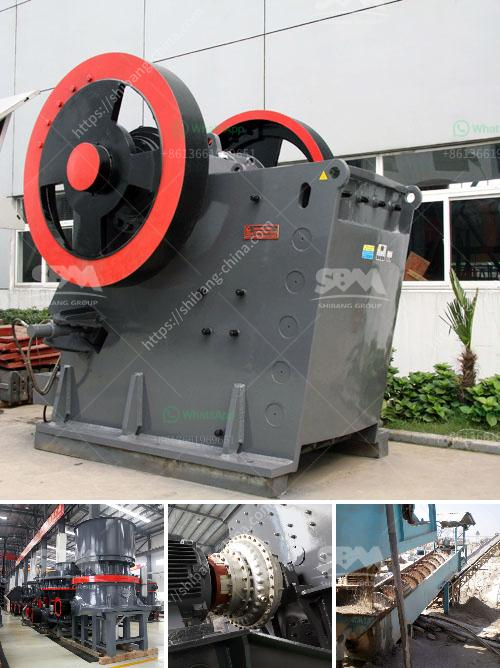

<h3>stone quarry crusher in ghana</h3>
Stone quarrying is the extraction of stones from the ground for various purposes, including construction, ornamentation, road building, and as an industrial raw material. Stone crusher machines are essential equipment in mining machinery, crushing the stone to meet various industry requirements, such as building materials, chemical industry, minerals processing, smelting, and other relevant industries.

The stone quarry crusher equipment for sale from SBM in Ghana includes the main crushing machine, vibrating screen, feeder, conveying equipment. Some auxiliary equipment is also necessary in the stone quarry crushing line, such as stone quarry crusher, stone quarrying plant, etc. The materials processed will be conveyed to quarry processing equipment. Techniques applied for extraction vary with the nature and location of the deposit.

Stone quarrying operations may include crushing, screening, size classification, material handling and storage operations. Crushing is the first stage in stone quarrying plant. The feeder or screens separate large boulders from finer rocks that do not require primary crushing, thus reducing the load to the primary crusher.

Jaw crusher, impact crusher, or gyratory crushers are usually used for primary crushing stage. The crushed particle sizes are normally 3 to 12 inches in diameter, and undersize material will be conveyed for re-crushing or used as coarse aggregates. Stone Crusher Machine Manufacturer in Ghana

SBM is a global supplier and manufacturer of stone crusher machine in Ghana. We provide complete range of stone quarry crusher machine for sale including jaw crusher, impact crusher, cone crusher, gyratory crusher, etc. which are available in stationary, portable and mobile applications, and suitable for all crushing applications for metal and nonmetal minerals.

In Ghana, jaw crusher is used as primary crusher for crushing gold ore in gold ore crushing industry. Jaw crusher is the most used gold mining machine for crushing ore. Jaw crusher can reach the crushing ratio of 4-6 and the shape of final product is even. So gold jaw curshers are widely applied to crush high hardness, mid hardness and soft rocks and ores such as slags, construction materials, marble, etc.

Gold mobile crusher is portable type gold broken. Gold mobile crusher can eliminate the broken places and situations of obstacles, and to provide efficient, low-cost project factory. To the client, mobile crushing station is the best choice for South Africa gold mining line. In gold mining line, it involves gold ore crushing, screening, grinding, washing and so on. Gold ore crusher is mainly used for initial size loading.

Jaw crusher can be decomposed into 150 mm or 6 inches, and then gold ore belt conveyor will transport gold ore rock materials to the gold ore vibrating screen which will send a large rock to the secondary crusher. Secondary crushing machine refers to the impact crusher and cone crusher. Impact crusher will be used as the secondary crushing machine.

In the rock production line, it would rather have more crushing stage than grinding stage. With cone crusher and impact crusher, the uranium ore materials will be processed into powder size. Then it is the grinding stage. Uranium Ore Grinding Machine: In the comminution stage, it has another important processing step: uranium ore grinding process. The conventional milling will be followed by autogenous and semi-autogenous milling, and at last, it would be the fine milling process.
<h3>Contact us</h3><ul><li><strong>Whatsapp:&nbsp;<a href="https://wa.me/8613661969651">+8613661969651</a></strong></li><li><a href="https://swt.shibang-china.com/?git&amp;zhl&amp;stone quarry crusher in ghana"><strong>Online Service(chat now)</strong></a></li></ul><h3>Related</h3><ul><li><a href='hammer mill peru.md'>hammer mill peru</a></li><li><a href='stone crusher machine from uk.md'>stone crusher machine from uk</a></li><li><a href='type of product manufactured vertical mills of india.md'>type of product manufactured vertical mills of india</a></li><li><a href='second hand jaw pulverizer india.md'>second hand jaw pulverizer india</a></li><li><a href='cost of malaysia mobile crusher in india.md'>cost of malaysia mobile crusher in india</a></li></ul>