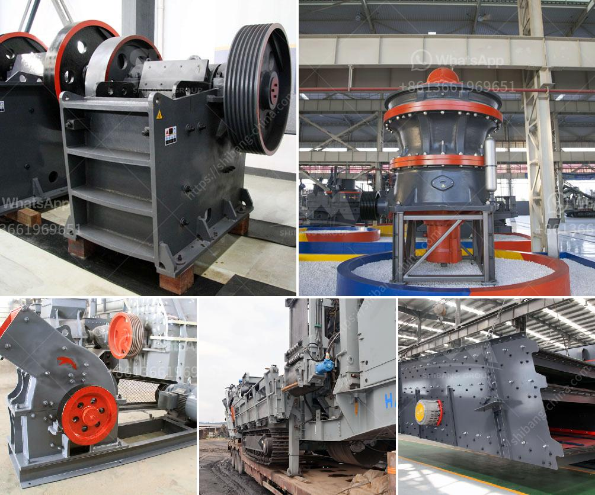

<h3>stone quarry plant</h3>
A stone quarry plant is a type of mining operation that involves the extraction, crushing, and screening of different types of stones for use in various construction and landscaping applications. This plant can be equipped with different types of crushers, screens, feeders, and conveyors to meet the specific needs of the quarrying process.

The primary purpose of a stone quarry plant is to provide stone resources to various industries such as construction, infrastructure development, and landscaping. The extracted stones are used to produce aggregates, which are essential materials for concrete production, road construction, and other building projects.

One of the key advantages of a stone quarry plant is that it allows for the extraction of stones in a cost-effective and efficient manner. The use of modern machinery, such as heavy-duty crushers and screens, enables the production of a wide range of high-quality aggregates with minimal wastage. This helps to maximize the profitability of the quarry operation and ensures a steady supply of stone resources for the market.

Another advantage of a stone quarry plant is the employment opportunities it provides for the local community. Quarrying operations require a skilled workforce to operate and maintain the machinery, as well as to carry out the extraction and processing activities. This creates job opportunities for various professionals and skilled workers, contributing to the economic development of the region.

In addition to job creation, a stone quarry plant also brings economic benefits through the generation of revenue. The extracted stones are sold to various customers, including construction companies, contractors, and individuals, who use them for their projects. The revenue generated from the sale of stones can be reinvested in the quarrying operation, further improving and expanding the plant's capabilities.

However, it is essential to note that quarrying operations can have environmental impacts if not properly managed. One of the key concerns is the impact on the local ecosystem, as quarrying activities may result in the loss of habitat for wildlife and disruption of natural processes. To mitigate these impacts, quarry operators need to implement sustainable practices, such as rehabilitation and restoration of the quarry site, and adopt measures to minimize dust, noise, and water pollution.

Overall, a stone quarry plant plays a crucial role in supplying the construction and landscaping industries with essential stone resources. It offers economic benefits through job creation and revenue generation while ensuring the responsible management of natural resources. By adopting sustainable practices, quarry operators can minimize the environmental impacts associated with their operations, making stone quarry plants an essential part of responsible and sustainable mining practices.
<h3>Contact us</h3><ul><li><strong>Whatsapp:&nbsp;<a href="https://wa.me/8613661969651">+8613661969651</a></strong></li><li><a href="https://swt.shibang-china.com/?git&amp;zhl&amp;stone quarry plant"><strong>Online Service(chat now)</strong></a></li></ul><h3>Related</h3><ul><li><a href='ball mill in kazakhstan.md'>ball mill in kazakhstan</a></li><li><a href='gravel crushers machine.md'>gravel crushers machine</a></li><li><a href='stationary jaw crusher.md'>stationary jaw crusher</a></li><li><a href='stone quarry plant.md'>stone quarry plant</a></li><li><a href='small scale rock grizzly separator.md'>small scale rock grizzly separator</a></li></ul>