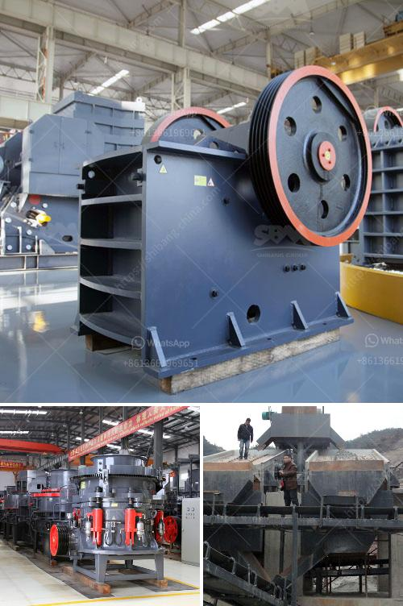

<h3>stone quarrys crusher in ghana</h3>
Stone quarrys are the backbone of our society, providing essential materials to build roads, bridges, buildings, and other infrastructures. With the increase in demand for construction materials, the need for stone quarrys crusher in Ghana is growing rapidly.

The past decade has seen a tremendous increase in the number of stone quarrys operating in Ghana. In fact, the country has become the preferred destination for many investors, thanks to its favorable business environment and abundant natural resources.

A stone quarrys crusher works by breaking down the rock into smaller pieces, which can be used in various construction projects. These crushers come with different capabilities and sizes, ensuring that all stone crushing needs are met, regardless of the project size.

One of the key advantages of the stone quarrys crusher is its ability to produce high-quality aggregate material. This material is essential in the construction industry as it provides strength and durability to the structures being built. Additionally, the crusher can produce different types of aggregate, such as granite, limestone, and sand, depending on the project requirements.

Furthermore, the stone quarrys crusher is a vital piece of equipment for companies specializing in aggregate production, road construction, and mining. This is because the crusher is designed to provide continuous and consistent output, ensuring that materials are processed efficiently.

In conclusion, stone quarrys crusher in Ghana plays an important role in the construction industry. The crusher is responsible for breaking down the rocks into smaller pieces, which can be used for various construction purposes. Moreover, the crusher offers advanced capabilities, ensuring that high-quality aggregate material is produced, meeting the demands of the growing construction industry in Ghana.
<h3>Contact us</h3><ul><li><strong>Whatsapp:&nbsp;<a href="https://wa.me/8613661969651">+8613661969651</a></strong></li><li><a href="https://swt.shibang-china.com/?git&amp;zhl&amp;stone quarrys crusher in ghana"><strong>Online Service(chat now)</strong></a></li></ul><h3>Related</h3><ul><li><a href='gypsum powder industry basic machines.md'>gypsum powder industry basic machines</a></li><li><a href='vibrating screens manufacturers.md'>vibrating screens manufacturers</a></li><li><a href='captains of crusher zenith.md'>captains of crusher zenith</a></li><li><a href='fine powder making machine.md'>fine powder making machine</a></li><li><a href='financial projections for a ore mining company.md'>financial projections for a ore mining company</a></li></ul>