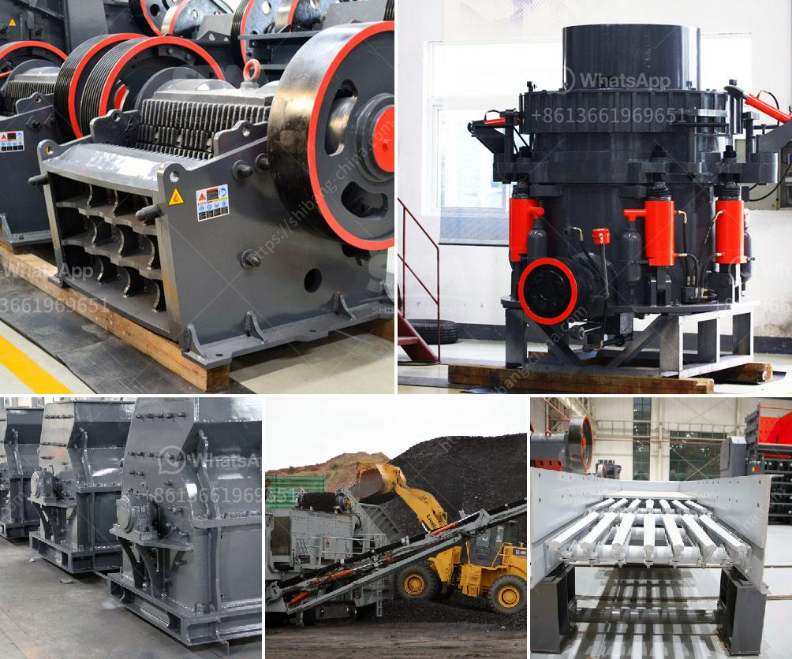

<h3>stone rock crushers in oman for sale</h3>
A rock crusher is a machine used to crush large stones into smaller stone sizes. Rock crushers come in different types and sizes and can be used for different purposes, such as primary, secondary, and tertiary crushing. One of the most popular rock crushers in Oman is the jaw crusher, which is highly suitable for primary crushing due to its high crushing ratio and large feeding size.

Oman is known for its diverse geological features, with mountains, deserts, and coastal areas. These unique landscapes offer abundant resources of rocks and stones, making the country a hub for the quarrying industry. Stone rock crushers play a crucial role in this industry as they provide the essential raw materials for construction projects, roads, and other infrastructure developments.

There are several types of stone rock crushers available in Oman, including jaw crushers, cone crushers, and impact crushers. Each type of crusher has its unique features, making it suitable for specific crushing applications. For instance, jaw crushers are commonly used for primary crushing as they can handle large rocks and have a high processing capacity.

Cone crushers, on the other hand, are more suitable for secondary and tertiary crushing. They are capable of producing finer stone sizes and are commonly used in aggregate production and mining operations. Impact crushers, with their high crushing efficiency, are often used for shaping the final product and producing cubical stones.

When looking for stone rock crushers in Oman for sale, there are several factors to consider. Firstly, determine the type and size of crusher that suits your project needs. The size of the stones you need to crush will help determine the appropriate machine. Additionally, consider the required capacity, power consumption, and maintenance requirements when selecting a rock crusher.

Besides the technical specifications, it is essential to choose a reliable supplier. Look for established companies in the industry that offer quality crushers and excellent after-sales service. A reputable supplier will provide guidance on selecting the right crusher for your application, as well as offer support and maintenance services to ensure optimal performance.

Oman's rock crusher market is growing steadily due to the increasing demand for stone aggregates. Government initiatives to boost infrastructure development and the flourishing construction industry continue to drive the demand for rock crushers. With a range of crushers available and reliable suppliers offering these machines at competitive prices, customers in Oman can easily find the right rock crusher to meet their specific requirements.

In conclusion, stone rock crushers play a vital role in Oman's quarrying industry. These machines efficiently crush large stones into smaller sizes, making them suitable for various construction projects and infrastructure developments. When looking for stone rock crushers for sale in Oman, consider factors such as the crusher type and size, capacity requirements, and the reputation of the supplier. With the right crusher, customers can ensure reliable and high-quality stone aggregates for their projects.
<h3>Contact us</h3><ul><li><strong>Whatsapp:&nbsp;<a href="https://wa.me/8613661969651">+8613661969651</a></strong></li><li><a href="https://swt.shibang-china.com/?git&amp;zhl&amp;stone rock crushers in oman for sale"><strong>Online Service(chat now)</strong></a></li></ul><h3>Related</h3><ul><li><a href='gypsum gypsum plant supplier from germany.md'>gypsum gypsum plant supplier from germany</a></li><li><a href='sell stone crusher 2x4.md'>sell stone crusher 2x4</a></li><li><a href='copper ore processing plant in philippines.md'>copper ore processing plant in philippines</a></li><li><a href='capital requirement for one ton cement mill.md'>capital requirement for one ton cement mill</a></li><li><a href='used coal power plant for sale.md'>used coal power plant for sale</a></li></ul>