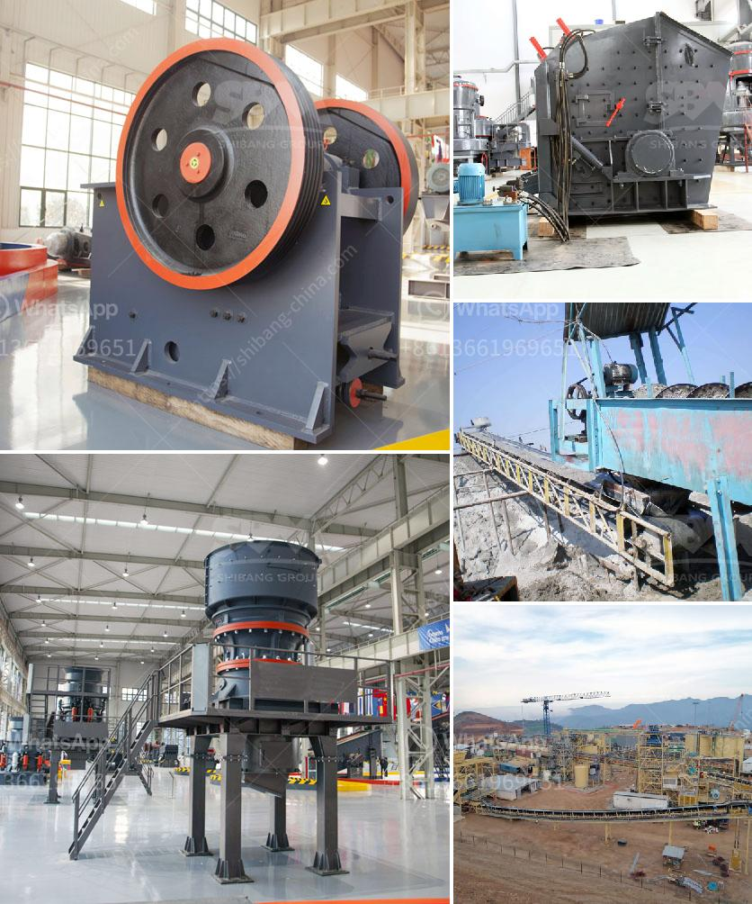

<h3>strainer of crushing machine</h3>
A strainer is an essential component of a crushing machine, playing a crucial role in the overall operation and efficiency of the equipment. It helps to separate different sizes of materials and ensure the desired consistency of the final product. Whether it is in the mining, construction, or recycling industry, a high-quality strainer significantly improves the functionality and effectiveness of a crushing machine.

The main purpose of a strainer in a crushing machine is to regulate the output size of crushed materials. It filters out larger pieces that need further processing while allowing smaller particles to pass through. This separation process is vital as the desired consistency of the final product varies depending on the application. For example, in the production of concrete, the size of aggregate particles must adhere to specific standards. A strainer ensures that only materials within the required size range are used, enhancing the quality and strength of the end product.

The design of a strainer is also crucial in maximizing the efficiency of a crushing machine. It should be able to handle a wide range of materials without clogging or jamming. Durability and resistance to wear and tear are key factors in ensuring uninterrupted operation and reducing maintenance requirements. Furthermore, a strainer with easily replaceable screens allows for quick adjustments to the output size, accommodating different production needs.

Regular maintenance and cleaning of the strainer are essential to prevent its efficiency from diminishing over time. Accumulated dust, dirt, and debris can impair the performance and result in uneven output or decreased productivity. By conducting routine inspections and cleanings, operators can ensure that the strainer is in optimal condition, guaranteeing the smooth running of the crushing machine and minimizing downtime.

In conclusion, a reliable and efficient strainer is a vital component of any crushing machine, ensuring the desired consistency and quality of the final product. Its role in separating different particle sizes cannot be underestimated, particularly in industries where specific standards are required. By selecting a high-quality strainer, conducting regular maintenance, and ensuring proper cleaning, operators can enhance the overall performance and maximize the efficiency of the crushing machine.
<h3>Contact us</h3><ul><li><strong>Whatsapp:&nbsp;<a href="https://wa.me/8613661969651">+8613661969651</a></strong></li><li><a href="https://swt.shibang-china.com/?git&amp;zhl&amp;strainer of crushing machine"><strong>Online Service(chat now)</strong></a></li></ul><h3>Related</h3><ul><li><a href='philippines crushing machine manufacturer in pakistan.md'>philippines crushing machine manufacturer in pakistan</a></li><li><a href='components of the nigerian mining industry.md'>components of the nigerian mining industry</a></li><li><a href='business plan for small scale chrome mining.md'>business plan for small scale chrome mining</a></li><li><a href='sale of stone hammer hammer.md'>sale of stone hammer hammer</a></li><li><a href='stone quarry plant.md'>stone quarry plant</a></li></ul>