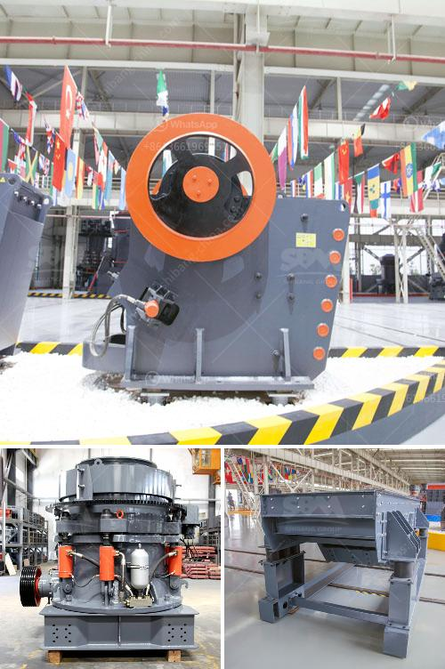

<h3>superfine grinding mill</h3>
Grinding is an essential process in various industries that require particle size reduction. Whether it is in the food, chemical, or mining industry, achieving the desired particle size is crucial for product quality and functionality. Traditional grinding mills have been used for decades, but advancements in technology have led to the development of more efficient and precise grinding equipment, such as the superfine grinding mill.

Superfine grinding mill, also known as ultrafine mill, is a type of Raymond mill which is designed to process ore powder with a particle size of less than 10 microns. Its distinguishing feature is its ability to increase production capacity while reducing energy consumption. Compared to traditional grinding mills, the superfine grinding mill can produce finer particle sizes, making it ideal for ultrafine grinding applications.

One of the main benefits of using a superfine grinding mill is its ability to produce a uniform particle size distribution. This is essential in industries such as pharmaceuticals and chemicals, where the quality and effectiveness of the product depend on the uniformity of the particles. By achieving a uniform particle size, the superfine grinding mill ensures consistent and reliable results, resulting in improved product quality.

Another advantage of the superfine grinding mill is its energy efficiency. Traditional grinding mills often consume a significant amount of energy to achieve the desired particle size. However, the superfine grinding mill utilizes a unique design that reduces energy consumption while maintaining high grinding efficiency. This not only reduces operational costs but also minimizes environmental impact, making it a more sustainable grinding solution.

In addition to its energy efficiency, the superfine grinding mill offers greater versatility in terms of materials that can be processed. It can handle a wide range of materials, including minerals, ores, chemicals, and even food products. This versatility makes it a popular choice in various industries, including mining, chemical engineering, and food processing.

The design of the superfine grinding mill also incorporates advanced technology to ensure optimal performance. It is equipped with a high-speed rotating rotor and a classifying wheel, which work in tandem to achieve the desired particle size. The design also includes a unique air circulation system that helps to cool the grinding chamber and prevent overheating, ensuring consistent and efficient grinding operations.

In conclusion, the superfine grinding mill is a valuable tool for industries that require precise and efficient particle size reduction. Its ability to produce a uniform particle size distribution, coupled with its energy efficiency and versatility, makes it a preferred choice for various applications. Whether it is for grinding minerals, chemicals, or food products, the superfine grinding mill can provide the fine grinding solution needed for optimal product quality and performance.
<h3>Contact us</h3><ul><li><strong>Whatsapp:&nbsp;<a href="https://wa.me/8613661969651">+8613661969651</a></strong></li><li><a href="https://swt.shibang-china.com/?git&amp;zhl&amp;superfine grinding mill"><strong>Online Service(chat now)</strong></a></li></ul><h3>Related</h3><ul><li><a href='mobile crusher made in turkey.md'>mobile crusher made in turkey</a></li><li><a href='plant layout mini cement plant pdf.md'>plant layout mini cement plant pdf</a></li><li><a href='gyratory cone crusher.md'>gyratory cone crusher</a></li><li><a href='industrial vibrating feeders.md'>industrial vibrating feeders</a></li><li><a href='3 roll mill specifications.md'>3 roll mill specifications</a></li></ul>