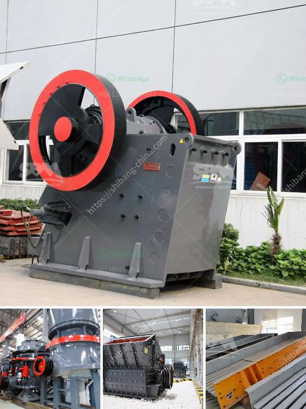

<h3>suppliers of conveyor belts</h3>
Conveyor belts play a vital role in various industries, from manufacturing to mining. They are designed to transport materials and products efficiently and safely from one point to another. To meet the diverse needs of these industries, a wide range of suppliers offer conveyor belts specifically tailored to different applications. In this article, we will explore some of the leading suppliers of conveyor belts and their offerings.

One prominent supplier of conveyor belts is Company A. With decades of experience in the industry, they have built a solid reputation for providing high-quality conveyor belts that meet stringent standards of durability and performance. Their extensive product line includes various types of belts, such as flat belts, modular belts, and timing belts. These belts are manufactured using premium materials like rubber, PVC, or polyurethane, ensuring excellent resistance to wear and tear. Additionally, Company A offers customization options to meet specific customer requirements.

Another renowned supplier is Company B, known for its innovation and technological advancements in conveyor belt manufacturing. They boast a wide range of belts that are designed to address specific needs, be it heavy-duty applications or those requiring hygiene and cleanability. Company B's belts are engineered to provide exceptional grip, smooth operation, and extended lifespan. What sets them apart is their focus on sustainability, as they utilize eco-friendly materials and manufacturing processes, reducing waste and environmental impact.

Company C is a global leader in conveyor belt solutions, offering an extensive portfolio of products to meet industry-specific demands. Known for their reliability and high-performance standards, their belts are used in diverse sectors like mining, agriculture, and logistics. Company C's range of belts includes heat-resistant belts, oil-resistant belts, and flame-retardant belts, catering to harsh environments and demanding applications. Moreover, they provide value-added services, such as on-site installation and maintenance, ensuring seamless operation for their customers.

One supplier that specializes in heavyweight belts for heavy-duty applications is Company D. Their belts are specifically designed to handle bulk materials in industries like construction, mining, and aggregates. Equipped with reinforced fabric layers and heavy-duty rubber compounds, these belts offer superior strength, impact resistance, and longevity. Additionally, Company D's belts are engineered to withstand extreme temperatures and abrasive materials, making them suitable for rugged environments. With an extensive global network, they ensure timely delivery and professional support.

Company E is a reliable supplier of modular belts, which are widely used in food processing and packaging industries. Their belts are constructed using FDA-approved materials, ensuring compliance with food safety standards. These modular belts offer hygienic, easy-to-clean surfaces and seamless connections, minimizing product contamination risks. Company E also offers a range of accessories, such as side guards and flight attachments, to enhance belt performance and meet specific application requirements.

In conclusion, the market offers a wide array of conveyor belt suppliers catering to diverse industries and applications. Whether it's heavy-duty applications requiring durability or specialized needs for food processing, there are suppliers like Company A, B, C, D, and E that provide high-quality conveyor belts tailored to meet specific demands. When choosing a supplier, it's crucial to consider factors such as product quality, customization options, sustainability practices, and value-added services to ensure optimal performance and efficiency of the conveyor belt systems.
<h3>Contact us</h3><ul><li><strong>Whatsapp:&nbsp;<a href="https://wa.me/8613661969651">+8613661969651</a></strong></li><li><a href="https://swt.shibang-china.com/?git&amp;zhl&amp;suppliers of conveyor belts"><strong>Online Service(chat now)</strong></a></li></ul><h3>Related</h3><ul><li><a href='calculations on the capacity of cone crusher.md'>calculations on the capacity of cone crusher</a></li><li><a href='hammer mills hammer mills.md'>hammer mills hammer mills</a></li><li><a href='uk quarry crusher machinery manufacturers.md'>uk quarry crusher machinery manufacturers</a></li><li><a href='pebble crushing machine.md'>pebble crushing machine</a></li><li><a href='berat mobile screen mobile crusher.md'>berat mobile screen mobile crusher</a></li></ul>