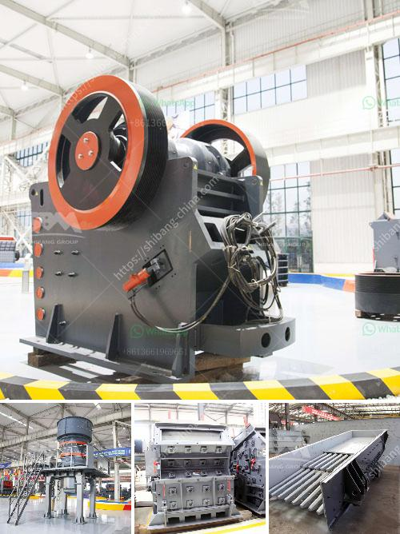

<h3>suppliers of ld slag crushing plants in india</h3>
India is a country rich in mineral resources, with a huge diversity in the geological composition of its land. One such mineral resource that has gained significant importance over the years is slag. Slag is a byproduct generated during the steel-making process and is often considered as waste material. However, with advancements in technology, slag has found various applications in industries like construction, cement manufacturing, and agriculture.

Slag crushing plants are used to crush and process the slag generated during steel production. LD slag, also known as basic oxygen furnace slag or converter slag, is one type of slag that is generated during the production of steel. LD slag is a byproduct of the steel industry and has properties similar to natural aggregates. It can be used in various applications such as road construction, soil stabilization, and as a raw material in cement production.

To meet the growing demand for LD slag crushing plants in India, several suppliers have emerged in the market. These suppliers offer a wide range of crushing plants specifically designed for processing LD slag. The plants are equipped with advanced technology and machinery to ensure efficient crushing and processing of the slag.

One such supplier is Metso Outotec. Metso Outotec is a global leader in sustainable minerals and metals processing solutions. They offer a comprehensive range of crushing plants for various applications, including LD slag crushing. Their plants are equipped with state-of-the-art technology and are designed to deliver high performance, reliability, and ease of operation. Metso Outotec also provides comprehensive support services to ensure maximum productivity and uptime for their customers.

Another prominent supplier of LD slag crushing plants is Thyssenkrupp Industries India. Thyssenkrupp Industries India is a leading manufacturer of crushing and screening equipment in India. They offer a wide range of crushing plants for various applications, including LD slag crushing. Their plants are known for their robust construction, high performance, and advanced technology. Thyssenkrupp Industries India also provides comprehensive after-sales support and services to their customers.

Besides Metso Outotec and Thyssenkrupp Industries India, there are several other suppliers in India that offer LD slag crushing plants. These include Harsco India Pvt. Ltd., TMEIC Corporation India, and Jaykay Enterprise, among others. Each supplier has its unique offerings and specialization, catering to the diverse needs of the steel industry in India.

In conclusion, the demand for LD slag crushing plants in India is increasing, and several suppliers are catering to this demand. These suppliers offer a wide range of crushing plants equipped with advanced technology to efficiently crush and process LD slag. With the growing emphasis on sustainability and resource optimization, LD slag is gaining importance as a valuable resource rather than a waste material. The availability of efficient and reliable crushing plants is crucial for the successful utilization of LD slag in various industries in India.
<h3>Contact us</h3><ul><li><strong>Whatsapp:&nbsp;<a href="https://wa.me/8613661969651">+8613661969651</a></strong></li><li><a href="https://swt.shibang-china.com/?git&amp;zhl&amp;suppliers of ld slag crushing plants in india"><strong>Online Service(chat now)</strong></a></li></ul><h3>Related</h3><ul><li><a href='stone crushers china.md'>stone crushers china</a></li><li><a href='bauxite mining machine.md'>bauxite mining machine</a></li><li><a href='stone crusher youtube.md'>stone crusher youtube</a></li><li><a href='construction crusher price.md'>construction crusher price</a></li><li><a href='graphite processing plant.md'>graphite processing plant</a></li></ul>