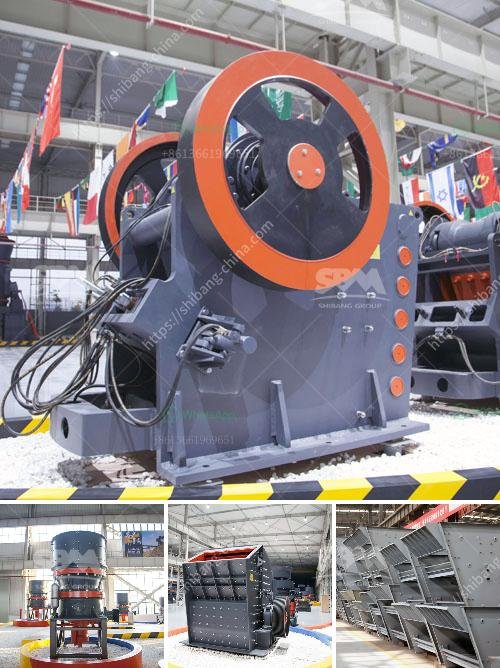

<h3>the cost of stone crusher in pakistan</h3>
Stone crusher is widely used in mining, metallurgical, construction, chemistry, petrochemicals, transportation, energy, building materials industry, suitable for crushing high hard, mid hard and soft rocks and ores such as iron ore, limestone, slag, marble, quartz, granite, cement, clinker and so on. The expanding of Pakistan’s infrastructure construction has driven the industry of stone crusher machines. The stone crusher market in Pakistan is booming due to increasing population, which has increased demand for building materials in the country.

Stone crushing industry is a dominant but still environmentally unorganized sector in Pakistan. Its different operations cause significant environmental impacts including air and noise pollution in the vicinity as well as vibration effects far-off. A large number of laborers in the stone crushing industry are exposed to high levels of dust, which affects their health.

The cost of stone crusher plant has always been one of the key topics that the customers need to consider.Generally,it is affected by the following factors, such as crusher type, specific crusher model,crusher manufacturer,shipment,brand,etc. The raw material scale you need to process decides the crusher type and specific model you need to choose. If you need a single small crusher, jaw crusher would be a better choice, whose total cost will be only thousands of dollars. If you need a medium scale and large size crusher machine, the cost of stone crusher plant is up to the crusher type you choose.PE-600×900 jaw crusher,PY1200 series cone crusher, mobile crusher are the hot sale ones. If you need larger production capacity, we also have the related crusher size for you to choose.

The cost of a stone crusher plant in Pakistan mainly depends on the costs of raw materials, equipment, fuel, transportation, and labor. However, the overlying reason the stone crusher machine is various types, please make it according to the actual requirements. As for the specific price, please feel free to consult online service staffs. They can provide you with professional advice and solutions for free.
<h3>Contact us</h3><ul><li><strong>Whatsapp:&nbsp;<a href="https://wa.me/8613661969651">+8613661969651</a></strong></li><li><a href="https://swt.shibang-china.com/?git&amp;zhl&amp;the cost of stone crusher in pakistan"><strong>Online Service(chat now)</strong></a></li></ul><h3>Related</h3><ul><li><a href='100tpd slag cement plant.md'>100tpd slag cement plant</a></li><li><a href='stone crusher quote list.md'>stone crusher quote list</a></li><li><a href='3 roll mill specifications.md'>3 roll mill specifications</a></li><li><a href='japan directory of mobile crushing plant.md'>japan directory of mobile crushing plant</a></li><li><a href='used coal power plant for sale.md'>used coal power plant for sale</a></li></ul>