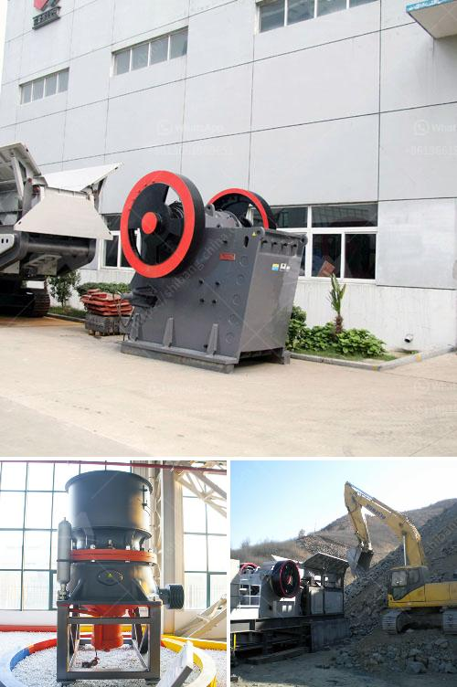

<h3>the largest stone crusher system</h3>
The stone crushing industry is a vital component of the construction industry. The largest stone crusher system is designed to handle large volumes of stones, including the most demanding specifications. With this unique system, its operators can easily break down huge stones into small pieces that are used in a variety of applications, such as road construction, building materials, and landscaping.

One of the main advantages of the largest stone crusher system is its ability to crush stones of different sizes. Whether it is small stones used as fillers or large rocks used as a foundation, this system can handle them all. This versatility is crucial in meeting the varied needs of the construction industry.

Another noteworthy feature of the largest stone crusher system is its efficiency. With advanced technology and a carefully designed structure, this system can crush stones with minimal energy consumption. This not only saves resources but also reduces the overall carbon footprint of the construction industry.

Furthermore, the largest stone crusher system is highly durable and resistant to wear and tear. Constructed with high-quality materials, this system can withstand heavy-duty usage without compromising its performance. Its robust design ensures that it can operate efficiently even in the toughest working conditions.

The maintenance requirements of the largest stone crusher system are also minimal. Regular cleaning and lubrication are enough to keep this system running smoothly. Additionally, its components are easily accessible, making repairs and replacements hassle-free.

Safety is a top priority when it comes to the largest stone crusher system. It is equipped with advanced safety features to protect the operators and prevent accidents. Emergency stop buttons, protective covers, and safety guards are some of the safety measures incorporated into this system.

The largest stone crusher system also offers excellent mobility. Its compact design allows it to be easily transported to different job sites, enhancing its versatility. This feature is especially beneficial for construction projects in remote locations or areas with limited infrastructure.

In conclusion, the largest stone crusher system is a crucial tool in the construction industry. Its ability to handle large volumes of stones, crush them efficiently, and provide various sizes for different applications makes it an invaluable asset. With its durability, low maintenance requirements, and advanced safety features, this system ensures a reliable and safe operation. It is a game-changer for the construction industry, offering an efficient and sustainable solution for stone crushing needs.
<h3>Contact us</h3><ul><li><strong>Whatsapp:&nbsp;<a href="https://wa.me/8613661969651">+8613661969651</a></strong></li><li><a href="https://swt.shibang-china.com/?git&amp;zhl&amp;the largest stone crusher system"><strong>Online Service(chat now)</strong></a></li></ul><h3>Related</h3><ul><li><a href='limestone rock crushing company.md'>limestone rock crushing company</a></li><li><a href='limestone primary crushing plant.md'>limestone primary crushing plant</a></li><li><a href='coal screening machine for sale south africa.md'>coal screening machine for sale south africa</a></li><li><a href='model pe 250 400 bantalan jaw crusher.md'>model pe 250 400 bantalan jaw crusher</a></li><li><a href='component of ball mill and its working principle.md'>component of ball mill and its working principle</a></li></ul>