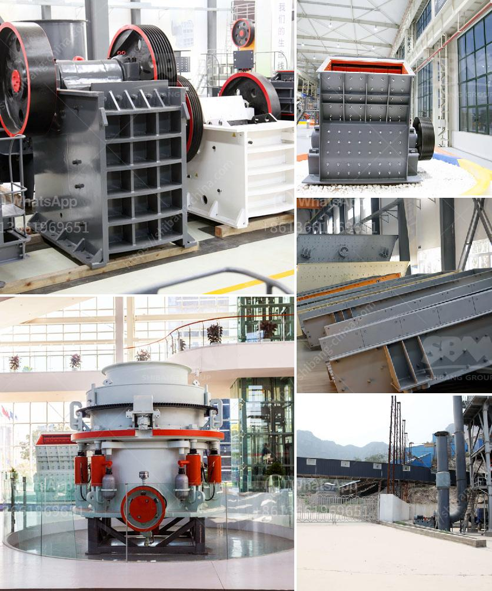

<h3>the process of preparation coal</h3>
The process of preparing coal is a complex and critical step in the production of energy. Coal, often referred to as black gold, is a carbon-rich fossil fuel that has been used for centuries to generate electricity and heat. However, before it can be used effectively, coal must undergo several preparation stages to remove impurities and improve its quality.

The first step in coal preparation is mining. Coal mines are established in areas where substantial coal deposits are found. Once a mine is established, the coal is extracted through various methods, including strip mining, underground mining, or mountaintop removal. The mining process can be arduous and dangerous, requiring careful planning and adherence to safety regulations.

After the coal is mined, it is transported to a coal preparation plant (CPP) for processing. In the CPP, the coal is crushed, screened, and washed to remove impurities. This process helps increase the coal's heating value and reduces emissions when burned. The specific operations performed at a CPP may vary depending on the quality of the coal and the desired end product.

Crushing is the initial stage of coal preparation. In this process, raw coal is fed into a crusher, which reduces the coal to a specified size suitable for downstream processing. After crushing, the coal is screened into different size fractions to separate the material into various desirable grades.

Next, the coal goes through a washing or cleaning process. Coal washing involves using water, chemicals, and mechanical techniques to remove impurities from the coal. The coal is immersed in a bath or a cyclone and agitated to separate and float the impurities to the surface. These impurities, also known as coal's ash content, can include rocks, slate, sulfur, and other organic and inorganic materials.

During the cleaning process, the coal is also dewatered, or moisture is removed, to increase its calorific value and reduce transportation costs. This can be done by mechanical means such as centrifuges or by thermal drying using specific equipment.

Once the coal is cleaned, it is often dried to further reduce its moisture content. Lower moisture content improves combustion efficiency and reduces pollutant emissions when the coal is burned. Drying can be accomplished through various methods, including thermal drying using hot air or waste heat from the power generation process.

After all the preparation stages are completed, the coal is ready for transportation and use. Depending on the destination and end-use, the coal may be transported by rail, truck, or barge to power plants, industrial facilities, or export terminals.

It is worth noting that the process of preparing coal has come a long way in terms of environmental considerations. In recent years, increasing attention has been given to reducing the environmental impact of coal mining, processing, and combustion. Techniques such as advanced cleaning technologies, carbon capture and storage, and improved combustion technologies have been developed to minimize the emission of pollutants such as particulate matter, sulfur dioxide, and nitrogen oxides.

In conclusion, the process of preparing coal involves multiple stages, including mining, crushing, screening, washing, and drying. Each step is crucial in removing impurities, improving coal quality, and reducing environmental impact. As the demand for energy continues to rise, ensuring the efficient and sustainable preparation of coal is essential for meeting global energy needs.
<h3>Contact us</h3><ul><li><strong>Whatsapp:&nbsp;<a href="https://wa.me/8613661969651">+8613661969651</a></strong></li><li><a href="https://swt.shibang-china.com/?git&amp;zhl&amp;the process of preparation coal"><strong>Online Service(chat now)</strong></a></li></ul><h3>Related</h3><ul><li><a href='project cost of tpd ofcement plant in pakistan.md'>project cost of tpd ofcement plant in pakistan</a></li><li><a href='stone crusher machine south africa.md'>stone crusher machine south africa</a></li><li><a href='gold processing equipment price in ghana.md'>gold processing equipment price in ghana</a></li><li><a href='marble milling machine.md'>marble milling machine</a></li><li><a href='used coal power plant for sale.md'>used coal power plant for sale</a></li></ul>