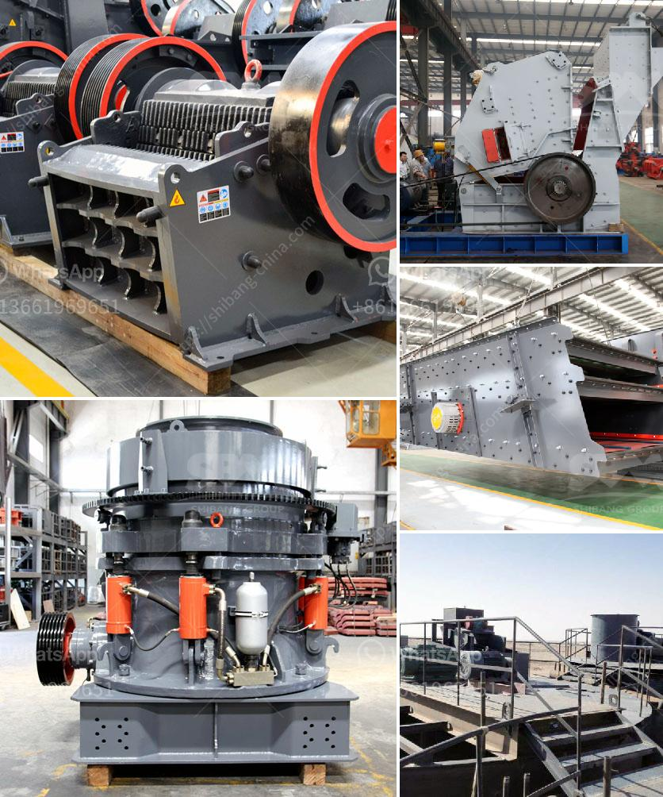

<h3>the world largest mobile crusher</h3>
The world of quarrying is filled with innovations and breakthroughs that have revolutionized the industry. One such major development is the invention of the world's largest mobile crusher, which is installed in a limestone quarry in Morocco. This monster machine is capable of chewing through rocks at an astonishing rate and has fundamentally transformed the extraction process. In this article, we will explore the various dimensions and capabilities of this colossal innovation.

This mammoth crusher measures an impressive 66 feet in length, 35 feet in width, and is over 54 feet tall. Its jaw consists of a robust 127-tonne frame that enables it to crush rock, concrete, and other materials into various sizes suitable for construction purposes. The efficiency of this machine lies in its immense power, capable of crushing up to 10,000 tons of material per hour! This staggering capacity far surpasses any other available mobile crusher currently in operation.

Despite its size, the world's largest mobile crusher possesses excellent mobility features. It is mounted on a tracked chassis that allows it to be easily moved around the quarry, reducing the need for additional equipment and infrastructure. The efficient mobility enables operators to crush material at the source, minimizing transportation costs and logistical challenges associated with traditional stationary crushers.

The introduction of such a massive mobile crusher has completely transformed quarrying operations worldwide. Quarry owners and operators are witnessing a dramatic increase in productivity and efficiency due to the enormous material handling capabilities of this machine. Rather than relying on multiple smaller crushers scattered around the site, quarry operators can use this single mobile unit to crush and process large quantities of material, simplifying the production chain and leading to considerable cost savings.

Beyond its impressive operational capabilities, this mobile crusher brings a range of environmental benefits. Its advanced design reduces energy consumption and greenhouse gas emissions compared to traditional crushers. By crushing materials at the source, the need for extensive transportation is minimized, reducing carbon emissions associated with transporting material to processing sites. Moreover, the reduced need for stationary crushers significantly reduces the noise and dust pollution often associated with quarrying activities.

The introduction of the world's largest mobile crusher has brought about a significant transformation in the quarrying industry. This monster machine's exceptional crushing capacity, coupled with advanced mobility features, has enabled quarry operators to achieve unprecedented levels of productivity and efficiency. Additionally, its eco-friendly design paves the way for sustainable quarrying practices, reducing carbon emissions and minimizing environmental impact.

As technology continues to evolve, we can expect further innovations in the quarrying sector. The world's largest mobile crusher sets a remarkable precedent for future developments, and it serves as a testament to human ingenuity in consistently pushing the boundaries of what is possible in the quarrying industry.
<h3>Contact us</h3><ul><li><strong>Whatsapp:&nbsp;<a href="https://wa.me/8613661969651">+8613661969651</a></strong></li><li><a href="https://swt.shibang-china.com/?git&amp;zhl&amp;the world largest mobile crusher"><strong>Online Service(chat now)</strong></a></li></ul><h3>Related</h3><ul><li><a href='component of ball mill and its working principle.md'>component of ball mill and its working principle</a></li><li><a href='plant project report pdf stone crushing.md'>plant project report pdf stone crushing</a></li><li><a href='price of grinding powder manufacturing machine.md'>price of grinding powder manufacturing machine</a></li><li><a href='stone quarry plant.md'>stone quarry plant</a></li><li><a href='mobile crushing and screening to hire south africa.md'>mobile crushing and screening to hire south africa</a></li></ul>