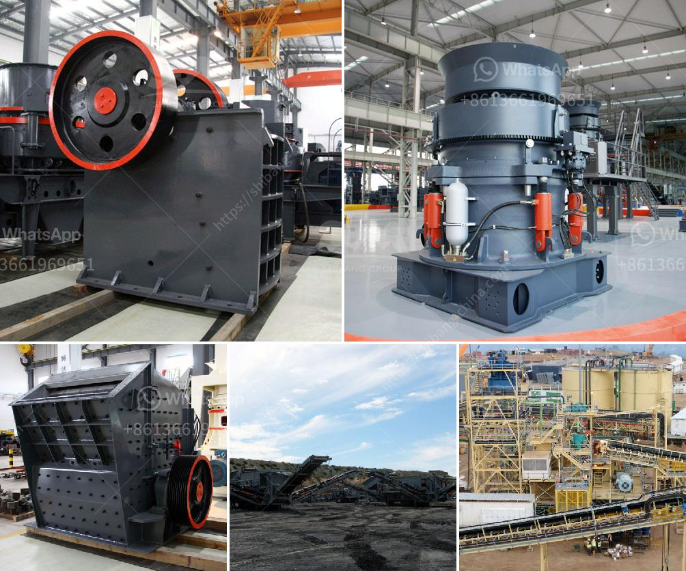

<h3>to produce tons of li ne powder</h3>
In numerous industries, from construction to agriculture, line powder plays a crucial role as a versatile material. Its applications range from soil acidity regulation to building material and as an ingredient in various products. With an increasing demand for line powder, manufacturers are seeking innovative ways to produce large quantities efficiently. In this article, we explore methods to produce tons of line powder to meet the rising market needs.

The first step in producing line powder is mining of the high-quality line rocks. Modern mining techniques, such as open-pit mining, facilitate the extraction process, resulting in a higher yield. Utilizing improved excavation machinery and technology, these mining methods allow for the extraction of large quantities of line in an efficient manner.

Once the line rocks are extracted, they undergo a series of crushing and grinding processes to transform them into fine powder. With the introduction of cutting-edge industrial machinery and automated systems, this process has become highly streamlined. Technologies such as ball mills and impact crushers ensure a consistent and efficient grinding process, leading to increased production rates.

To obtain a fine, consistent particle size, the line powder needs to undergo rigorous screening and sieving procedures. Advancements in sieving techniques, such as high-frequency vibrating screens, enable manufacturers to precisely separate and classify the line particles according to size. Consequently, this results in a higher quality end product, meeting specific customer requirements.

After the grinding and sieving processes, line powder requires proper drying to eliminate moisture content and improve its usability. High-capacity drying units employing the latest technologies such as fluidized bed dryers ensure rapid and efficient drying, aiding in higher production throughput. Additionally, state-of-the-art packaging systems assist in efficiently packaging and transporting large quantities of line powder to end-users.

With the ever-increasing demand for line powder, manufacturers are investing in advancements to boost production capacities. Through the implementation of advanced mining techniques, streamlined crushing and grinding processes, enhanced screening and sieving methods, and efficient drying and packaging solutions, producing tons of line powder has become a reality. This ensures a steady supply of this versatile material, supporting various industries and encouraging further innovation in line powder applications.
<h3>Contact us</h3><ul><li><strong>Whatsapp:&nbsp;<a href="https://wa.me/8613661969651">+8613661969651</a></strong></li><li><a href="https://swt.shibang-china.com/?git&amp;zhl&amp;to produce tons of li ne powder"><strong>Online Service(chat now)</strong></a></li></ul><h3>Related</h3><ul><li><a href='3 meters conveyor belts.md'>3 meters conveyor belts</a></li><li><a href='impact stone crusher.md'>impact stone crusher</a></li><li><a href='second hand small cement mill in uae.md'>second hand small cement mill in uae</a></li><li><a href='precio trituradora de tierras en pakistan.md'>precio trituradora de tierras en pakistan</a></li><li><a href='mining heavy equipment price list.md'>mining heavy equipment price list</a></li></ul>