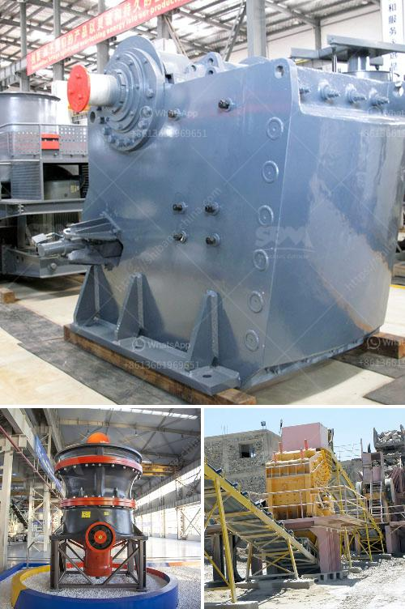

<h3>toggle plate of jaw crusher</h3>
The toggle plate in a jaw crusher is a critical component that acts as a safety mechanism for the crusher. It controls the movement of the bottom part of the jaw, which means that it prevents excessive wear and tear on the jaw itself.

The toggle plate is a metal piece that is fitted between the swinging jaws. It is designed to bend slightly as the jaw moves, allowing it to be flexible enough to absorb shocks and vibrations. This reduces the risk of damage to the jaw by ensuring that the forces exerted on it are evenly distributed.

One of the primary functions of the toggle plate is to protect the jaw from excessive wear and tear. When the jaw moves, it generates a large amount of force, especially during crushing operations. This force can cause the jaw to become worn down over time. The toggle plate helps to distribute this force evenly, preventing the jaw from wearing out too quickly.

In addition to its protective function, the toggle plate also plays a role in the crushing process. As the jaw moves, the toggle plate moves along with it. This movement creates friction and compression forces on the material being crushed, helping to break it down into smaller pieces. The toggle plate acts as a guide, ensuring that the material is evenly distributed across the crushing chamber, which improves the efficiency of the crushing process.

Another important function of the toggle plate is to provide a means of adjusting the size of the discharge opening. By moving the toggle plate, the opening between the jaws can be adjusted, allowing for different sized materials to be produced. This is crucial in many industries, where different sizes of crushed materials are required for various purposes.

The toggle plate is typically made of cast or forged steel, which provides strength and durability. It is designed to withstand high pressure and heavy loads that are common in crushing applications. It is also designed to be easily replaced when it becomes worn or damaged.

In conclusion, the toggle plate is an essential component of a jaw crusher. It provides protection for the jaw, ensures even distribution of forces, improves crushing efficiency, and allows for easy adjustment of the discharge opening. Without a functioning toggle plate, the jaw crusher may not perform optimally and may experience excessive wear and tear. Therefore, regular inspection and maintenance of the toggle plate is necessary to ensure the smooth operation of the jaw crusher.
<h3>Contact us</h3><ul><li><strong>Whatsapp:&nbsp;<a href="https://wa.me/8613661969651">+8613661969651</a></strong></li><li><a href="https://swt.shibang-china.com/?git&amp;zhl&amp;toggle plate of jaw crusher"><strong>Online Service(chat now)</strong></a></li></ul><h3>Related</h3><ul><li><a href='portable crushers sweden.md'>portable crushers sweden</a></li><li><a href='jaw crusher c160 menghancurkan peralatan.md'>jaw crusher c160 menghancurkan peralatan</a></li><li><a href='stone quarrys crusher in ghana.md'>stone quarrys crusher in ghana</a></li><li><a href='mining process of limestone.md'>mining process of limestone</a></li><li><a href='precipitated calcium carbonate manufacturing machinery.md'>precipitated calcium carbonate manufacturing machinery</a></li></ul>