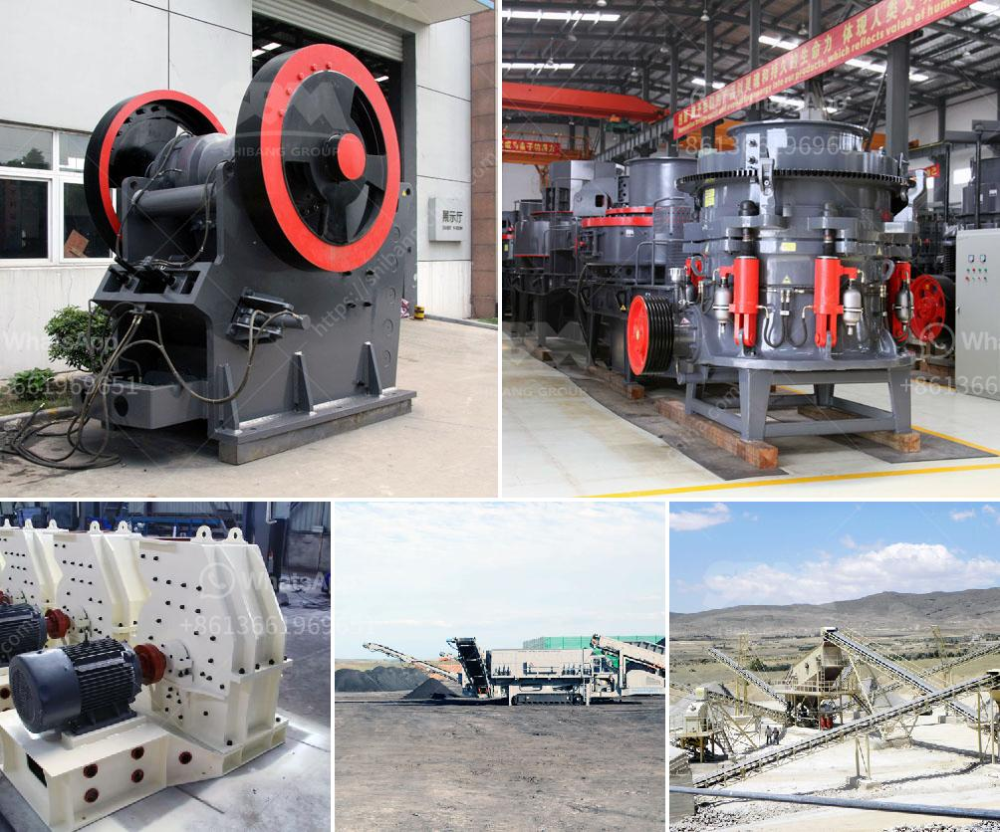

<h3>ton crushers south africa for sale</h3>
South Africa is home to a plethora of minerals and natural resources such as gold, platinum, coal, iron ore, manganese, chromium, vanadium, asbestos, diamonds, and more. This country has been an economic powerhouse in the continent for the past several decades, and it is still attracting foreign direct investments to this day. With the increasing demand for minerals, the need for efficient and cost-effective crushing equipment is paramount. In this article, we will discuss the ton crushers available in South Africa for sale and explore their features, benefits, and potential applications.

Ton crushers are designed to break stones into smaller pieces. They can be used in a variety of industries, such as mining, construction, demolition, recycling, and other similar applications. These machines are available in different sizes, capacities, and power requirements to suit various project requirements. Furthermore, ton crushers are known for their durability, high efficiency, and low maintenance requirements, making them an ideal choice for many businesses.

One of the popular ton crushers available for sale in South Africa is the Ton 1100 x 650 jaw crusher. This machine is built on a heavy-duty "track" chassis and features a highly reliable "CJ211" single-toggle jaw crusher with a feed opening of 1,100 mm x 650 mm / 43" x 25". This jaw crusher has been designed for high productivity in both quarrying and recycling applications, making it an ideal solution for contractors and quarry operators alike.

Another option available in South Africa is the Ton MB Crusher Bucket. This versatile jaw crusher attachment is suitable for excavators between 17 and 50 tons. It is capable of crushing stones of various sizes and hardness levels. The MB Crusher Bucket is equipped with a hydraulic system to aid in its implementation. Furthermore, this machine can save you time and money on your project, as it eliminates the need for hiring additional crushing equipment and transport vehicles.

Ton crushers are compact machines that are built to last. They are manufactured by a team of skilled engineers and technicians in the company's modern factory in Italy. A notable feature of the Ton crushers is the fact that they are built from scratch and strictly tailored to the customer's specific requirements. This ensures that customers get exactly what they need to meet their crushing demands.

In summary, Ton crushers South Africa for sale offer a high-quality product with the latest technology and innovation. They provide unmatched performance and reliability, making them a perfect fit for South Africa's demanding mining and quarrying industries. With the growing need for minerals and resources, South Africa and its neighboring countries have great potential for growth and expansion. Thus, there is a bright future for the ton crushers available in the market in the years to come.

If you are in need of a ton crusher in South Africa, Orecrusher is a leading manufacturer and supplier of crushing and screening solutions to the mining and quarrying industries. Visit their website for more information or reach out to their experts for assistance in finding the right ton crusher for your project.
<h3>Contact us</h3><ul><li><strong>Whatsapp:&nbsp;<a href="https://wa.me/8613661969651">+8613661969651</a></strong></li><li><a href="https://swt.shibang-china.com/?git&amp;zhl&amp;ton crushers south africa for sale"><strong>Online Service(chat now)</strong></a></li></ul><h3>Related</h3><ul><li><a href='floatation washing machine for silica sand.md'>floatation washing machine for silica sand</a></li><li><a href='used portable rock crusher for sale.md'>used portable rock crusher for sale</a></li><li><a href='copper concentrate plant manufacturers in south africa.md'>copper concentrate plant manufacturers in south africa</a></li><li><a href='list of equipment used gold diamond mining.md'>list of equipment used gold diamond mining</a></li><li><a href='stone jaw crusher machinery supplier.md'>stone jaw crusher machinery supplier</a></li></ul>