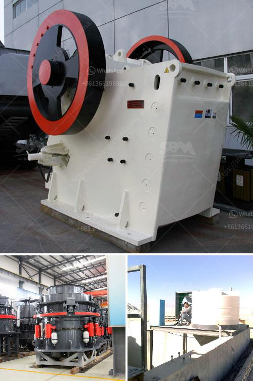

<h3>ton per hour hammer mill grinding mill china</h3>
The hammer mill is a versatile grinding machine that utilizes high-speed rotating hammers to crush and grind different materials. This hammer mill can be employed in various industries such as animal feed, ethanol production, biomass plants, and more. In China, it has been widely used to process corn, soybean, wheat, and other grains. 

One of the advantages of the hammer mill is its high grinding efficiency. It can grind and crush materials into a fine powder within seconds. This efficiency is mainly due to the unique design of the hammer mill's internal components, including the crushing chamber and the rotating hammers. As a result, the hammer mill can process a large volume of materials within a short period, which increases overall productivity.

The ton per hour capacity of the hammer mill is another important feature to consider. With different models and configurations available, the hammer mill can handle a wide range of materials and output capacities. From 1 ton per hour to 30 tons per hour, the hammer mill can be customized to meet the specific needs of the industry and application.

Moreover, the hammer mill is highly durable and requires minimal maintenance. It is built with robust materials that can withstand the high impact forces generated during the grinding process. This ensures the hammer mill’s longevity and reduces downtime, increasing the machine's efficiency and overall profitability.

In conclusion, the ton per hour hammer mill is a powerful and efficient grinding machine that can process a wide range of materials. From grains to biomass, it provides a reliable and cost-effective solution for industries in China and around the world. With its high grinding capacity and low maintenance requirements, the hammer mill is a valuable investment for any business looking to enhance their grinding operations and maximize productivity.
<h3>Contact us</h3><ul><li><strong>Whatsapp:&nbsp;<a href="https://wa.me/8613661969651">+8613661969651</a></strong></li><li><a href="https://swt.shibang-china.com/?git&amp;zhl&amp;ton per hour hammer mill grinding mill china"><strong>Online Service(chat now)</strong></a></li></ul><h3>Related</h3><ul><li><a href='india conveyor belt for stone crusher.md'>india conveyor belt for stone crusher</a></li><li><a href='small grinding machine for limestone.md'>small grinding machine for limestone</a></li><li><a href='mobile crusher medium manufacturers japan.md'>mobile crusher medium manufacturers japan</a></li><li><a href='hammer crusher kapasitas 10 ton per jam dan ukurannya.md'>hammer crusher kapasitas 10 ton per jam dan ukurannya</a></li><li><a href='equipos para triturado de mineria.md'>equipos para triturado de mineria</a></li></ul>