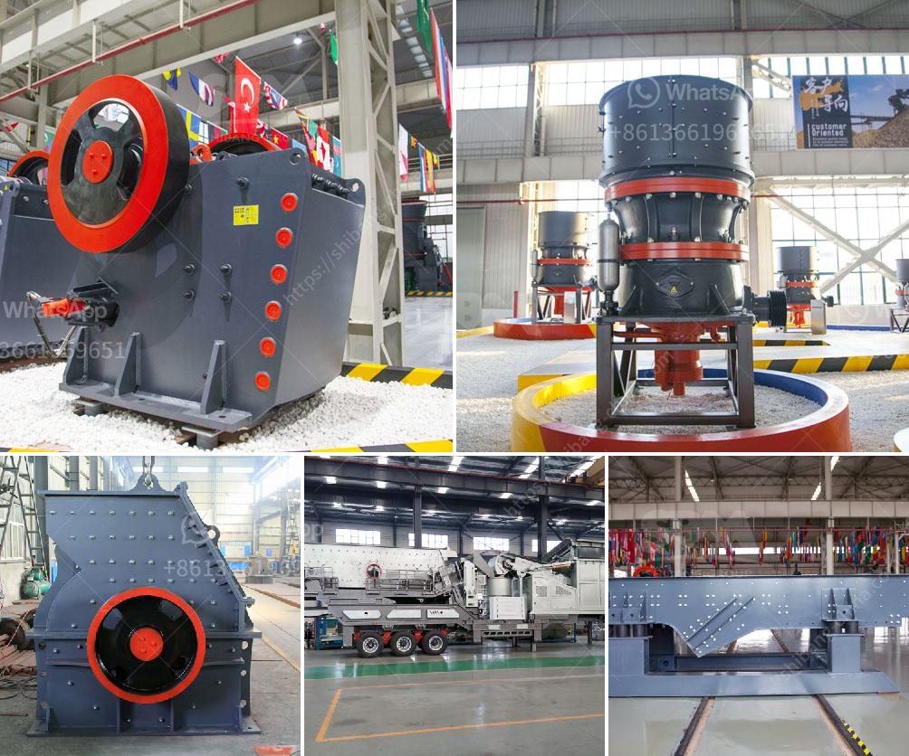

<h3>top aggregate crusher suppliers in south africa</h3>
In South Africa, the construction industry has been experiencing steady growth due to the government's investment in infrastructure development. This has increased the demand for aggregates, which are vital materials used in the construction of roads, buildings, and other infrastructure projects. As a result, there has been a rise in the number of aggregate crusher suppliers in the country. In this article, we will explore some of the top aggregate crusher suppliers in South Africa.

Top-quality aggregate stone crushers suppliers offer comprehensive crushing and screening solutions for road and raw material requirements. In addition to their wide range of diversified services, these suppliers also provide the following:

- Extraction of aggregates: They have an extensive fleet of machinery to extract aggregates from quarries, river beds, and other sources. This includes excavators, loaders, and dump trucks that can handle large volumes of material.

- Crushing and screening: Once the aggregates are extracted, they are crushed to the required sizes using powerful crushers. The suppliers have state-of-the-art crushing and screening equipment that helps them produce high-quality aggregates.

- Transportation: After the aggregates are crushed, they are transported to the construction sites using trucks. The suppliers have a well-established transportation network that ensures timely delivery of the materials.

- Quality control: The suppliers have quality control measures in place to ensure that the aggregates meet the required specifications. They conduct regular tests on the materials and maintain accurate records of the test results.

Besides being the largest privately-owned aggregate crusher supplier in South Africa, they are also a leading supplier of construction materials to the building and civil engineering industries. Their production encompasses a wide range of products, including crushed aggregates, asphalt, ready mix concrete, and precast concrete products.

Another key player in the market is a well-known international supplier of aggregate products. They have been providing top-quality aggregates to the construction industry for many years and have a strong presence in South Africa. Their products include aggregates for concrete, asphalt, and road construction, as well as specialty aggregates such as railway ballast and armor rock.

- OMV Crushers: OMV Crushers has been a significant player in the development of South Africa's infrastructure since its inception in 1952. It has been involved in projects ranging from the G6 freeway extension to the Gautrain Rail Link.

- Lafarge South Africa: Lafarge is a world leader in building materials and is a major supplier of aggregates in South Africa. Their offering includes crushed stone, gravel, and sand materials for the construction industry. They boast an extensive distribution network, allowing them to supply to even the most remote areas.

- Raumix Aggregates: With over 50 years of experience, Raumix Aggregates is a leading supplier of aggregates in South Africa. They have a wide range of products for various applications, including road construction, industrial and residential developments, as well as landscaping.

In conclusion, South Africa has a robust market for aggregate crusher suppliers who provide crushing and screening solutions and play a critical role in the construction industry. The top suppliers, with their extensive range of products and services, ensure a steady supply of high-quality aggregates, contributing to the country's infrastructure development.
<h3>Contact us</h3><ul><li><strong>Whatsapp:&nbsp;<a href="https://wa.me/8613661969651">+8613661969651</a></strong></li><li><a href="https://swt.shibang-china.com/?git&amp;zhl&amp;top aggregate crusher suppliers in south africa"><strong>Online Service(chat now)</strong></a></li></ul><h3>Related</h3><ul><li><a href='sand making machine indonesia.md'>sand making machine indonesia</a></li><li><a href='hammer mill lima price.md'>hammer mill lima price</a></li><li><a href='prices of granite crusher.md'>prices of granite crusher</a></li><li><a href='kaolin processing line.md'>kaolin processing line</a></li><li><a href='mantencion a cone crusher.md'>mantencion a cone crusher</a></li></ul>