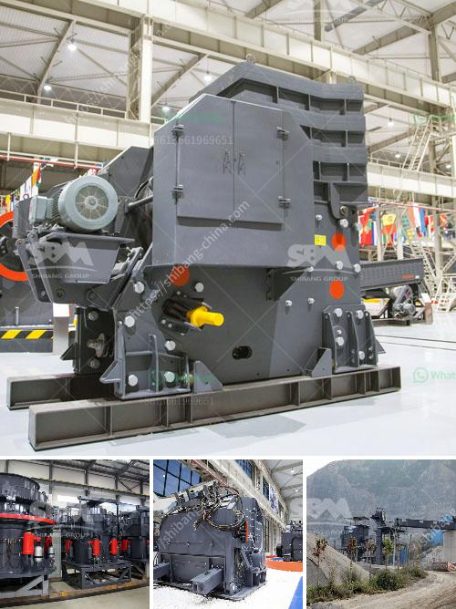

<h3>top ten cement plant epc contractor</h3>
Cement plants are vital infrastructural facilities that play a key role in the construction industry. They are responsible for producing one of the main components used in the construction of buildings, roads, bridges, and other structures. However, the establishment of a cement plant requires expertise and experience in designing, engineering, procuring, and constructing the facility. This is where the role of EPC (Engineering, Procurement, and Construction) contractors becomes crucial.

EPC contractors specialize in providing turnkey solutions for setting up cement plants, ensuring efficient and timely completion of projects. With their expertise, they can handle all aspects of the project, from conceptualization to commissioning. In this article, we will highlight the top ten cement plant EPC contractors known for their outstanding performance in the industry.

1. FL Smidth & Co. A/S: A leading global supplier of equipment, services, and solutions for cement production, FL Smidth offers comprehensive EPC services for cement plant projects.

2. Thyssenkrupp Industrial Solutions AG: This German engineering company provides end-to-end solutions for cement plant construction, focusing on sustainability and innovation.

3. KHD Humboldt Wedag International AG: KHD specializes in designing and constructing cement plants using advanced technologies, ensuring high-quality and cost-effective solutions.

4. Cemengal: As a specialist in complete cement plants, Cemengal offers innovative and efficient EPC services, with a strong focus on customization and customer satisfaction.

5. CBMI Construction Co., Ltd: CBMI's expertise lies in the construction of large-scale cement plants, employing advanced engineering techniques to deliver high-performance facilities.

6. SINOMA International Engineering Co., Ltd: With a vast portfolio of successful projects, SINOMA is renowned for its expertise in building cement plants with high production capacities.

7. Fives FCB: Fives FCB is a global player in the cement plant industry, providing tailor-made solutions to optimize production and reduce environmental impact.

8. IHI Corporation: This Japanese multinational engineering company offers top-notch EPC services for cement plants, ensuring maximum efficiency and reliability.

9. CNBM International Engineering Co., Ltd: Known for its extensive experience in international contracting, CNBM provides turnkey solutions for cement plants, focusing on sustainable development.

10. MTK Engineering Co., Ltd: MTK offers comprehensive EPC services for cement plants, emphasizing on energy efficiency, environmental protection, and worker safety.

These top ten cement plant EPC contractors have proven track records in successfully completing projects around the world, adhering to international quality standards. By leveraging their expertise and technological advancements, they continue to contribute significantly to the growth and development of the global cement industry.
<h3>Contact us</h3><ul><li><strong>Whatsapp:&nbsp;<a href="https://wa.me/8613661969651">+8613661969651</a></strong></li><li><a href="https://swt.shibang-china.com/?git&amp;zhl&amp;top ten cement plant epc contractor"><strong>Online Service(chat now)</strong></a></li></ul><h3>Related</h3><ul><li><a href='crushing plant process flow.md'>crushing plant process flow</a></li><li><a href='portable hammer mill australia in perth.md'>portable hammer mill australia in perth</a></li><li><a href='calcium carbonate production line in germany.md'>calcium carbonate production line in germany</a></li><li><a href='concrete stones crushing business plan.md'>concrete stones crushing business plan</a></li><li><a href='rock cone crusher.md'>rock cone crusher</a></li></ul>