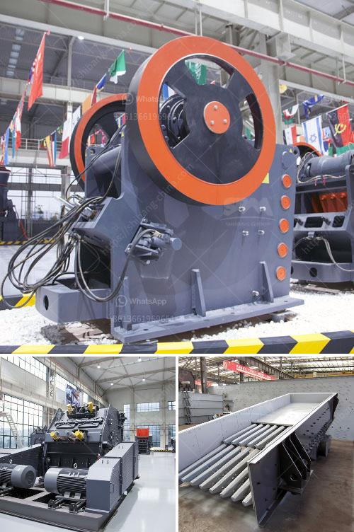

<h3>track mounted jaw crusher</h3>
A track mounted jaw crusher, also known as a mobile jaw crusher, is a vital piece of equipment in the quarry and mining industry. These machines help break down larger rocks into smaller, more manageable sizes for further processing.

When considering a track mounted jaw crusher, there are many factors to consider, such as the overall productivity of the machine, its reliability, and ease of maintenance. Some of the key features and benefits of a track mounted jaw crusher are discussed below.

One of the main advantages of a track mounted jaw crusher is its ability to be moved around easily. This allows for greater flexibility and efficiency in a range of applications. It is especially useful in areas where traditional crushers cannot reach or where there are logistical challenges. The mobility of these machines enables operators to bring the crusher to the material, rather than the other way around.

Another advantage of a track mounted jaw crusher is its compact design. This makes it suitable for working in tight spaces and ensures that transport is both economical and easy. Despite their smaller size, these crushers still offer high performance levels and can handle a wide variety of materials. Whether it is hard rock, limestone, or recycled concrete, a track mounted jaw crusher is capable of crushing them all.

In terms of productivity, a track mounted jaw crusher excels. With a high-capacity hopper, a jaw crusher can deliver up to 650 tonnes per hour, depending on the material and the feed size. Jaw crushers are mostly used in primary crushing applications, which means they provide the best reduction ratios.

Reliability is also a key feature of a track mounted jaw crusher. The machine is built to last and requires minimal maintenance. Regular checks and servicing can ensure its longevity and keep it running smoothly. Additionally, many manufacturers offer excellent after-sales support, which can be invaluable if any problems arise.

Apart from their primary function of crushing material, track mounted jaw crushers can also be used as a standalone unit or combined with other machines to form a complete crushing and screening set-up. This versatility allows for the efficient processing of various materials and provides operators with more options for different applications.

In conclusion, a track mounted jaw crusher is a valuable asset for any quarry or mining operation. Its mobility, compact design, high productivity, and reliability make it a flexible and efficient solution for crushing a variety of materials. From hard rock to recycled concrete, a track mounted jaw crusher can handle it all. By investing in a track mounted jaw crusher, operators can maximize their productivity and reduce their operating costs, ultimately achieving higher profitability in their business.
<h3>Contact us</h3><ul><li><strong>Whatsapp:&nbsp;<a href="https://wa.me/8613661969651">+8613661969651</a></strong></li><li><a href="https://swt.shibang-china.com/?git&amp;zhl&amp;track mounted jaw crusher"><strong>Online Service(chat now)</strong></a></li></ul><h3>Related</h3><ul><li><a href='types of crushers ppt.md'>types of crushers ppt</a></li><li><a href='strainer of crushing machine.md'>strainer of crushing machine</a></li><li><a href='aggregate crushers for sale saudi arabia.md'>aggregate crushers for sale saudi arabia</a></li><li><a href='slag crusher cost.md'>slag crusher cost</a></li><li><a href='crusher mobile stone crusher.md'>crusher mobile stone crusher</a></li></ul>